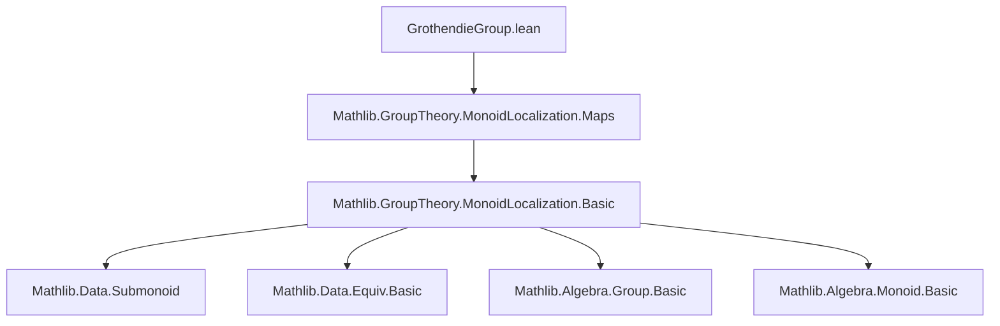

**Technical Brief: GrothendieckGroup.lean**

---

### 1. KEY DEFINITIONS & THEOREMS

| Name | Type / Signature | Purpose |
|------|------------------|---------|
| `GrothendieckGroup M` | `abbrev GrothendieckGroup : Type _ := Localization (⊤ : Submonoid M)` | Constructs the Grothendieck group of a commutative monoid `M` as the localization of `M` at the top submonoid (i.e., all elements). |
| `of : M →* GrothendieckGroup M` | `abbrev of : M →* GrothendieckGroup M := (monoidOf ⊤).toMonoidHom` | Canonical monoid homomorphism embedding `M` into its Grothendieck group. |
| `instCommGroup` | `instance : CommGroup (GrothendieckGroup M)` | Proves the Grothendieck group is a commutative group. |
| `inv_mk` | `lemma inv_mk (m : M) (s : ⊤) : (mk m s)⁻¹ = mk s ⟨m, mem_top _⟩` | Describes inverses in the localization: inverse of `mk m s` is `mk s m`. |
| `mk_div_mk` | `lemma mk_div_mk (m₁ m₂ s₁ s₂) : mk m₁ s₁ / mk m₂ s₂ = mk (m₁ * s₂) (s₁ * m₂)` | Explicit formula for division in the localized structure. |
| `lift` | `noncomputable def lift : (M →* G) ≃ (GrothendieckGroup M →* G)` | Universal property: monoid maps from `M` to a group `G` biject with group maps from `GrothendieckGroup M` to `G`. |
| `lift_apply` | `lemma lift_apply (f : M →* G) (x : GrothendieckGroup M)` | Explicit description of `lift f` on a representative: `f(sec x).1 / f(sec x).2`. |
| `of_injective` | `lemma of_injective [IsCancelMul M] : Injective (of M)` | `of` is injective iff `M` is cancellative (here proved under cancellativity assumption). |

---

### 2. NAMING CONVENTIONS

- **Prefixes**:
  - `of_`: canonical map from original structure (e.g., `of`, `of_injective`)
  - `mk_`: localization constructor (e.g., `mk`, `mk_div_mk`, `inv_mk`)
  - `lift_`: universal property map (e.g., `lift`, `lift_apply`)
- **Suffixes**:
  - `_injective`: injectivity lemmas
  - `_apply`: application lemmas for nontrivially defined maps
- **Pattern**:
  - `inst_` for typeclass instances (`instCommGroup`)
  - `to_additive` attribute used to parallel additive versions (e.g., `to_additive` on definitions/lemmas)

---

### 3. TACTIC STACK

Frequently used tactics:
- `simp` — heavily used for simplification, especially with `mk`, `inv`, `div`, `comp`, `sec`
- `rw` — rewriting using lemmas like `mk_eq_mk_iff'`, `mul_comm`, `div_eq_mul_inv`
- `cases` — `cases a using ind` for induction on localization elements
- `convert` — to match goals up to definitional equality (e.g., `convert Submonoid.LocalizationMap.mk'_self' _ _`)
- `ext` — extensionality for function equality in `lift` proofs
- `congr` — congruence closure for equality proofs
- `simpa` — simplification with discharge (e.g., `simpa using h`)
- `ring` likely implicit via `simp` (not explicit here, but standard in such contexts)

---

### 4. PROOF LOGIC

- **Structure**: The proof follows the standard localization-based construction:
  1. Define `GrothendieckGroup M` as `Localization ⊤`.
  2. Define `of` via `monoidOf`.
  3. Define inversion using `rec` on localization (universal property of localization).
  4. Prove group axioms (especially `inv_mul_cancel`) via `ind` and simplifications.
  5. Prove universal property via `lift`, using `monoidOf ⊤.lift` and `Group.isUnit`.
  6. Show `lift` is an equivalence via `left_inv`/`right_inv` using `ext` + `simp`.

- **Inductive reasoning**: Localization elements are handled via `ind` (induction principle), reducing to `mk m s` form.
- **Cancellation**: Injectivity of `of` uses `mk_eq_mk_iff'`, which relies on cancellativity.

---

### 5. IMPORTS

- `Mathlib.GroupTheory.MonoidLocalization.Maps` — provides:
  - `Localization`
  - `monoidOf`
  - `mk`, `mk_eq_mk_iff`, `ind`, `lift`, `sec`, etc.
  - `Submonoid.LocalizationMap.mk'_mul`, `mk'_self'`, etc.

No other imports are listed — this module is self-contained relative to `MonoidLocalization`.

---

### 6. DEPENDENCY & THEORY OVERVIEW (Mermaid Diagrams)

#### Dependency Graph (Module-Level)



#### Theory Flow (Conceptual)

```mermaid
graph LR
  CommMonoid[M : CommMonoid] -->|Localization at ⊤| GrothGroup[GrothendieckGroup M]
  GrothGroup -->|of : M →* G| GrothGroup
  GrothGroup -->|instCommGroup| CommGroup
  (M →* G) -->|lift| (GrothGroup M →* G)
  GrothGroup -->|mk_div_mk| Division
  GrothGroup -->|inv_mk| Inversion
```

#### Universal Property Diagram (Categorical)

```mermaid
graph LR
  M -- of --> GrothGroup M
   \\         /
    \\       /
     f     lift f
      \\   /
       v v
        G
```

Where `f : M →* G` (with `G` a commutative group) factors uniquely through `GrothGroup M`.

---

### 7. ADDITIONAL NOTES

- **Additive variant**: All definitions/lemmas have `to_additive` annotations, indicating an additive counterpart (e.g., `GrothendieckGroupAdd` would be `Localization ⊤` for additive monoids).
- **Noncomputability**: `lift` is `noncomputable` because it uses `sec`, which may require choice.
- **Top submonoid**: Using `⊤ : Submonoid M` ensures *all* elements are inverted — essential for group completion.
- **Injectivity condition**: `of_injective` requires `IsCancelMul M`, aligning with classical algebra: group completion is injective iff the monoid is cancellative.

--- 

Let me know if you'd like the additive version formalized or a comparison with the categorical Grothendieck group construction.
