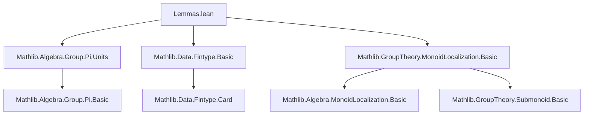

**Technical Brief: `Lemmas.lean` — Localizations of Commutative Monoids**

---

### 1. **Key Definitions & Theorems**

| Name | Type / Signature | Purpose |
|------|------------------|---------|
| `surj_pi_of_finite` | `{S : Submonoid M} → IsLocalizationMap S f → (n : ι → N) → ∃ s : S, ∃ x : ι → M, ∀ i, n i * f s = f (x i)` | Lifts a finite family of elements in the localized monoid $N$ to a common denominator $s \in S$ and numerators in $M$. Generalizes surjectivity of localization to finite products. |
| `pi` | `(S : Π i, Submonoid (M i)) → (∀ i, IsLocalizationMap (S i) (f i)) → IsLocalizationMap (Submonoid.pi univ S) (Pi.map f)` | Shows that the product of localization maps is again a localization map for the product submonoid. Core structural lemma for behavior of localization under dependent products. |

Both theorems are equipped with `@[to_additive]`, indicating dual additive versions are intended (e.g., for additive commutative monoids).

---

### 2. **Naming Conventions**

- **Prefixes**:
  - `surj_`: indicates surjectivity-related lifting (e.g., `surj_pi_of_finite`).
  - `pi`: indicates product-related constructions (`pi`, `Pi.map`, `Submonoid.pi`).
- **Suffixes**:
  - `_of_eq`: indicates a property about equality in the localization (e.g., `exists_of_eq`).
- **Class/Type parameters**:
  - `hf : IsLocalizationMap S f`: standard naming for the localization map hypothesis.
  - `S : Submonoid M`: standard for the multiplicative subset.

---

### 3. **Tactic Stack**

Frequent tactics used in proofs:

- `choose`: to extract witnesses from existential quantifiers.
- `exact`, `refine`, `intro`, `ext`: basic proof structure.
- `rw`: rewriting using equalities like `map_mul`, `S.coe_mul`, `hx`.
- `simp_rw`: (implied via `rw` + `simp`-friendly lemmas).
- `congr`: for pointwise equality of functions.
- `funext`: extensionality for functions.
- `mul_prod_erase`, `univ.mul_prod_erase`: specialized rewriting for finite products over fintypes.
- `nonempty_fintype`, `classical`: for classical reasoning with finite types.

No heavy automation (e.g., `aesop`, `linarith`) appears—proofs are mostly manual algebraic manipulations.

---

### 4. **Proof Logic**

- **`surj_pi_of_finite`**:
  - Uses finiteness of `ι` to construct a common denominator as a product over `i : ι`.
  - For each `i`, `hf.surj` gives $x_i \in M$, $s_i \in S$ with $n(i) \cdot f(s_i) = f(x_i)$.
  - Sets global denominator $s = \prod_i s_i$, numerator $x(i) = x_i \cdot \prod_{j \ne i} s_j$.
  - Verifies equality using monoid homomorphism properties and product identities.

- **`pi`**:
  - **`map_units`**: reduces to pointwise unit condition via `Pi.isUnit_iff`.
  - **`surj`**: lifts each component $z_i \in N_i$ using $(hf i).surj$, then packages numerators/denominators into dependent pairs.
  - **`exists_of_eq`**: given equality in the product localization, uses componentwise `exists_of_eq` to get a common denominator $c(i)$, then packages into a global denominator.

Induction is *not* used; proofs rely on finite product constructions and pointwise reasoning.

---

### 5. **Imports**

| Import | Role |
|--------|------|
| `Mathlib.Algebra.Group.Pi.Units` | Provides `Pi.isUnit_iff`, used in `map_units`. |
| `Mathlib.Data.Fintype.Basic` | Supplies `nonempty_fintype`, `univ`, `mul_prod_erase`, etc., for finite-indexed products. |
| `Mathlib.GroupTheory.MonoidLocalization.Basic` | Core localization theory: `IsLocalizationMap`, `surj`, `exists_of_eq`, `map_units`, `Submonoid.pi`, `Pi.map`. |

---

### 6. **Mermaid Diagrams**

#### **Dependency Graph (Module-Level)**



#### **Theoretical Overview (Localizations & Products)**

```mermaid
graph LR
  M[CommMonoid M] -->|S ⊆ M| N[Localization S⁻¹M]
  N -->|f| N'[IsLocalizationMap S f]
  M_i[Π i, M i] -->|Π S i| N_i[Π i, S i⁻¹M i]
  N_i -->|Π f i| N'[IsLocalizationMap (Π S i) (Π f i)]
  N' <==|pi theorem| N
```

- The `pi` theorem asserts that localization commutes with finite products (up to isomorphism), formalized via `IsLocalizationMap`.
- `surj_pi_of_finite` is a technical strengthening used to handle families of elements with a *common* denominator—crucial for constructing lifts in product settings.

---

### 7. **Domain Context**

- **Area**: Commutative algebra / category theory (localization of monoids).
- **Use Case**: Building foundational lemmas for sheaf theory, scheme theory, or homological algebra where localization interacts with products (e.g., gluing, descent).
- **Lean-Specific Notes**:
  - Uses `FunLike`/`MulHomClass` to abstract over homomorphism types.
  - Leverages `Fintype` to avoid choice in finite products.
  - `to_additive` suggests future extension to additive contexts (e.g., modules, abelian groups).

--- 

Let me know if you'd like the corresponding additive versions formalized or a proof outline for a specific lemma.
