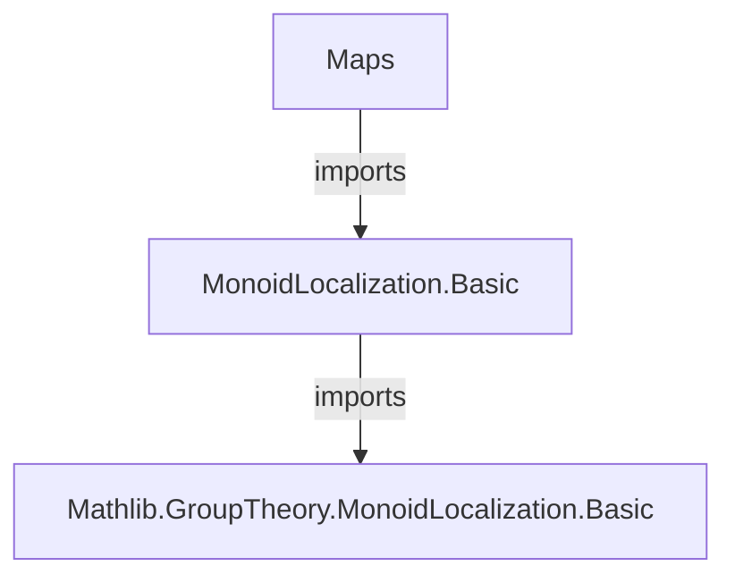

**Technical Brief: `Maps.lean` — Mapping Properties of Monoid Localizations**

---

### 1. **Key Definitions & Theorems**

| Name | Type / Signature | Purpose |
|------|------------------|---------|
| `LocalizationMap` | `class` | Encapsulates the universal property of localization: a monoid hom `f : M →* N` such that `f(S)` consists of units and satisfies the universal property. |
| `lift` | `f.lift hg : N →* P` | Induced map from localization `N` to `P`, given `g : M →* P` with `g(S) ⊆ Units P`. |
| `map` | `f.map hy k : N →* Q` | Induced map between localizations, given `g : M →* P` with `g(S) ⊆ T`, and localization maps `f : M →* N`, `k : P →* Q`. |
| `lift_mk'` | `f.lift hg (f.mk' x y) = g x * (IsUnit.liftRight … y)⁻¹` | Explicit formula for `lift` on standard generators `f.mk' x y`. |
| `lift_spec` | `f.lift hg z = v ↔ g x = g y * v` (where `z * f y = f x`) | Characterization of `lift` via the denominator representation. |
| `lift_left_inverse` | `k.lift f.map_units (f.lift k.map_units z) = z` | Shows that the induced maps between two localizations are inverses. |
| `mulEquivOfLocalizations` | `N ≃* P` | Isomorphism between two localizations of `M` at `S`. |
| `map_injective_of_injective` | `Injective g → Injective (f.map …)` | Injectivity of induced map on localizations under injective `g`. |
| `map_surjective_of_surjective` | `Surjective g → Surjective (f.map …)` | Surjectivity of induced map on localizations under surjective `g`. |
| `ofMulEquivOfDom` | `LocalizationMap T N` | Transport localization along an isomorphism of domains: if `j : P ≃* M`, `T.map j = S`, then `f ∘ j` localizes `T`. |
| `mulEquivOfMulEquiv` | `N ≃* Q` | Isomorphism of localizations induced by an isomorphism of domains matching submonoids. |
| `mulEquivOfQuotient` | `Localization S ≃* N` | Isomorphism between the quotient-type localization and any concrete localization `f : M →* N`. |

---

### 2. **Naming Conventions**

- **Prefixes**:
  - `lift_`: induced map from localization (via universal property).
  - `map_`: induced map *between* localizations (via base map `g`).
  - `ofMulEquivOf…`: constructions using isomorphisms of domains/codomains.
  - `mulEquivOf…`: isomorphisms between localizations.

- **Suffixes**:
  - `_spec`, `_spec_mul`: characterizations of `lift`/`map` in terms of representatives.
  - `_mk'`, `_mk`: behavior on standard generators `mk'` / `mk`.
  - `_left_inverse`, `_right_inv`, `_unique`: uniqueness / inverse properties.
  - `_equiv`, `_equiv_of…`: isomorphisms.

- **`map_units`**, **`isUnit_comp`**: predicates or proofs that certain elements map to units.

- **`sec`**, **`sec_spec`**, **`sec_spec'`**: section of the localization map used to pick representatives.

---

### 3. **Tactic Stack**

Frequent tactics used in proofs:

- `rw`, `simp_rw`, `simp`: rewriting using definitions, especially `mk'_spec`, `sec_spec`, `lift_apply`, `map_mk'`.
- `exact`, `refine`, `apply`: constructing proofs via universal properties.
- `obtain ⟨…⟩`, `rintro ⟨…⟩`: destructuring existential or conjunction hypotheses.
- `ext`: extensionality for functions/homomorphisms.
- `mul_inv_left`, `mul_inv_right`, `mul_assoc`, `mul_comm`: monoid arithmetic.
- `congr_arg`, `DFunLike.ext`, `MonoidHom.ext`: equality of functions/homs.
- `aesop`, `ac_rfl`: automated simplification and rewriting for commutative monoids.
- `change`, `dsimp`: simplifying goal or hypotheses for readability.

---

### 4. **Proof Logic**

The logical flow in most proofs follows this pattern:

1. **Represent elements** in the localization using `mk' x y` or `sec z`.
2. **Reduce to base monoid** using `lift_mk'`, `lift_spec`, or `map_mk'`.
3. **Apply properties of units** (`IsUnit.liftRight`, `map_units`, `isUnit_comp`) to handle inverses.
4. **Use universal property** (`eq_iff_exists`, `lift_unique`, `lift_of_comp`) to lift equalities or uniqueness.
5. **Leverage surjectivity/injectivity** of `g` or `k` to lift properties to localizations.
6. **Construct isomorphisms** via `lift_left_inverse` + `lift_right_inverse`, or via `mulEquivOfLocalizations`.

Induction is rarely needed; proofs are mostly *algebraic* and *representative-based*, relying on the universal property and concrete formulas.

---

### 5. **Imports**

- `Mathlib.GroupTheory.MonoidLocalization.Basic`: core definitions and basic properties of monoid localization.

This file builds on that foundation to develop mapping properties (lift, map, equivalences), crucial for later developments (e.g., Grothendieck groups, localization of rings/modules).

---

### 6. **Mermaid Diagrams**

#### **Dependency Graph (Module Level)**



#### **Theory Overview (Localizations & Maps)**

```mermaid
graph TD
  M[CommMonoid M] -->|S ≤ M| S[Submonoid S]
  M -->|f| N[N = M[S⁻¹]]
  M -->|g| P[P]
  g -->|g(S) ⊆ Units P| lift[lift : N →* P]
  M -->|g| P -->|T ≤ P| T[Submonoid T]
  P -->|k| Q[Q = P[T⁻¹]]
  g -->|g(S) ⊆ T| map[map : N →* Q]
  N -->|lift k.map_units| P
  P -->|lift f.map_units| N
  lift & map -->|universal| Eq[Equalities via representatives]
  N ≃* P <-->|mulEquivOfLocalizations| f k
  M ≃* P <-->|mulEquivOfMulEquiv| N ≃* Q
```

#### **Key Construction Pipeline**

```mermaid
graph LR
  f[M →* N] -->|g : M →* P, g(S) ⊆ Units P| lift[N →* P]
  f[M →* N] -->|g : M →* P, g(S) ⊆ T| map[N →* Q]
  f[M →* N] & k[M →* P] -->|both localize S| equiv[N ≃* P]
  j[M ≃* P] & S.map j = T -->|transport| equivDom[N ≃* Q]
  quotient[Localization S] -->|mulEquivOfQuotient| f[N]
```

---

### 7. **Summary**

This file formalizes the *mapping properties* of monoid localizations in Lean 4, establishing:

- The existence and uniqueness of induced maps (`lift`, `map`).
- Their behavior on standard generators (`mk'`).
- Equivalence of different localizations (`mulEquivOfLocalizations`).
- Preservation of injectivity/surjectivity under localization.
- Transport of localization along domain isomorphisms (`ofMulEquivOfDom`, `ofMulEquivOfLocalizations`).
- Identification of the quotient-type localization with any concrete localization (`mulEquivOfQuotient`).

It serves as a foundational module for further algebraic constructions (e.g., Grothendieck groups, localization of rings, sheaf theory).
