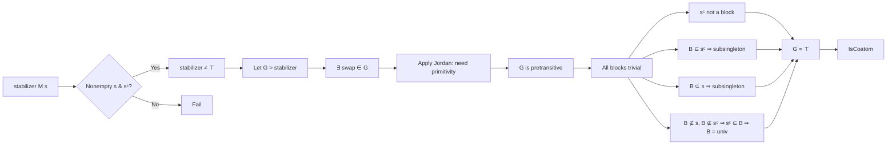

**Technical Brief: Maximal Subgroups of Symmetric Groups (`MaximalSubGroups.lean`)**  
*Domain: Group Theory / Permutation Groups*  
*Formalization Language: Lean 4 (Mathlib)*  
*Author: Antoine Chambert-Loir (2025)*  
*License: Apache 2.0*

---

### 1. KEY DEFINITIONS & THEOREMS

| Name | Type / Signature | Purpose |
|------|------------------|---------|
| `stabilizer M s` | `Subgroup M` | Stabilizer subgroup of a subset `s : Set α` under a mul-action `M ↷ α`. |
| `isPreprimitive M s` | `Prop` | Action of `M` on `s` is *preprimitive*: every block of imprimitivity is trivial (singleton or `s`). |
| `isPretransitive M α` | `Prop` | Action is *pretransitive*: for any `a ∈ s`, `b ∈ sᶜ`, there exists `g ∈ M` with `g • a = b`. |
| `IsBlock M B` | `Prop` | `B ⊆ α` is a *block of imprimitivity* for `M`: for all `g ∈ M`, `g • B = B` or `g • B ∩ B = ∅`. |
| `IsCoatom H` | `Prop` | `H ≤ G` is a *coatom* (maximal proper subgroup): `H < ⊤` and for all `K`, `H < K ≤ ⊤ ⇒ K = ⊤`. |
| `stabilizer.surjective_toPerm s` | `Function.Surjective (stabilizer (Perm α) s → Perm s)` | The stabilizer of `s` surjects onto `Perm s` via restriction. |
| `isCoatom_stabilizer` | `s.Nonempty → sᶜ.Nonempty → Nat.card α ≠ 2 * s.ncard → IsCoatom (stabilizer (Perm α) s)` | **Main theorem**: Stabilizer of `s` is maximal in `Perm α` in the *intransitive case* (i.e., when `s` and `sᶜ` are nonempty and not equal size). |
| `has_swap_mem_of_lt_stabilizer` | `stabilizer (Perm α) s < G ⇒ ∃ g, g.IsSwap ∧ g ∈ G` | Any strict overgroup of a stabilizer contains a transposition (swap). |
| `subgroup_eq_top_of_isPreprimitive_of_isSwap_mem` | *(implicit, from Jordan)* | If a subgroup acts primitively and contains a swap, it is the full symmetric group. |

---

### 2. NAMING CONVENTIONS

- **Prefixes**:
  - `is_`: Predicate properties (`isPreprimitive`, `isPretransitive`, `isCoatom`, `isBlock`)
  - `mem_`: Membership criteria (`mem_stabilizer_iff`, `mem_fixingSubgroup_iff`)
  - `of_`: Construction from structure (`ofSubtype`, `of_partition`, `of_fixingSubgroup`)
  - `subsingleton_of_`, `compl_subset_of_`: Implication lemmas for structural constraints.

- **Suffixes**:
  - `_stabilizer`: Relating to stabilizer subgroups.
  - `_of_`: Hypothesis-driven variants (`_of_ncard_lt_ncard_compl`, `_of_nonempty_of_nonempty_compl`).
  - `_le`, `_lt`: Subgroup inclusion direction (`hG.le`, `hG'`).

- **Notable patterns**:
  - `stabilizer_compl`: `stabilizer sᶜ = stabilizer s` (up to conjugacy).
  - `smul_mem_smul_set`, `Set.mem_smul_set`: Action on subsets.
  - `ofFixingSubgroup M s`: The type of points fixed by `s`, used for induced actions.

---

### 3. TACTIC STACK

| Tactic | Frequency | Role |
|--------|-----------|------|
| `aesop` | High | Automated reasoning for set membership, subset, and basic group equalities. |
| `simp_rw` | Medium | Simplification with rewrite rules (e.g., `mem_smul_set`, `ofSubtype_apply_of_mem`). |
| `rw` | High | Rewriting definitions (`mem_stabilizer_iff`, `stabilizer_compl`, `eq_top_iff`). |
| `cases` | Medium | Structural case analysis (`lt_or_ge`, `eq_bot_or_eq_top_of_prime_card`). |
| `intro`, `exact`, `apply` | High | Standard proof construction. |
| `grind` | Medium | Goal-driven simplification (used in `compl_subset_of_...`). |
| `norm_num`, `lia` | Low | Arithmetic normalization and linear integer arithmetic. |
| `convert`, `congr'` | Low | Equality chaining and congruence closure. |

---

### 4. PROOF LOGIC

**General proof strategy** (for `isCoatom_stabilizer`):

1. **Nontriviality**: Show `stabilizer M s ≠ ⊤` using existence of a swap moving an element of `s` to `sᶜ`.
2. **Maximality**: Let `G` be a strict overgroup (`stabilizer < G`). Show `G = ⊤`.
   - Use `has_swap_mem_of_lt_stabilizer` to get a swap `g ∈ G`.
   - Apply *Jordan’s theorem*: if `G` acts primitively and contains a swap, then `G = ⊤`.
3. **Primitivity of `G`**:
   - Show `G` is *pretransitive* via `isPretransitive_of_partition`.
   - Show all blocks of `G` are trivial:
     - **Step 1**: `sᶜ` is not a block (uses `s.ncard < sᶜ.ncard`).
     - **Step 2**: Any block `B ⊆ sᶜ` is a subsingleton (via `subsingleton_of_ssubset_of_stabilizer_Perm_le`).
     - **Step 3**: Any block `B ⊆ s` is a subsingleton (via `subsingleton_of_stabilizer_lt_of_subset`).
     - **Step 4**: For a non-subsingleton block `B`, show `sᶜ ⊆ B` (via `compl_subset_of_stabilizer_le_of_not_subset_of_not_subset_compl`), then deduce `B = univ` by cardinality.

**Inductive/structural pattern**:
- Most proofs proceed by *case analysis* on cardinalities (`lt`, `eq`, `gt`), then use:
  - `stabilizer_compl` symmetry,
  - `swap` elements to generate transpositions,
  - block-theoretic lemmas (`IsBlock`, `IsTrivialBlock`, `IsPreprimitive`).

---

### 5. IMPORTS & DEPENDENCIES

| Module | Role |
|--------|------|
| `Mathlib.GroupTheory.GroupAction.Jordan` | Jordan’s theorem: primitive + swap ⇒ full symmetric group. |
| `Mathlib.GroupTheory.SpecificGroups.Cyclic` | Basic facts about cyclic groups, used for `Perm α` structure. |
| `Mathlib.GroupTheory.Subgroup.Simple` | Simplicity lemmas, e.g., `eq_bot_or_eq_top_of_prime_card`. |
| `Mathlib.GroupTheory.GroupAction.SubMulAction.OfFixingSubgroup` | Construction of induced action on fixed-point types (`ofFixingSubgroup`). |

**Core dependencies**:
- `MulAction`, `Subgroup`, `Equiv.Perm`, `Set`, `Finite`, `Fintype`, `ENat`.

---

### 6. MERMAID DIAGRAMS

#### Dependency Graph (Top-Level)

```mermaid
graph TD
  A[MaximalSubGroups.lean] --> B[Mathlib.GroupTheory.GroupAction.Jordan]
  A --> C[Mathlib.GroupTheory.SpecificGroups.Cyclic]
  A --> D[Mathlib.GroupTheory.Subgroup.Simple]
  A --> E[Mathlib.GroupTheory.GroupAction.SubMulAction.OfFixingSubgroup]

  B --> F[Jordan's Theorem]
  C --> G[Perm α ≅ C_n?]
  D --> H[Prime-card subgroup simplicity]
  E --> I[FixingSubgroup Action]

  A --> J[O'Nan-Scott Classification]
  J --> K[Intransitive case (this file)]
  J --> L[Imprimitive case (TODO)]
  J --> M[Primitive case (TODO)]
```

#### Overview of `isCoatom_stabilizer` Proof Flow



---

### 7. CONTEXTUAL THEORY

- **O’Nan–Scott classification**: Classifies maximal subgroups of finite symmetric/alternating groups into 8 types. This file formalizes the **intransitive case** (stabilizers of proper nonempty subsets).
- **Jordan’s theorem**: A cornerstone of permutation group theory — used here to lift from primitive action + a transposition to full symmetric group.
- **Blocks of imprimitivity**: Central to primitivity; used to rule out intermediate subgroups.
- **Cardinality constraints**: The condition `Nat.card α ≠ 2 * s.ncard` excludes the *imprimitive* case where `s` and `sᶜ` have equal size (wreath product structure).

---

### 8. TODO & EXTENSIONS

- Formalize the **imprimitive case** (stabilizers of partitions, wreath products).
- Formalize the **primitive but imprimitive** cases (affine, diagonal, almost simple).
- Applications to:
  - **Primitive actions on combinations**: e.g., `Finset α` or `α × α`.
  - **Jordan groups** and simplicity of alternating groups.

---

*End of Technical Brief.*
