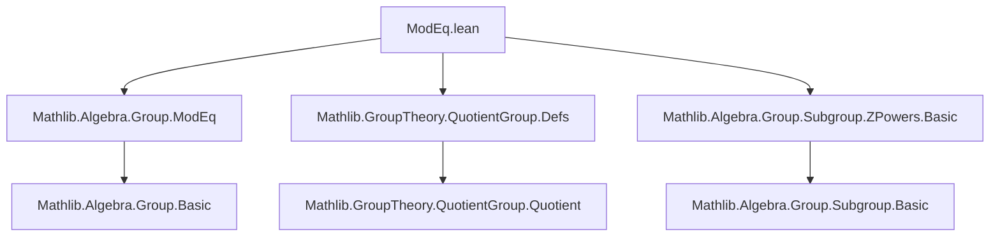

### Technical Brief: `ModEq.lean`

---

#### **1. Key Definitions & Theorems**

| Name | Type / Signature | Purpose |
|------|------------------|---------|
| `modEq_iff_eq_mod_zmultiples` | `a ≡ b [PMOD p] ↔ (a : G ⧸ AddSubgroup.zmultiples p) = b` | Establishes equivalence between congruence modulo `p` (via `PMOD`) and equality of cosets in the quotient group `G ⧸ ⟨p⟩_ℤ`. |
| `not_modEq_iff_ne_mod_zmultiples` | `¬a ≡ b [PMOD p] ↔ (a : G ⧸ AddSubgroup.zmultiples p) ≠ b` | Logical negation of the above; characterizes non-congruence as inequality of cosets. |

- **`a ≡ b [PMOD p]`**: Standard congruence relation in additive notation: $ a - b \in \mathbb{Z} \cdot p $, i.e., $ a - b = n \cdot p $ for some $ n \in \mathbb{Z} $.
- **`AddSubgroup.zmultiples p`**: The additive subgroup generated by $ p $, i.e., $ \{ n \cdot p \mid n \in \mathbb{Z} \} $.
- **`G ⧸ AddSubgroup.zmultiples p`**: Quotient additive group of cosets modulo the cyclic subgroup generated by $ p $.

---

#### **2. Naming Conventions**

- **Prefixes**:
  - `modEq_`: Relates to congruence modulo a multiple (`PMOD`).
  - `eq_mod_`: Relates to equality in a quotient modulo a subgroup.
- **Suffixes**:
  - `_iff_eq_`: Biconditional linking a congruence relation to equality in a quotient.
  - `_iff_ne_`: Biconditional linking negated congruence to inequality in a quotient.

---

#### **3. Tactic Stack**

The proof uses a compact chain of rewrites and simplifications:

- `rw [modEq_comm]`: Commutativity of congruence (to align left-hand side).
- `simp_rw [...]`: A sequence of rewrites and simplifications:
  - `modEq_iff_eq_add_zsmul`: Converts `a ≡ b [PMOD p]` to $ \exists n, a = b + n \cdot p $.
  - `QuotientAddGroup.eq_iff_sub_mem`: Equality in quotient $ a + H = b + H \iff a - b \in H $.
  - `AddSubgroup.mem_zmultiples_iff`: Membership in cyclic subgroup: $ a - b \in \mathbb{Z} \cdot p \iff \exists n, a - b = n \cdot p $.
  - `eq_sub_iff_add_eq'`: Rewrites $ a = b + n \cdot p \iff a - b = n \cdot p $.
  - `eq_comm`: Commutativity of equality (final normalization).

No induction or case analysis is needed — the proof is purely equational/simplificational.

---

#### **4. Proof Logic**

- **Strategy**: Direct equivalence via rewriting using known characterizations:
  1. Start from congruence definition (`modEq_comm`).
  2. Unfold `modEq` as existence of integer multiple (`modEq_iff_eq_add_zsmul`).
  3. Translate existence condition into subgroup membership (`mem_zmultiples_iff`).
  4. Translate subgroup membership into coset equality (`QuotientAddGroup.eq_iff_sub_mem`).
- **No induction or recursion** — purely algebraic reasoning in an `AddCommGroup`.

---

#### **5. Imports & Dependencies**

| Import | Role |
|--------|------|
| `Mathlib.Algebra.Group.ModEq` | Defines `PMOD`, `modEq`, and basic properties. |
| `Mathlib.GroupTheory.QuotientGroup.Defs` | Defines quotient groups and coset equality. |
| `Mathlib.Algebra.Group.Subgroup.ZPowers.Basic` | Defines `AddSubgroup.zmultiples`, the cyclic subgroup generated by an element. |

These imports collectively provide the algebraic infrastructure for congruence, cyclic subgroups, and quotient groups in additive notation.

---

#### **6. Mermaid Diagrams**

##### **Dependency Graph (Module-Level)**



##### **Conceptual Overview (Theory Flow)**

```mermaid
flowchart LR
  subgraph Definitions
    A[AddCommGroup G]
    B[p ∈ G]
    C[AddSubgroup.zmultiples p]
    D[G ⧸ C]
  end

  subgraph Relations
    E[a ≡ b [PMOD p]]
    F[(a : D) = (b : D)]
  end

  E <-->|modEq_iff_eq_mod_zmultiples| F
```

- **Interpretation**: Congruence modulo $ p $ (left) corresponds exactly to equality of cosets in the quotient by the cyclic subgroup generated by $ p $ (right).

---

#### **7. Summary**

This file formalizes a foundational bridge between *elementary congruence* (`PMOD`) and *quotient group structure* in additive commutative groups. It shows that congruence modulo a multiple is precisely equality in the quotient by the cyclic subgroup generated by that multiple — a key insight for lifting congruence reasoning into categorical or homological contexts (e.g., exact sequences, cohomology). The proof is elegant and fully automated via `simp_rw`, reflecting Lean’s strength in algebraic formalization.
