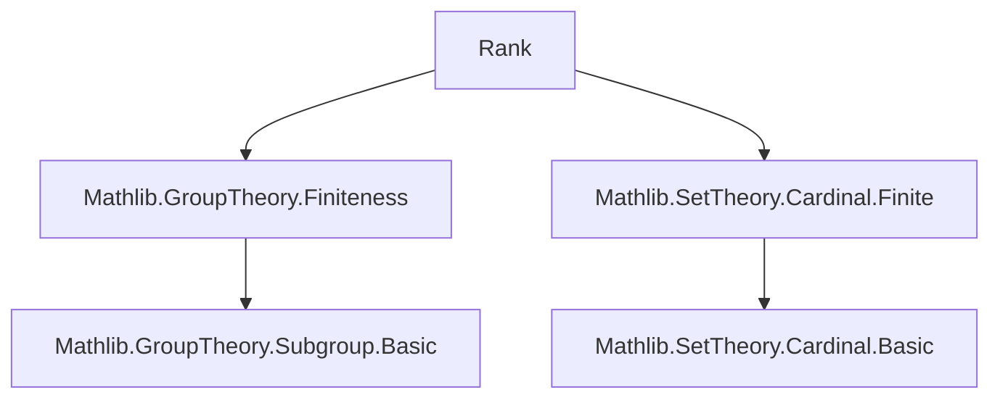

**Technical Brief: `Rank.lean` — Rank of a Group**

---

### 1. **Key Definitions & Theorems**

| Name | Type / Signature | Purpose |
|------|------------------|---------|
| `rank` | `[FG G] → ℕ` | Minimum size of a generating set for a *finitely generated* group `G`. Defined via `Nat.find` on the predicate “there exists a generating set of size `n`”. |
| `rank_spec` | `[FG G] → ∃ S : Finset G, S.card = rank G ∧ closure S = ⊤` | Guarantees existence of a minimal generating set achieving the rank. |
| `rank_le` | `[FG G] → {S : Finset G} → closure S = ⊤ → rank G ≤ S.card` | Minimality: any generating set has size ≥ `rank G`. |
| `rank_le_of_surjective` | `[FG G] [FG H] → (f : G →* H) → Surjective f → rank H ≤ rank G` | Monotonicity under surjective homomorphisms. |
| `rank_range_le` | `[FG G] → (f : G →* H) → rank f.range ≤ rank G` | Special case of above for the range of a homomorphism. |
| `rank_congr` (Group) | `[FG G] [FG H] → G ≃* H → rank G = rank H` | Invariance under group isomorphism. |
| `rank_congr` (Subgroup) | `H = K → rank H = rank K` | Equality of subgroups implies equal ranks. |
| `rank_closure_finset_le_card` | `(s : Finset G) → rank (closure s) ≤ s.card` | Rank of a subgroup generated by a finite set is ≤ its cardinality. |
| `rank_closure_finite_le_nat_card` | `[Finite s] → rank (closure s) ≤ Nat.card s` | Extension to arbitrary finite subsets via `Nat.card`. |
| `nat_card_centralizer_nat_card_stabilizer` | `(g : G) → Nat.card (centralizer {g}) = Nat.card (stabilizer g)` | Equality of centralizer and stabilizer sizes under conjugation action. |

---

### 2. **Naming Conventions**

- **Prefixes**:
  - `rank_`: all lemmas/defs about the rank function.
  - `nat_card_`: cardinality of finite types/sets (e.g., `nat_card_centralizer_...`).
- **Suffixes**:
  - `_le`: inequality direction (≤) in rank comparisons.
  - `_spec`: existence of a minimal witness.
  - `_congr`: invariance under equivalence/isomorphism.
  - `_closure_...`: statements about subgroups generated by sets.
- **To-additive annotations**: All group-theoretic lemmas have `to_additive` attributes, indicating additive group analogues are expected (e.g., `add_rank`).

---

### 3. **Tactic Stack**

- `classical`: used to enable classical choice for `Nat.find`.
- `rw`, `subst`, `rfl`: basic rewriting and reflexivity.
- `apply`, `trans`: for chaining inequalities and implications.
- `have`, `suffices`: intermediate proof steps.
- `Finset.card_image_le.trans_eq`: arithmetic reasoning about finite set sizes.
- `closure_preimage_eq_top`, `MonoidHom.map_closure`, `Subgroup.map_top_of_surjective`: algebraic simplifications.
- `congr_arg`: for converting equalities of sets to equalities of subgroups.

No heavy automation (e.g., `aesop`, `linarith`, `ring`) is used—proofs are mostly direct algebraic manipulation.

---

### 4. **Proof Logic**

- **Definition**: `rank G` is defined via Hilbert’s epsilon (`Nat.find`) on the predicate “there exists a generating set of size `n`”, using decidability from `FG G` (finitely generated).
- **Existence & minimality**: `rank_spec` and `rank_le` follow directly from properties of `Nat.find`.
- **Monotonicity**: For `f : G ↠ H`, lift a minimal generating set of `G`, map it via `f`, and use surjectivity to show its image generates `H`.
- **Isomorphism invariance**: Apply monotonicity in both directions via `f` and `f⁻¹`.
- **Closure bounds**: Construct a preimage finite set in the subgroup and bound its size using injectivity of the inclusion map.

Induction is *not* used—proofs rely on set-theoretic constructions and universal properties of subgroups.

---

### 5. **Imports & Dependencies**

- `Mathlib.GroupTheory.Finiteness`: Provides `FG` (finitely generated) class and related lemmas.
- `Mathlib.SetTheory.Cardinal.Finite`: Supplies `Finite`, `Fintype`, `Nat.card`, and conversions between finite sets and types.

These imports define the foundational finiteness conditions and cardinal arithmetic needed for rank.

---

### 6. **Mermaid Diagrams**

#### **Dependency Graph (Module-Level)**



#### **Overview of File Structure**

```mermaid
flowchart LR
  A[rank def] --> B[rank_spec]
  A --> C[rank_le]
  B & C --> D[rank_le_of_surjective]
  D --> E[rank_range_le]
  D --> F[rank_congr (Group)]
  G[Subgroup.rank_congr] --> H[rank_closure_finset_le_card]
  H --> I[rank_closure_finite_le_nat_card]
  J[nat_card_centralizer...] --> K[centralizer = stabilizer]
```

#### **Theoretical Context**

- **Place in Theory**: This file sits in the hierarchy between basic group theory (`Subgroup`, `Hom`) and more advanced structural results (e.g., Burnside’s problem, residual finiteness).
- **Related Concepts**:
  - `erank` (future extension): rank for arbitrary groups (possibly infinite).
  - `diameter`, `generating_set`: related combinatorial invariants.
  - `class_number`, `composition_series_length`: alternative “size” measures.

---

### 7. **Open Questions / TODOs (from file)**

- Extend `rank` to non-finitely generated groups via:
  - `erank G : ℕ∞` (extended naturals), or
  - `rank G : Cardinal` (full cardinal-valued version).
- Develop calculus of `rank` under extensions, products, and quotients (not yet covered).

--- 

Let me know if you'd like formalization suggestions for the TODO items or a formal proof outline for `rank_le_of_surjective`.
