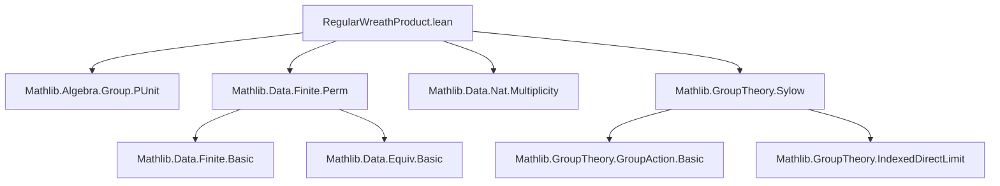

### Technical Brief: `RegularWreathProduct.lean`

---

#### **1. Key Definitions & Theorems**

| Name | Type / Signature | Purpose |
|------|------------------|---------|
| `RegularWreathProduct D Q` | `Type*` (with `[Group D] [Group Q]`) | Underlying type of the regular wreath product: pairs `(left : Q → D, right : Q)` |
| `D ≀ᵣ Q` | Notation for `RegularWreathProduct D Q` | Shorthand for the regular wreath product |
| `instance : Group (D ≀ᵣ Q)` | `Group` instance | Defines group structure via `⟨a₁ * (x ↦ b₁(a₂⁻¹ * x)), a₂ * b₂⟩` |
| `rightHom : D ≀ᵣ Q →* Q` | Group homomorphism | Projection onto the second component (`right`) |
| `inl : Q →* D ≀ᵣ Q` | Group homomorphism | Embedding `q ↦ ⟨1, q⟩` |
| `toPerm D Q Λ` | `D ≀ᵣ Q →* Equiv.Perm (Λ × Q)` | Permutation representation induced by `MulAction D Λ` |
| `IteratedWreathProduct G n` | `Type u` | Iterated wreath product of `G`, `n` times: `PUnit` if `n = 0`, else `(G ≀ᵣ G ≀ᵣ ... ≀ᵣ G)` (`n` times) |
| `iteratedWreathToPermHom G n` | `IteratedWreathProduct G n →* Equiv.Perm (Fin n → G)` | Canonical homomorphism into permutations of function space |
| `iteratedWreathToPermHomInj G n` | `Function.Injective (iteratedWreathToPermHom G n)` | Injectivity of the above map (used for embedding into Sylow) |
| `Sylow.mulEquivIteratedWreathProduct` | `P ≃* IteratedWreathProduct G n` | Isomorphism between a Sylow `p`-subgroup of `Perm α` (where `|α| = pⁿ`) and the `n`-fold iterated wreath product of a group `G` of order `p` |

---

#### **2. Naming Conventions**

- **Structure fields**: `left`, `right` — components of a wreath product element.
- **Homomorphisms**:
  - `rightHom`: projection onto `right` component.
  - `inl`: left inclusion (standard in coproduct/wreath product contexts).
  - `toPerm`: permutation representation.
  - `iteratedWreathToPermHom`: iterated version of `toPerm`.
- **Properties**:
  - `*_left`, `*_right`: lemmas about projections of operations.
  - `*_def`: definitional equalities for operations.
  - `*_eq_*`: lemmas equating composite maps to identities (e.g., `rightHom_comp_inl_eq_id`).
- **Iterated**:
  - `IteratedWreathProduct_zero`, `IteratedWreathProduct_succ`: recursive definition lemmas.
  - `card` lemmas use `geom_sum` for closed-form counting.

---

#### **3. Tactic Stack**

- **Core tactics**: `simp`, `ext`, `rw`, ` rfl`, `group`
- **Advanced/automation**:
  - `aesop` not used explicitly (manual proofs dominate).
  - `induction n with | zero | succ` for structural induction on `n`.
  - `have/haveI/have let` for intermediate constructions (e.g., `let e1 := ...`).
  - `equiv` reasoning: `equiv.trans`, `equiv.symm`, `equiv.congr`.
  - `MonoidHom.ofInjective`, `MulAction.toPermHom`, `permCongrHom` for categorical constructions.
  - `Finite.of_equiv`, `Finite.card_congr`, `Nat.card_*` for cardinality arguments.

---

#### **4. Proof Logic**

- **Group structure proofs**:  
  `mul_assoc`, `one_mul`, `mul_one`, `inv_mul_cancel` are proven by `ext` + `simp`, leveraging definitional equality of structure components.

- **Homomorphism properties**:  
  Verified by `map_one'`, `map_mul'` goals, often solved by `ext` + `simp` or `by ext <;> simp`.

- **Injectivity proofs** (e.g., `toPermInj`, `iteratedWreathToPermHomInj`):  
  Use `MulAction.toPerm_injective` or reduce to faithfulness of the action (`FaithfulSMul`) and inductive lifting.

- **Sylow isomorphism**:  
  - Construct an injective homomorphism `f` from `IteratedWreathProduct G n` into `Perm α`.
  - Show its image has correct order (via `Nat.card` calculations using `geom_sum` and factorial multiplicity).
  - Use `Sylow.ofCard` to get a Sylow subgroup `P'` equal to `range f`.
  - Conclude via `P ≃* P' ≃* IteratedWreathProduct G n`.

- **Inductive arguments**:  
  - `IteratedWreathProduct.card` and `Finite` instance use induction on `n`, with base case `n = 0` (PUnit) and step using `RegularWreathProduct.card`.

---

#### **5. Imports & Dependencies**

| Module | Purpose |
|--------|---------|
| `Mathlib.Algebra.Group.PUnit` | Provides `PUnit` as trivial group (base case for iterated wreath). |
| `Mathlib.Data.Finite.Perm` | Permutation groups, cardinality of `Perm α`, `equivFinOfCardEq`. |
| `Mathlib.Data.Nat.Multiplicity` | Used for factorial `p`-adic valuation in Sylow order computation. |
| `Mathlib.GroupTheory.Sylow` | Sylow theorems, `Sylow p G`, `Sylow.ofCard`, `P.equiv P'`. |

---

#### **6. Mermaid Diagrams**

##### **Dependency Graph (Top-Level Modules)**



##### **Overview of File Structure**

```mermaid
flowchart LR
  subgraph "Core Definitions"
    A[RegularWreathProduct D Q] --> B[Group instance]
    A --> C[rightHom : D≀ᵣQ →* Q]
    A --> D[inl : Q →* D≀ᵣQ]
    A --> E[toPerm : D≀ᵣQ →* Perm(Λ×Q)]
  end

  subgraph "Iterated Construction"
    F[IteratedWreathProduct G n] --> G[Base: n=0 → PUnit]
    F --> H[Step: n+1 → (Iterated G n) ≀ᵣ G]
    F --> I[iteratedWreathToPermHom]
    F --> J[iteratedWreathToPermHomInj]
  end

  subgraph "Sylow Application"
    K[Sylow p (Perm α)] --> L[Isomorphism to IteratedWreathProduct G n]
    L --> M[Uses: injective hom, card counting, equiv transport]
  end

  A --> F
  E --> K
```

---

#### **7. Summary**

This file formalizes the **regular wreath product** of groups, including its group structure, canonical maps, permutation representation, and cardinality. It then builds up to a major application: proving that a Sylow `p`-subgroup of `Perm(pⁿ)` is isomorphic to the `n`-fold iterated wreath product of a cyclic group of order `p`. The proofs rely heavily on inductive reasoning, faithfulness of group actions, and careful cardinal arithmetic using factorial multiplicity. The formalization is clean, modular, and follows Lean’s algebraic library conventions.
