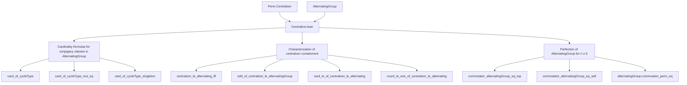
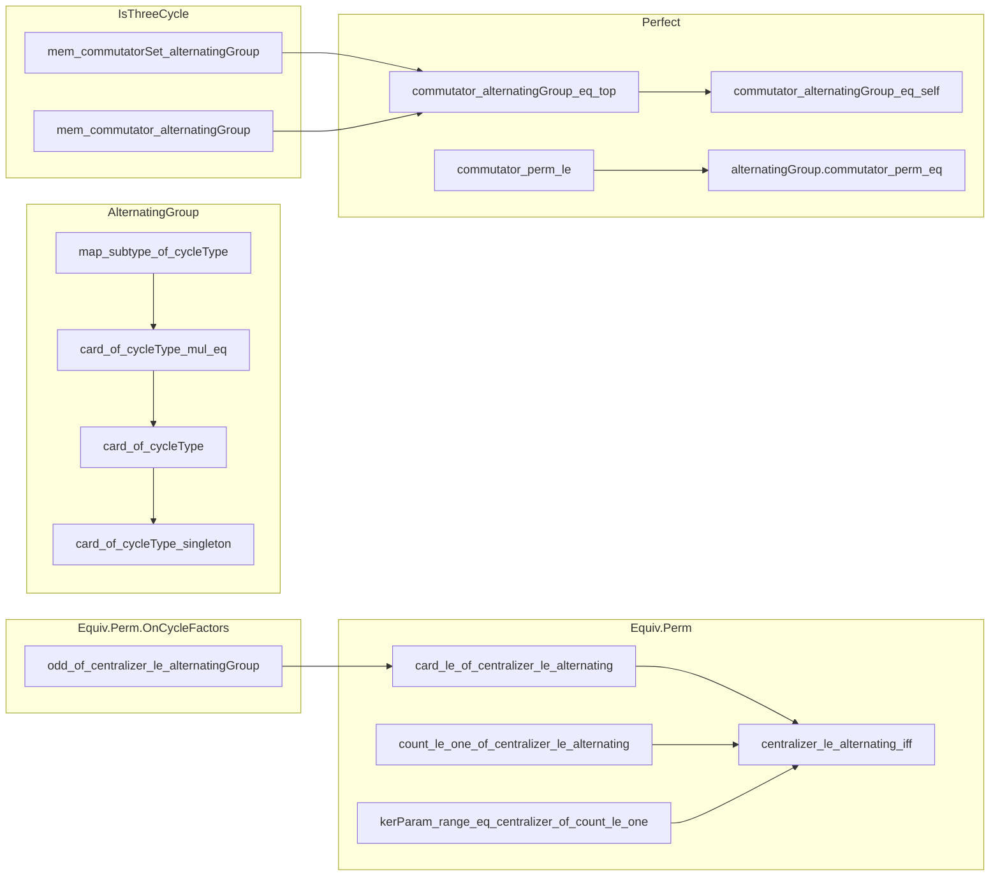

### Technical Brief: Centralizer.lean — Formalization of Centralizers in Alternating Groups

---

#### **1. Key Definitions & Theorems**

| Name | Type / Signature | Purpose |
|------|------------------|---------|
| `odd_of_centralizer_le_alternatingGroup` | `Subgroup.centralizer {g} ≤ alternatingGroup α → i ∈ g.cycleType → Odd i` | If the centralizer of `g` lies in the alternating group, then every cycle length in `g` is odd. |
| `card_le_of_centralizer_le_alternating` | `Subgroup.centralizer {g} ≤ alternatingGroup α → Fintype.card α ≤ g.cycleType.sum + 1` | Bounds the size of the domain by the sum of cycle lengths plus one (i.e., at most one fixed point). |
| `count_le_one_of_centralizer_le_alternating` | `Subgroup.centralizer {g} ≤ alternatingGroup α → ∀ i, g.cycleType.count i ≤ 1` | Ensures no repeated cycle lengths — all cycles are distinct. |
| `centralizer_le_alternating_iff` | `Subgroup.centralizer {g} ≤ alternatingGroup α ↔ (∀ c ∈ g.cycleType, Odd c) ∧ Fintype.card α ≤ g.cycleType.sum + 1 ∧ ∀ i, g.cycleType.count i ≤ 1` | Characterizes when the centralizer lies in the alternating group via three necessary and sufficient conditions. |
| `map_subtype_of_cycleType` | `({g | (g : Perm α).cycleType = m} : Finset (alternatingGroup α)).map (Embedding.subtype _) = ...` | Describes how the set of even permutations with fixed cycle type embeds into all permutations — depends on parity of `m.sum + m.card`. |
| `card_of_cycleType_mul_eq` | `#{g : alternatingGroup α | g.val.cycleType = m} * ((card α - m.sum)! * m.prod * ∏ n ∈ m.toFinset, (m.count n)!) = ...` | Relates the count of even permutations of a given cycle type to factorials and products, conditional on feasibility and parity. |
| `card_of_cycleType` | `#{g : alternatingGroup α | g.val.cycleType = m} = ...` | Explicit formula for the number of even permutations with given cycle type. |
| `card_of_cycleType_singleton` | Special case of `card_of_cycleType` for single-cycle cycle types `{n}`. |
| `kerParam_range_eq_centralizer_of_count_le_one` | Under `∀ i, g.cycleType.count i ≤ 1`, `range (kerParam g) = centralizer {g}` | Identifies the centralizer as the image of `kerParam g` when cycles are distinct. |
| `mem_commutatorSet_alternatingGroup` | `IsThreeCycle g → g ∈ commutatorSet (alternatingGroup α)` | A 3-cycle in `alternatingGroup α` (for `n ≥ 5`) lies in its own commutator subgroup. |
| `commutator_alternatingGroup_eq_top` | `5 ≤ card α → commutator (alternatingGroup α) = ⊤` | Alternating group is perfect for `n ≥ 5`. |
| `commutator_alternatingGroup_eq_self` | `5 ≤ card α → ⁅alternatingGroup α, alternatingGroup α⁆ = alternatingGroup α` | Same as above, using commutator subgroup notation. |
| `alternatingGroup.commutator_perm_eq` | `5 ≤ card α → commutator (Perm α) = alternatingGroup α` | The commutator subgroup of the full symmetric group is exactly the alternating group. |

---

#### **2. Naming Conventions**

- **Prefixes:**
  - `odd_`, `card_`, `count_`, `centralizer_`, `cycleType_`, `commutator_`, `kerParam_`, `map_subtype_`, `isThreeCycle_`
- **Suffixes:**
  - `_le_alternating`, `_le_alternatingGroup`, `_iff`, `_eq_top`, `_eq_self`, `_singleton`, `_mul_eq`
- **Structure:**
  - Predicates often prefixed with `is_`, `odd_`, `even_`, `count_`, `card_`
  - Theorems about centralizers use `centralizer_...`
  - Cycle-type-related results use `cycleType_...`
  - Results about parity use `odd_`, `even_`, `sign_`

---

#### **3. Tactic Stack**

Frequently used tactics in this file:

| Tactic | Usage |
|--------|-------|
| `rw` | Rewriting definitions (`cycleType_def`, `mem_centralizer_singleton_iff`, `sign_of_cycleType`, etc.) |
| `simp_rw` | Simplified rewriting with `simp`-like behavior for nested structures |
| `split_ifs` | Handling `if ... then ... else ...` cases |
| `rcases` / `obtain` | Extracting structure from existential hypotheses |
| `apply` / `exact` | Applying lemmas or hypotheses directly |
| `convert` | Matching goals up to definitional equality |
| `rwa` | `rw` + `assumption` |
| `by_contra!` | Proof by contradiction with `not` simplification |
| `aesop` / `lia` | Linear arithmetic and automated reasoning |
| `ext` | Extensionality for sets/functions/subtypes |
| `rfl` | Reflexivity for definitional equalities |
| `simp only [...]` | Fine-grained simplification with explicit lemmas |
| `rw [pow_prime_eq_one_iff]`, `rw [sign_kerParam_apply_apply]` | Domain-specific rewrites for cycle structure and sign |

---

#### **4. Proof Logic**

The logical flow across the file follows a structured progression:

1. **Cycle decomposition analysis**  
   - Start with `odd_of_centralizer_le_alternatingGroup`: derive parity constraints on cycle lengths from centralizer containment.

2. **Cardinality and support constraints**  
   - Use fixed points and support size to bound domain size (`card_le_of_centralizer_le_alternating`) and enforce uniqueness of cycle lengths (`count_le_one_of_centralizer_le_alternating`).

3. **Characterization**  
   - Combine previous lemmas into `centralizer_le_alternating_iff`, establishing equivalence of three structural conditions.

4. **Counting even permutations**  
   - Use `map_subtype_of_cycleType` to relate sets of permutations with fixed cycle type in `Perm α` and `alternatingGroup α`.  
   - Derive formulas for `card_of_cycleType` and `card_of_cycleType_mul_eq` using known counts in `Perm α`.

5. **Special cases and applications**  
   - Single-cycle case (`card_of_cycleType_singleton`) and 3-cycles (`IsThreeCycle` lemmas) used to prove perfection.

6. **Perfection of alternating groups**  
   - Show that 3-cycles lie in the commutator subgroup (via conjugacy and squaring), then use closure to deduce `commutator = ⊤`.

7. **Commutator subgroup of `Perm α`**  
   - Conclude `commutator (Perm α) = alternatingGroup α` for `n ≥ 5`.

---

#### **5. Imports & Dependencies**

| Module | Purpose |
|--------|---------|
| `Mathlib.GroupTheory.Perm.Centralizer` | Core definitions: `centralizer`, `cycleType`, `cycleFactorsFinset`, `kerParam`, `OnCycleFactors` |
| `Mathlib.GroupTheory.SpecificGroups.Alternating` | Definitions of `alternatingGroup`, `sign`, `IsThreeCycle`, `commutator`, `commutatorSet` |
| `Mathlib.Data.Finset.Basic`, `Multiset`, `Function`, `Equiv.Perm` | Supporting infrastructure for finite sets, multisets, permutations |
| `Mathlib.GroupTheory.Subgroup.Basic`, `Closure`, `Commutator` | Subgroup operations, closure, commutator subgroup theory |
| `Mathlib.Data.Int.Basic`, `Units`, `ZMod` | Sign homomorphism (`sign : Perm α →* ℤˣ`), parity, units |

---

#### **6. Mermaid Diagrams**

##### **Dependency Graph (High-Level)**

##### **Overview of File Structure**

---

#### **7. Summary**

This file formalizes foundational results about centralizers in alternating groups, especially focusing on when a centralizer lies entirely within the alternating group. It provides:

- A full characterization (`centralizer_le_alternating_iff`) of such permutations in terms of cycle structure (odd lengths, distinctness, at most one fixed point).
- Explicit counting formulas (`card_of_cycleType`, `card_of_cycleType_mul_eq`) for even permutations of a given cycle type.
- Applications to the structure of alternating groups, culminating in the proof that `alternatingGroup α` is perfect for `card α ≥ 5`.

The formalization leverages multiset-based cycle type theory, sign homomorphism properties, and subgroup containment arguments, with heavy use of `rw`, `simp`, and case analysis on parity and cycle structure.

--- 

Let me know if you'd like a formalized dependency graph in `.lean` format or a summary of the proof strategy for `centralizer_le_alternating_iff`.
