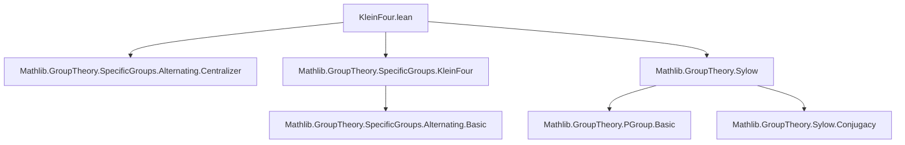

### Technical Brief: `KleinFour.lean`

---

#### **1. Key Definitions & Theorems**

| Name | Type / Signature | Purpose |
|------|------------------|---------|
| `kleinFour α` | `Subgroup (alternatingGroup α)` | Subgroup generated by elements of cycle type `{2, 2}` in `alternatingGroup α`. |
| `mem_kleinFour_of_order_two_pow` | `g ∈ alternatingGroup α → orderOf g ∣ 2^n → g.cycleType = [] ∨ g.cycleType = {2, 2}` | Characterizes elements of 2-power order in `alternatingGroup α` when `|α| = 4`. |
| `card_of_card_eq_four` | `Nat.card (alternatingGroup α) = 12` | Computes order of `alternatingGroup α` when `|α| = 4`. |
| `card_two_sylow_of_card_eq_four` | `Nat.card S = 4` for any `S : Sylow 2 (alternatingGroup α)` | Size of any 2-Sylow subgroup when `|α| = 4`. |
| `coe_two_sylow_of_card_eq_four` | `↑S = {1} ∪ {g | cycleType g = {2, 2}}` | Explicit description of elements in a 2-Sylow subgroup. |
| `two_sylow_eq_kleinFour_of_card_eq_four` | `S = kleinFour α` | Any 2-Sylow subgroup equals `kleinFour α`. |
| `subsingleton_two_sylow` | `Subsingleton (Sylow 2 (alternatingGroup α))` | Uniqueness of 2-Sylow subgroup ⇒ normality. |
| `characteristic_kleinFour` | `(kleinFour α).Characteristic` | `kleinFour α` is characteristic in `alternatingGroup α`. |
| `normal_kleinFour` | `(kleinFour α).Normal` | Immediate corollary of characteristic ⇒ normal. |
| `kleinFour_card_of_card_eq_four` | `Nat.card (kleinFour α) = 4` | Size of `kleinFour α`. |
| `exponent_kleinFour_of_card_eq_four` | `Monoid.exponent (kleinFour α) = 2` | Exponent of `kleinFour α` is 2. |
| `kleinFour_isKleinFour` | `IsKleinFour (kleinFour α)` | Confirms `kleinFour α` satisfies the definition of a Klein four group. |
| `kleinFour_eq_commutator` | `kleinFour α = commutator (alternatingGroup α)` | Identifies `kleinFour α` as the derived (commutator) subgroup. |

---

#### **2. Naming Conventions**

- **Prefixes**:
  - `kleinFour_`: for properties of the subgroup `kleinFour α`.
  - `two_sylow_`: for statements about 2-Sylow subgroups.
  - `card_`: for cardinality computations.
  - `coe_`: for coercion to underlying set.
  - `exponent_`: for monoid exponent properties.

- **Suffixes**:
  - `_of_card_eq_four`: condition `Nat.card α = 4`.
  - `_eq_`: equality results (e.g., `two_sylow_eq_kleinFour`).
  - `_is_`: classification (e.g., `kleinFour_isKleinFour`).
  - `_normal`, `_characteristic`: subgroup properties.

---

#### **3. Tactic Stack**

Frequently used tactics:
- `rw`, `simp`, `simp_rw`: for rewriting and simplification.
- `interval_cases`: for case analysis on small natural numbers.
- `decide`: for automated arithmetic verification.
- `rcases`, `obtain`, `cases'`: for destructuring existential/universal hypotheses.
- `convert`, `apply`, `exact`: for proof construction.
- `set_tac`, `set_ext`, `ext`: for set extensionality.
- `apply_fun`, `funext`, `subtype.ext`: for extensionality in function/subtype contexts.
- `have`, `suffices`, `obtain`: for intermediate lemma introduction.

---

#### **4. Proof Logic**

The logical flow is structured as follows:

1. **Element classification** (`mem_kleinFour_of_order_two_pow`):  
   For `|α| = 4`, any element of 2-power order in `alternatingGroup α` must have cycle type `()` or `{2, 2}`.

2. **Cardinality computations** (`card_of_card_eq_four`, `card_two_sylow_of_card_eq_four`):  
   Compute sizes of `alternatingGroup α` and its 2-Sylow subgroups.

3. **Set-theoretic identification** (`coe_two_sylow_of_card_eq_four`):  
   Show that any 2-Sylow subgroup consists exactly of identity and double transpositions.

4. **Equality with `kleinFour`** (`two_sylow_eq_kleinFour_of_card_eq_four`):  
   Since `kleinFour` is the closure of double transpositions (plus identity), it coincides with any 2-Sylow subgroup.

5. **Uniqueness & normality** (`subsingleton_two_sylow`, `normal_kleinFour`, `characteristic_kleinFour`):  
   All 2-Sylow subgroups are conjugate; uniqueness ⇒ normal ⇒ characteristic.

6. **Group structure** (`kleinFour_card_of_card_eq_four`, `exponent_kleinFour_of_card_eq_four`, `kleinFour_isKleinFour`):  
   Confirm group-theoretic properties of `kleinFour α`.

7. **Derived subgroup identification** (`kleinFour_eq_commutator`):  
   Use quotient size and universal property of commutator subgroup to show equality.

---

#### **5. Imports**

- `Mathlib.GroupTheory.SpecificGroups.Alternating.Centralizer`
- `Mathlib.GroupTheory.SpecificGroups.KleinFour`
- `Mathlib.GroupTheory.Sylow`

These imports provide foundational results on alternating groups, Sylow theory, and the abstract Klein four group.

---

#### **6. Mermaid Diagrams**

##### **Dependency Graph (Module-Level)**



##### **Theoretical Overview (File-Level)**

```mermaid
flowchart LR
  A[alternatingGroup α, |α|=4] --> B[2-Sylow subgroups S]
  B --> C[|S| = 4]
  C --> D[S = {1} ∪ {g | cycleType g = {2,2}}]
  D --> E[kleinFour α = S]
  E --> F[Unique 2-Sylow ⇒ normal]
  F --> G[Characteristic]
  E --> H[kleinFour α has order 4, exponent 2]
  H --> I[IsKleinFour]
  E --> J[Quotient has order 3 ⇒ derived subgroup ≤ kleinFour]
  J --> K[kleinFour = commutator]
```

---

#### **7. Summary**

This file establishes that for a finite type `α` of cardinality 4, the subgroup of `alternatingGroup α` generated by double transpositions is:
- a Klein four group,
- the unique 2-Sylow subgroup,
- characteristic (hence normal),
- and equal to the commutator subgroup.

The proof strategy leverages cycle structure analysis, Sylow theory, and group actions, culminating in structural characterizations of `A₄`. The `TODO` indicates future work to remove the `|α| = 4` assumption in `kleinFour_eq_commutator`.
