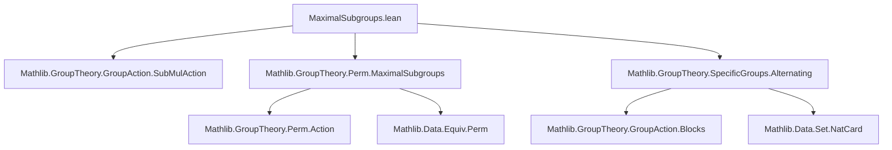
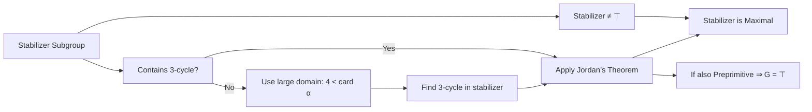
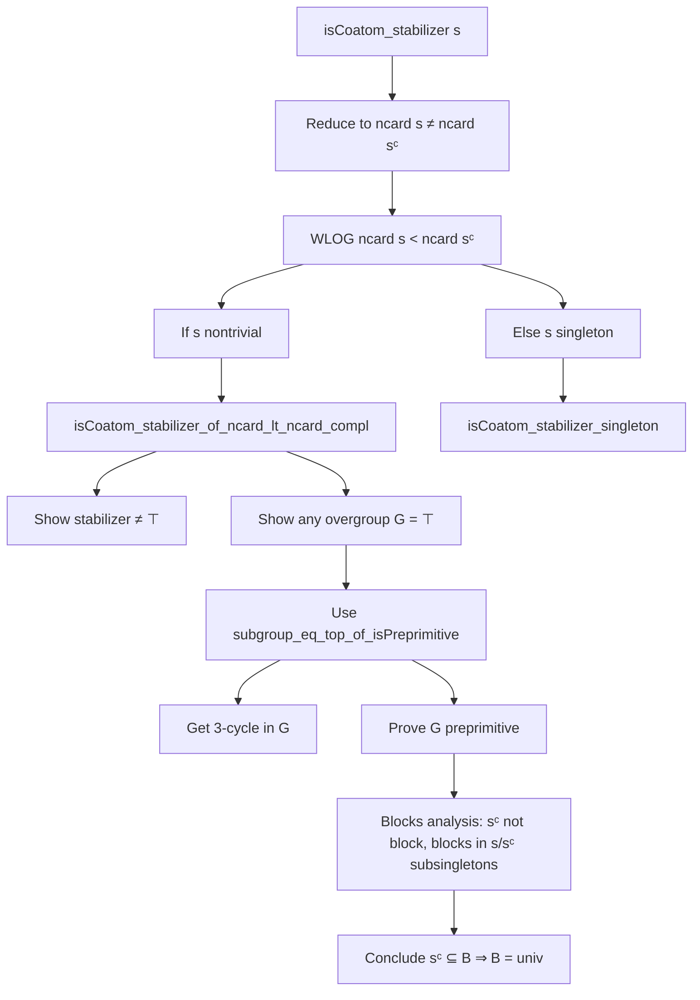

**Technical Brief: Maximal Subgroups of Alternating Groups (`MaximalSubGroups.lean`)**  
*Domain: Group Theory, Permutation Groups, Classification of Maximal Subgroups*  
*Author: Antoine Chambert-Loir (2025)*  
*License: Apache 2.0*

---

### 1. KEY DEFINITIONS & THEOREMS

| Name | Type / Signature | Purpose |
|------|------------------|---------|
| `stabilizer G s` | `Subgroup G` | Stabilizer of a set `s : Set α` under the action of `G ≤ Perm α`. |
| `alternatingGroup α` | `Subgroup (Perm α)` | The alternating group on a finite type `α`. |
| `IsCoatom H` | `Prop` | `H` is a *maximal proper subgroup*: `H ≠ ⊤` and for all `G`, `H < G ≤ ⊤` implies `G = ⊤`. |
| `IsPreprimitive G α` | `Prop` | `G ≤ Perm α` acts *pretransitively*: for any `a b : α`, there exists `g ∈ G` with `g • a = b` *or* `g • a ≠ a ∧ g • b ≠ b`. (Used as a proxy for primitivity in Jordan-type arguments.) |
| `IsBlock G B` | `Prop` | `B ⊆ α` is a *block of imprimitivity* for `G`. |
| `isCoatom_stabilizer` | `∀ s, s.Nonempty → sᶜ.Nonempty → Nat.card α ≠ 2 * ncard s → IsCoatom (stabilizer (alternatingGroup α) s)` | Main theorem: stabilizer of a nontrivial, non-full set is maximal in `alternatingGroup α`, unless the set is exactly half the domain (balanced case). |
| `isCoatom_stabilizer_of_ncard_lt_ncard_compl` | `s.Nontrivial → s.ncard < sᶜ.ncard → IsCoatom (stabilizer (alternatingGroup α) s)` | Intransitive case proof when `s` is strictly smaller than its complement. |
| `isCoatom_stabilizer_singleton` | `3 ≤ Nat.card α → s.Nonempty → s.Subsingleton → IsCoatom (stabilizer (alternatingGroup α) s)` | Handles the case where `s` is a singleton (uses `stabilizer_singleton`). |
| `subgroup_eq_top_of_isPreprimitive` | `4 < Nat.card α → G ≤ alternatingGroup α → IsPreprimitive G α → stabilizer (alternatingGroup α) s ≤ G → G = ⊤` | Jordan-type maximality criterion: containing a 3-cycle and acting primitively ⇒ full group. |
| `exists_mem_stabilizer_isThreeCycle` | `4 < Nat.card α → ∃ g ∈ stabilizer (Perm α) s, g.IsThreeCycle` | Key existence lemma: any set stabilizer in `Perm α` contains a 3-cycle when domain is large enough. |
| `stabilizer.surjective_toPerm` | `sᶜ.Nontrivial → Function.Surjective (stabilizer (alternatingGroup α) s → Perm s)` | Surjectivity of restriction map from set stabilizer in `alternatingGroup` to permutations of the set. |
| `stabilizer_isPreprimitive` | `sᶜ.Nontrivial → IsPreprimitive (stabilizer (alternatingGroup α) s) s` | Consequence of surjectivity: set stabilizer in `alternatingGroup` acts primitively on the set. |

---

### 2. NAMING CONVENTIONS

- **Prefixes**:
  - `stabilizer_`: properties of set stabilizers.
  - `isCoatom_`: maximality of subgroups.
  - `exists_mem_stabilizer_`: existence of specific group elements in stabilizers.
  - `alternatingGroup_`: results specific to `alternatingGroup`.
  - `subgroup_`: subgroup containment arguments.

- **Suffixes**:
  - `_of_ncard_lt_ncard_compl`: case where set size < complement size.
  - `_singleton`: case where set is a singleton.
  - `_isPreprimitive`: arguments using pretransitivity/primitivity.
  - `_le`: subgroup containment (`≤`).
  - `_ne_top`: showing subgroup is proper.

- **Other patterns**:
  - `stabilizer_compl`: identity `stabilizer G sᶜ = stabilizer G s`.
  - `mem_stabilizer_set_iff_subset_smul_set`, `mem_stabilizer_iff`: standard equivalence lemmas.

---

### 3. TACTIC STACK

| Tactic | Frequency | Role |
|--------|-----------|------|
| `aesop` | Very High | Automated reasoning for set membership, disjointness, permutations, and basic algebraic properties. |
| `grind` | High | Custom tactic (likely from `Mathlib.Tactic`) for grinding through arithmetic, `ncard`, and `Finset`-based inequalities. |
| `rw` | High | Rewriting using lemmas like `stabilizer_compl`, `ncard_add_ncard_compl`, `two_mul`, etc. |
| `simp` / `simp only` | High | Simplification with `mem_stabilizer`, `smul_def`, `Subgroup.mk_smul`, `perm.smul_def`, etc. |
| `obtain` / `rcases` | High | Extracting witnesses (e.g., `⟨a, b, c, …⟩`) from existential hypotheses. |
| `apply` | Medium | Applying lemmas like `alternatingGroup_le_of_isPreprimitive_of_isThreeCycle_mem`. |
| `convert` | Low | When target is definitionally close but needs small adjustments. |
| `ext` | Low | Extensionality for functions/maps. |
| `by_cases` | Medium | Splitting on `a = b`, `2 < ncard s`, etc. |
| `wlog` | Medium | “Without loss of generality” for symmetric cases (e.g., `s` vs `sᶜ`). |

---

### 4. PROOF LOGIC

**General Strategy** (for `isCoatom_stabilizer`):

1. **Reduction to cases**:
   - Use `ncard s + ncard sᶜ = Nat.card α` to reduce the inequality `Nat.card α ≠ 2 * ncard s` to `ncard s ≠ ncard sᶜ`.
   - WLOG assume `ncard s < ncard sᶜ`; else swap `s` and `sᶜ` using `stabilizer_compl`.

2. **Handle two subcases**:
   - **Nontrivial `s`**: Apply `isCoatom_stabilizer_of_ncard_lt_ncard_compl`.
   - **Singleton `s`**: Reduce to `stabilizer_singleton`, then apply `isCoatom_stabilizer_singleton`.

3. **Proof of `isCoatom_stabilizer_of_ncard_lt_ncard_compl`**:
   - Show `stabilizer ≠ ⊤` via `stabilizer_ne_top`.
   - Let `G` be a strict overgroup; aim to show `G = ⊤`.
   - Use `subgroup_eq_top_of_isPreprimitive`: need `IsPreprimitive G α`.
   - To prove pretransitivity:
     - Use `G.isPretransitive_of_stabilizer_lt` + `exists_mem_stabilizer_smul_eq` (ensures transitivity on `s`).
     - For blocks: show any nontrivial block `B` must contain `sᶜ` (via 4-step argument):
       1. `sᶜ` is *not* a block (uses `ncard s < ncard sᶜ`).
       2. Blocks inside `sᶜ` are subsingletons (via `subsantisoft_of_ssubset_compl_of_stabilizer_alternatingGroup_le`).
       3. Blocks inside `s` are subsingletons (via `stabilizer_subgroup_isPreprimitive`).
       4. Conclude `sᶜ ⊆ B` using `IsMultiplyPretransitive` (or direct combinatorial argument).
     - Then `B = univ` by cardinality.

4. **Jordan-type arguments** (in `subgroup_eq_top_of_isPreprimitive`):
   - Use `exists_mem_stabilizer_isThreeCycle` to get a 3-cycle `g ∈ G`.
   - Apply `alternatingGroup_le_of_isPreprimitive_of_isThreeCycle_mem`: if `G ≤ alternatingGroup α` contains a 3-cycle and acts primitively, then `alternatingGroup α ≤ G`.

---

### 5. IMPORTS & DEPENDENCIES

| Module | Role |
|--------|------|
| `Mathlib.GroupTheory.GroupAction.SubMulAction` | Stabilizers, blocks, pretransitivity, multiplication actions. |
| `Mathlib.GroupTheory.Perm.MaximalSubgroups` | General theory of maximal subgroups in `Perm α`; `isCoatom_stabilizer` for `Perm`. |
| `Mathlib.GroupTheory.SpecificGroups.Alternating` | Definition and basic properties of `alternatingGroup α`. |

**Key auxiliary libraries used** (via `Mathlib`):
- `Mathlib.Data.Set.NatCard` (`ncard`, `Finset` arithmetic)
- `Mathlib.Data.Equiv.Perm` (`swap`, `IsThreeCycle`, `sign`, `support`)
- `Mathlib.GroupTheory.Perm.Action` (action lemmas, `smul_def`)
- `Mathlib.GroupTheory.Subgroup.Lattice` (lattice properties, `≤`, `⊤`, `⊔`)
- `Mathlib.GroupTheory.GroupAction.Blocks` (`IsBlock`, `IsTrivialBlock`)

---

### 6. MERMAID DIAGRAMS

#### Dependency Graph (Top-Level)

#### Overview of Theoretical Flow

#### Proof Structure of `isCoatom_stabilizer`

---

### 7. CONTEXTUAL NOTES

- **O’Nan–Scott Classification**: This file formalizes the *intransitive case* (stabilizers of subsets). The *imprimitive* (wreath product) and *primitive* (almost simple) cases are future work.
- **Critical Hypothesis**: `Nat.card α ≠ 2 * ncard s` excludes the *balanced* case where `s` and `sᶜ` have equal size — in that case, the stabilizer is *not* maximal (it sits inside a wreath product `Sym(k) ≀ C₂`).
- **Jordan’s Theorem**: Central tool: a primitive subgroup of `Sym(n)` containing a 3-cycle contains `Alt(n)`.
- **`stabilizer.surjective_toPerm`**: Key for lifting permutations of `s` to elements of `alternatingGroup α` fixing `s` setwise — requires `sᶜ` nontrivial to adjust sign via a disjoint transposition.

--- 

*End of Technical Brief.*
