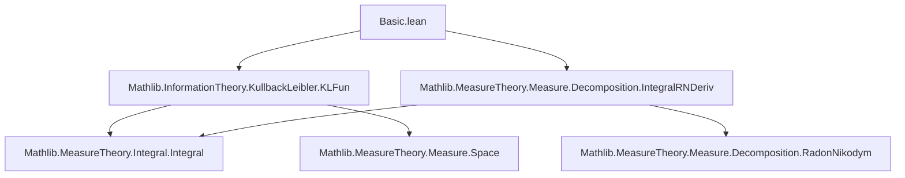
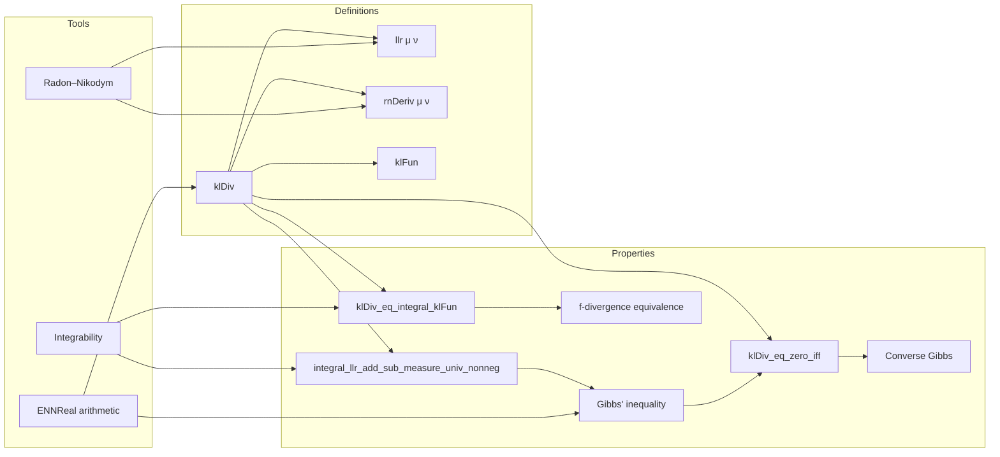

### Technical Brief: `Basic.lean` — Kullback-Leibler Divergence in Lean 4

---

#### **1. Key Definitions & Theorems**

| Name | Type / Signature | Purpose |
|------|------------------|---------|
| `klDiv` | `Measure α → Measure α → ℝ≥0∞` | Main definition: KL divergence between two measures, extended to finite measures via correction term. |
| `klDiv_of_ac_of_integrable` | `μ ≪ ν → Integrable (llr μ ν) μ → klDiv μ ν = ENNReal.ofReal (∫ llr μ ν ∂μ + ν.univ - μ.univ)` | Simplifies `klDiv` when absolute continuity and integrability hold. |
| `klDiv_self` | `[SigmaFinite μ] → klDiv μ μ = 0` | KL divergence of a measure with itself is zero. |
| `klDiv_zero_left` | `[IsFiniteMeasure ν] → klDiv 0 ν = ν.univ` | KL divergence from zero measure. |
| `klDiv_zero_right` | `[NeZero μ] → klDiv μ 0 = ∞` | KL divergence to zero measure is infinite. |
| `klDiv_eq_zero_iff` | `[IsFiniteMeasure μ] [IsFiniteMeasure ν] → klDiv μ ν = 0 ↔ μ = ν` | **Converse Gibbs’ inequality**: KL divergence zero iff measures equal. |
| `integral_llr_add_sub_measure_univ_nonneg` | `μ ≪ ν → Integrable (llr μ ν) μ → 0 ≤ ∫ llr μ ν ∂μ + ν.univ - μ.univ` | **Gibbs’ inequality**: ensures argument of `ENNReal.ofReal` is nonnegative. |
| `klDiv_eq_integral_klFun` | `[IsFiniteMeasure μ] [IsFiniteMeasure ν] → klDiv μ ν = ...` | Alternative expression using `klFun`, linking KL divergence to *f*-divergence. |
| `klDiv_eq_lintegral_klFun` | `[IsFiniteMeasure μ] [IsFiniteMeasure ν] → klDiv μ ν = ...` | Expression via *extended* (l)integral of `klFun ∘ rnDeriv`. |
| `toReal_klDiv` | `μ ≪ ν → Integrable (llr μ ν) μ → (klDiv μ ν).toReal = ...` | Relates finite KL divergence to real-valued integral. |
| `mul_log_le_toReal_klDiv` | `μ ≪ ν → Integrable (llr μ ν) μ → ... ≤ (klDiv μ ν).toReal` | Lower bound on KL divergence using log-likelihood ratio. |
| `mul_log_le_klDiv` | `[IsFiniteMeasure μ] [IsFiniteMeasure ν] → ... ≤ klDiv μ ν` | Extended version of previous inequality in `ℝ≥0∞`. |

---

#### **2. Naming Conventions**

- **Prefixes**:
  - `klDiv_`: all lemmas/defs related to KL divergence.
  - `integral_`: integrals over measures (e.g., `integral_llr_add_sub_measure_univ_nonneg`).
  - `toReal_`: conversion from `ℝ≥0∞` to `ℝ`.
  - `mul_`, `llr_`, `rnDeriv_`: specific components (log-likelihood ratio, Radon–Nikodym derivative).
- **Suffixes**:
  - `_nonneg`: nonnegativity lemmas.
  - `_iff`: characterizations as biconditionals.
  - `_eq_zero_iff`: zero-characterization lemmas.
  - `_le_`, `_ge_`: inequality lemmas.
- **Function names**:
  - `llr μ ν`: log-likelihood ratio.
  - `rnDeriv ν μ`: Radon–Nikodym derivative of `μ` w.r.t. `ν`.
  - `klFun x = x * log x + 1 - x`: convex function used in *f*-divergence representation.

---

#### **3. Tactic Stack**

Frequently used tactics in proofs:
- `rw`, `simp`, `convert`, `exact`, `refine`, `apply`
- `by_cases`, `contrapose!`, `swap`, `filter_upwards`
- `rwa`, `symm`, `rfl`, `congr`, `ext`
- `lintegral_eq_zero_iff`, `ofReal_le_ofReal`, `ae_of_all`, `aestronglyMeasurable`
- `fun_prop`, `funext`, `aesop` (likely for automation in simpler goals)
- `ring`, `linarith`, `norm_num` (for arithmetic in `ℝ`/`ℝ≥0∞`)

---

#### **4. Proof Logic**

- **Structure**:
  - Most proofs follow a *case analysis* on absolute continuity (`μ ≪ ν`) and integrability of `llr μ ν`.
  - When both hold, use `klDiv_of_ac_of_integrable` to reduce to real integrals.
  - When either fails, use `klDiv_of_not_ac` / `klDiv_of_not_integrable` to get `∞`.
- **Key reasoning patterns**:
  - Use `integral_congr_ae` to simplify integrals via a.e. equality.
  - Use `klFun_nonneg` and `convexOn_klFun` to apply Jensen-type inequalities.
  - Use `rnDeriv_eq_one_iff_eq` to deduce measure equality from KL = 0.
  - Use `lintegral_eq_zero_iff` to deduce equality of measures from zero *f*-divergence.
- **Induction**: Not used directly; relies on measure-theoretic properties (e.g., absolute continuity, Radon–Nikodym).

---

#### **5. Imports**

- `Mathlib.InformationTheory.KullbackLeibler.KLFun`: defines `klFun`, basic properties.
- `Mathlib.MeasureTheory.Measure.Decomposition.IntegralRNDeriv`: provides tools for Radon–Nikodym derivatives and integrals w.r.t. them.

---

#### **6. Mermaid Diagrams**

##### **Dependency Graph (Module-Level)**

##### **Overview of Theory Flow**

---

#### **7. Summary**

This module formalizes the **Kullback–Leibler divergence** for finite measures in Lean 4, extending the standard probabilistic definition to finite (non-probability) measures via a correction term. It establishes foundational properties:
- Nonnegativity (Gibbs’ inequality),
- Zero-characterization (converse Gibbs),
- Equivalence to *f*-divergences via `klFun`,
- Behavior under zero/identical measures.

The formalization leverages:
- Radon–Nikodym derivatives (`rnDeriv`),
- Log-likelihood ratios (`llr`),
- Convex analysis (`klFun`),
- Extended nonnegative reals (`ℝ≥0∞`) for robustness.

It is a foundational module for information-theoretic reasoning in `Mathlib`, likely used in larger projects on statistics, machine learning, and probability theory.

--- 

Let me know if you'd like a **dependency graph of lemmas**, or a **proof sketch of `klDiv_eq_zero_iff`**.
