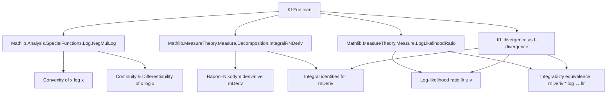

### Technical Brief: `KLFun.lean`

---

#### **1. Key Definitions & Theorems**

| Name | Type / Signature | Purpose |
|------|------------------|---------|
| `klFun` | `ℝ → ℝ`, `klFun x = x * log x + 1 - x` | Core function used to express KL divergence as an *f*-divergence. |
| `klFun_apply` | `∀ x, klFun x = x * log x + 1 - x` | Definition unfolding lemma. |
| `klFun_zero` | `klFun 0 = 1` | Evaluates `klFun` at 0 (by continuity: $0 \cdot \log 0 := 0$ in Lean). |
| `klFun_one` | `klFun 1 = 0` | Normalization condition: ensures KL divergence vanishes on equal measures. |
| `strictConvexOn_klFun` | `StrictConvexOn ℝ (Ici 0) klFun` | Strict convexity on $[0, \infty)$, key for uniqueness of minimizer. |
| `convexOn_klFun` | `ConvexOn ℝ (Ici 0) klFun` | Weaker convexity (follows from strict). |
| `continuous_klFun` | `Continuous klFun` | Ensures measurability and integrability tools apply. |
| `measurable_klFun` / `stronglyMeasurable_klFun` | `Measurable` / `StronglyMeasurable klFun` | Needed for integration w.r.t. measures. |
| `hasDerivAt_klFun` | `x ≠ 0 ⇒ HasDerivAt klFun (log x) x` | Derivative away from 0. |
| `deriv_klFun` | `deriv klFun = log` | Global derivative identity (with convention `deriv klFun 0 = 0`). |
| `isMinOn_klFun` | `IsMinOn klFun (Ici 0) 1` | Minimum at $x = 1$, value 0. |
| `klFun_nonneg` | `x ≥ 0 ⇒ klFun x ≥ 0` | Nonnegativity on $[0, \infty)$, crucial for KL nonnegativity. |
| `klFun_eq_zero_iff` | `x ≥ 0 ⇒ klFun x = 0 ↔ x = 1` | Characterizes the unique minimizer. |
| `integrable_klFun_rnDeriv_iff` | `μ ≪ ν ⇒ Integrable (klFun ∘ rnDeriv) ν ↔ Integrable (llr μ ν) μ` | Equivalence of integrability conditions for KL and log-likelihood ratio. |
| `integral_klFun_rnDeriv` | `μ ≪ ν ∧ Integrable (llr μ ν) μ ⇒ ∫ klFun(rnDeriv) dν = ∫ llr dμ + ν(1) − μ(1)` | Integral identity linking KL divergence to log-likelihood ratio. |

---

#### **2. Naming Conventions**

- **Prefixes**:
  - `klFun_`: for lemmas about the function itself (`klFun_zero`, `klFun_one`, `klFun_nonneg`, etc.).
  - `deriv`, `rightDeriv`, `leftDeriv`: for derivative-related lemmas (`deriv_klFun`, `rightDeriv_klFun_one`).
  - `hasDerivAt`, `differentiableAt`, `differentiableWithinAt`: standard analysis terminology.
  - `convexOn`, `strictConvexOn`, `concaveOn`: convex analysis terminology.
  - `tendsto_`, `isMinOn`: limit/minimization terminology.

- **Suffixes**:
  - `_apply`: definition unfolding.
  - `_iff`: equivalence statements.
  - `_iff_hypothesis`: e.g., `integrable_klFun_rnDeriv_iff` (no suffix, but pattern holds).
  - `_atTop`, `_nhdsGT_zero`, etc.: limit direction qualifiers.

- **Function names**:
  - `klFun`: short for *Kullback–Leibler function*.
  - `llr`: *log-likelihood ratio* (imported from `LogLikelihoodRatio`).
  - `rnDeriv`: *Radon–Nikodym derivative*.

---

#### **3. Tactic Stack**

Frequently used tactics in this file:

| Tactic | Usage |
|--------|-------|
| `unfold`, `rw`, `convert`, `congr` | Rewriting definitions and equalities. |
| `simp` / `simp only` | Simplifying known values (`klFun_one`, `log_zero`, etc.). |
| `ring` | Algebraic simplifications (e.g., `x * log x + 1 - x = x * (log x - 1) + 1`). |
| `exact`, `refine`, `by_cases` | Proof construction and case splits (e.g., `x = 0` vs `x ≠ 0`). |
| `fun_prop` | Propagation of continuity/measurability properties. |
| `tendsto_atTop`, `tendsto_log_atTop`, etc. | Limit arguments (e.g., `tendsto_klFun_atTop`). |
| `deriv`, `derivWithin`, `hasDerivAt` | Derivative calculus (via `hasDerivAt_klFun`, `deriv_klFun`). |
| `convexOn`, `strictConvexOn`, `isMinOn` | Convex analysis reasoning. |
| `integrable_*`, `integral_*` | Measure-theoretic reasoning (e.g., `integral_rnDeriv_smul`, `integrable_rnDeriv_mul_log_iff`). |

---

#### **4. Proof Logic**

- **Structure**:
  - **Definition**: `klFun` defined as `x * log x + 1 - x`.
  - **Elementary properties**:
    - Continuity, measurability, convexity (via `mul_log`, `convexOn_id`, etc.).
    - Derivative analysis: piecewise (`x ≠ 0`), then extended globally using `deriv` convention.
    - Minimizer at $x = 1$, nonnegativity, strict convexity ⇒ uniqueness.
  - **Measure-theoretic results**:
    - Use `integrable_rnDeriv_mul_log_iff` (from `LogLikelihoodRatio`) to relate integrability of `klFun ∘ rnDeriv` and `llr`.
    - Compute integral via linearity: split `x log x + 1 - x`, apply known lemmas:
      - `integral_rnDeriv_mul_log_iff`
      - `Measure.integral_toReal_rnDeriv`
      - `integral_rnDeriv_smul`
    - Use `integrable_add_iff_integrable_left'` to reduce to known integrability.

- **Common proof pattern**:
  - Case split on `x = 0` or `x ≠ 0`.
  - Use `hasDerivAt_klFun` to get derivative, then `deriv` lemma.
  - Use convex analysis lemmas (`isMinOn_of_rightDeriv_eq_zero`) for minimizer.
  - For integrals: decompose `klFun`, apply imported lemmas from `LogLikelihoodRatio` and `IntegralRNDeriv`.

---

#### **5. Imports**

| Module | Purpose |
|--------|---------|
| `Mathlib.Analysis.SpecialFunctions.Log.NegMulLog` | Provides `mul_log`, convexity/concavity of `x log x`, continuity, differentiability. |
| `Mathlib.MeasureTheory.Measure.Decomposition.IntegralRNDeriv` | Radon–Nikodym derivative properties, integrals involving `rnDeriv`. |
| `Mathlib.MeasureTheory.Measure.LogLikelihoodRatio` | Defines `llr μ ν`, integrability equivalence `integrable_rnDeriv_mul_log_iff`. |

---

#### **6. Mermaid Diagrams**

##### **Dependency Graph (Module-Level)**



##### **Overview of File Structure**

```mermaid
flowchart LR
  subgraph Definitions
    D1[klFun] --> D2[klFun_apply]
    D1 --> D3[klFun_zero]
    D1 --> D4[klFun_one]
  end

  subgraph Properties
    P1[Continuity] --> P2[Measurability]
    P2 --> P3[Strong measurability]
    P1 --> P4[Convexity]
    P4 --> P5[Strict convexity]
    P5 --> P6[Minimizer at 1]
    P6 --> P7[Nonnegativity]
    P7 --> P8[Zero iff x = 1]
  end

  subgraph Derivatives
    D1 --> D9[Derivative = log (x ≠ 0)]
    D9 --> D10[deriv klFun = log]
    D10 --> D11[Right/Left derivatives]
  end

  subgraph Measure Theory
    M1[Integrability equivalence] --> M2[Integral identity]
    M2 --> M3[KL = ∫ llr dμ + ν(1) − μ(1)]
  end

  D1 --> P1
  D1 --> D9
  P6 --> M1
  M1 --> M2
```

---

#### **7. Theory Context**

- **Goal**: Show that KL divergence is an *f*-divergence for `klFun`, i.e.,  
  $$
  D_{\text{KL}}(\mu \| \nu) = \int \! \mathrm{klFun}\!\left(\frac{d\mu}{d\nu}(x)\right) d\nu(x)
  $$
  for $\mu \ll \nu$, and relate it to the log-likelihood ratio.

- **Why `klFun`?** Among all functions differing by $a(x - 1)$, `klFun` is uniquely characterized by:
  - $\mathrm{klFun}(1) = 0$,
  - $\mathrm{deriv}\,\mathrm{klFun}(1) = 0$,
  ensuring KL is nonnegative and zero iff $\mu = \nu$, even for non-probability measures.

- **Broader theory**: Part of a formalization of *f*-divergences, information theory, and measure-theoretic probability in Lean.

--- 

Let me know if you'd like a formalized dependency graph for the entire `InformationTheory` namespace or a comparison with other *f*-divergence functions (e.g., `x ↦ x log x - x + 1`, `x ↦ |x - 1|`, etc.).
