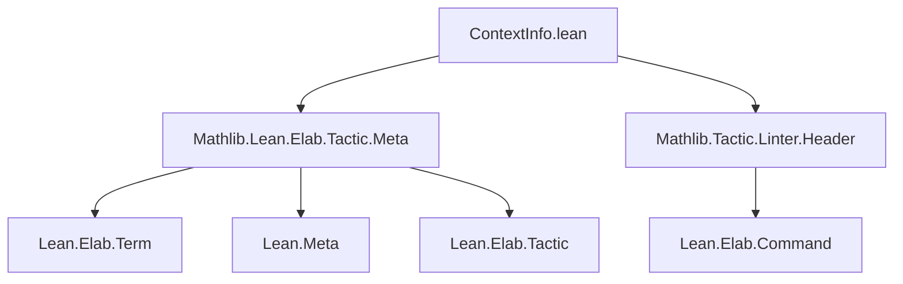

**Technical Brief: `ContextInfo.lean`**

---

### 1. KEY DEFINITIONS & THEOREMS

| Name | Type | Purpose |
|------|------|---------|
| `runCoreMWithMessages` | `ContextInfo → CoreM α → CommandElabM α` | Embeds a `CoreM` computation into `CommandElabM`, preserving and migrating logs, using `info.ngen` and `info.parentDecl?` to avoid ID collisions and support auxiliary declarations. |
| `runMetaMWithMessages` | `ContextInfo → LocalContext → MetaM α → CommandElabM α` | Embeds a `MetaM` computation into `CommandElabM`, using `runCoreMWithMessages`, and ensures local instances are visible via `Meta.withLocalInstances`. |
| `runTactic` | `ContextInfo → TacticInfo → MVarId → (MVarId → MetaM α) → CommandElabM α` | Executes a tactic *function* (not syntax) in the context of a specific goal, using fresh metavariables since the original goal is already assigned. |
| `runTacticCode` | `ContextInfo → TacticInfo → MVarId → Syntax → (Σ α, MVarId → MetaM α) → CommandElabM (List α)` | Executes tactic *syntax* (`code`) in context of a goal, with optional postprocessing (`m`), returning list of resulting goals. |

> **Note**: No theorems are proven in this file — it is purely a utility module for tactic execution in the infotree context.

---

### 2. NAMING CONVENTIONS

- **Prefix `run`**: Indicates *execution* or *embedding* of a monadic action into another context (`runCoreM`, `runMetaM`, `runTactic`, `runTacticCode`).
- **Suffix `WithMessages`**: Indicates that *logging* (messages, traces) is migrated back to the outer context.
- **`ctx`, `i`, `goal`**: Standard variable names for `ContextInfo`, `TacticInfo`, and `MVarId`, respectively.
- **`info`, `mctx`, `lctx`**: Conventions for context components (`info` = full `ContextInfo`, `mctx` = metavariable context, `lctx` = local context).

---

### 3. TACTIC STACK

- `do`-notation (monadic sequencing)
- `let`-bindings with destructuring
- `panic!` (for runtime assertions)
- `mapM` (for mapping over lists)
- `getD` (default value for `Option`)
- `filterMap id` (to extract non-`none` local instances)
- `toIO` (to lift `CoreM` to `IO`)
- `withOptions`, `withLocalInstances`, `liftTermElabM`, `modify`, `read`, `get`, `put` (standard `ReaderT`/`StateT` operations)

No high-level tactics like `simp`, `rw`, or `induction` are used — this is infrastructure-level code.

---

### 4. PROOF LOGIC / EXECUTION FLOW

- **Context preservation**: All functions reconstruct the necessary monadic state (`env`, `ngen`, `auxDeclNGen`, `lctx`, `mctx`) from `info` to ensure correctness.
- **Fresh ID generation**: Avoids ID collisions by reusing `info.ngen` and `info.parentDecl?`.
- **Message migration**: Logs and traces from inner computations are appended to outer state.
- **Goal safety**: `runTactic` panics if the goal is not in `i.goalsBefore`, enforcing correctness of tactic replay.
- **Fresh metavariables**: In `runTactic`, original goal is *unassignable* (already assigned), so a fresh one is created.

---

### 5. IMPORTS

| Import | Role |
|--------|------|
| `Mathlib.Lean.Elab.Tactic.Meta` | Provides `Meta`, `Tactic`, and elaboration infrastructure (`runTactic'`, `MetaM`, etc.) |
| `Mathlib.Tactic.Linter.Header` | Enforces header/linter requirements (copyright, module docstring) — *not* used for logic. |

> **No external dependencies beyond Lean/Mathlib core elaboration infrastructure.**

---

### 6. DEPENDENCY & OVERVIEW DIAGRAM

#### Module Dependency Graph (Mermaid)



#### File Overview (Mermaid)

```mermaid
flowchart LR
  subgraph "ContextInfo.lean"
    I[info : ContextInfo] -->|runCoreMWithMessages| A[CoreM α → CommandElabM α]
    I -->|runMetaMWithMessages| B[MetaM α → CommandElabM α]
    I & J[i : TacticInfo] & K[goal : MVarId] -->|runTactic| C[(MVarId → MetaM α) → CommandElabM α]
    I & J & K & L[code : Syntax] & M[m : Σ α, MVarId → MetaM α] -->|runTacticCode| D[CommandElabM (List α)]
  end

  A --> N[CoreM → IO]
  B --> O[MetaM.run → CoreM]
  C --> P[Meta.mkFreshExprSyntheticOpaqueMVar]
  D --> Q[Lean.Elab.runTactic']
```

---

### 7. SUMMARY

This file provides **infrastructure for tactic execution in the language server / infotree context**, ensuring:
- Correct metavariable and local context isolation,
- Message logging propagation,
- Safe reuse of `ContextInfo` for embedding `CoreM`, `MetaM`, and tactic computations into `CommandElabM`.

It is foundational for **interactive proof editing**, **IDE support**, and **tactic replay** in Lean 4.

--- 

*End of technical brief.*
