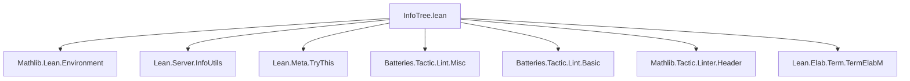
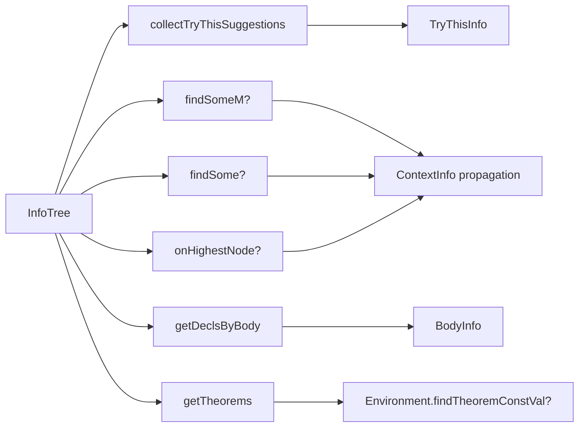

**Technical Brief: InfoTree.lean**

---

### 1. KEY DEFINITIONS & THEOREMS

| Name | Type | Purpose |
|------|------|---------|
| `collectTryThisSuggestions` | `PersistentArray InfoTree → Array Suggestion` | Collects all `Suggestion`s from `TryThisInfo`s embedded in an array of `InfoTree`s, traversing in post-order. |
| `findSomeM?` | `(... → m (Option α)) → InfoTree → Option ContextInfo → m (Option α)` | Monadic traversal: finds the first `some a` result of a context-aware function `f` over nodes, merging contexts as it descends. |
| `findSome?` | `(ContextInfo → Info → PersistentArray InfoTree → Option α) → InfoTree → Option ContextInfo → Option α` | Non-monadic version of `findSomeM?`, using `Id.run`. |
| `onHighestNode?` | `InfoTree → Option ContextInfo → (ContextInfo → Info → PersistentArray InfoTree → α) → Option α` | Extracts the value of `f` on the *highest* (outermost) node with context. |
| `getDeclsByBody` | `InfoTree → List Name` | Collects names of all elaborated declarations whose body elaboration went through `Lean.Elab.Term.BodyInfo`. |
| `getTheorems` | `InfoTree → Environment → List ConstantVal` | Returns all declarations in the tree that are theorems (per `Environment.findTheoremConstVal?`). |

No theorems (proofs) are stated; all are definitions with no correctness lemmas proven in this file.

---

### 2. NAMING CONVENTIONS

- **Prefixes**:
  - `collect*`: Aggregates data from trees.
  - `get*`: Retrieves information (often from environment or tree).
  - `find*?`: Searches for first match; returns `Option`.
- **Suffixes**:
  - `?`: Indicates `Option`-valued result.
  - `M`: Indicates monadic version (`findSomeM?` vs `findSome?`).
- **Structure**:
  - `onHighestNode?` uses `on*` to indicate “apply function at a specific node”.
  - `*BottomUp` (in `getDeclsByBody`) indicates bottom-up traversal strategy.

---

### 3. TACTIC STACK

- **No tactics used in proofs** (no proofs present).
- **Tactics used in definitions** (via `do`-notation):
  - `match` (pattern matching on `Info`, `Context`, `Option`)
  - `pure`, `return`, `let ... | ... =>`
  - `modify`, `for ... in ...`, `·.push`
  - `Id.run` (for non-monadic wrappers)
- **No `simp`, `rw`, `aesop`, `ring`, etc.** — purely functional/monadic code.

---

### 4. PROOF LOGIC

- **No proofs** — only definitions.
- **Computation logic**:
  - Recursive/iterative tree traversal (`visitM'`, `findSomeM?`, `collectNodesBottomUp`).
  - Context propagation via `ctx.mergeIntoOuter?`, `i.updateContext?`.
  - Pattern-based filtering (`if i.value.typeName == ``Lean.Elab.Term.BodyInfo`` then ...`).
- **Control flow**:
  - Early return on `some a` in `findSomeM?`.
  - Bottom-up accumulation in `getDeclsByBody` via `collectNodesBottomUp`.

---

### 5. IMPORTS & SCOPE

**Primary dependencies**:
- `Mathlib.Lean.Environment`: Provides `Environment`, `ConstantVal`, `findTheoremConstVal?`.
- `Lean.Server.InfoUtils`: Core `InfoTree`, `Info`, `ContextInfo`, traversal utilities.
- `Lean.Meta.TryThis`: Defines `TryThisInfo`, `Suggestion`.
- `Batteries.Tactic.Lint.Misc`, `Batteries.Tactic.Lint.Basic`: Linter infrastructure.
- `Mathlib.Tactic.Linter.Header`: Enforces header conventions (shake: keep).
- `Lean.Elab.Term.TermElabM`: Elaboration monad (used implicitly via `ContextInfo`, `Info`).

**Scope**: Extensions to `Lean.Elab.InfoTree` — specifically, utilities for extracting *semantic* information (suggestions, declarations, theorems) from elaborated infotrees.

---

### 6. DEPENDENCY & OVERVIEW DIAGRAMS

#### Module Dependency (Mermaid)

#### File Overview (Mermaid)

---

### 7. SUMMARY

This file extends `Lean.Elab.InfoTree` with utilities for *semantic introspection* of elaborated Lean code. It enables:
- Extraction of interactive suggestions (`collectTryThisSuggestions`),
- Context-aware tree search (`findSomeM?`, `findSome?`, `onHighestNode?`),
- Declaration and theorem extraction (`getDeclsByBody`, `getTheorems`).

All functions are *purely computational*, relying on monadic state and context propagation, with no formal correctness theorems yet proven. The design reflects Lean’s internal infotree traversal patterns, optimized for tooling (e.g., `try this`, IDE hints, refactoring).
