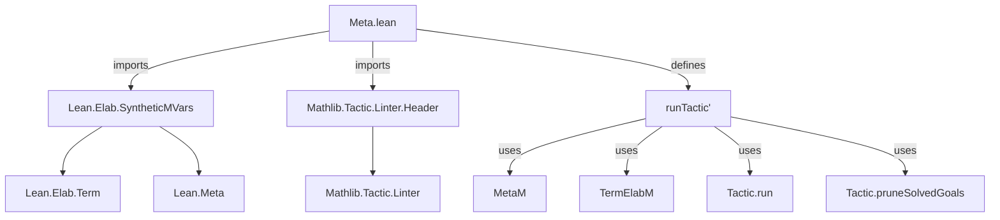

**Technical Brief: `Meta.lean` (Lean 4)**  
*Domain: Lean 4 Tactic Engine & Metaprogramming*

---

### 1. KEY DEFINITIONS & THEOREMS

| Name | Type | Purpose |
|------|------|---------|
| `runTactic'` | `MVarId → Syntax → Context → State → MetaM (List MVarId)` | Executes a tactic (given as `Syntax`) on a specific metavariable ID (`mvarId`) in the `MetaM` monad, discarding the final `Term.State`. Returns the list of remaining (unsolved) metavariable IDs. |

- **Note**: This is a *variant* of `Lean.Elab.runTactic`, adapted for use in `MetaM` (e.g., in tactic scripts or metaprograms), where one does not need to carry forward the `Term.State`.

---

### 2. NAMING CONVENTIONS

- **Prefixes**:
  - `runTactic'` uses the standard `runTactic` base name, with a prime (`'`) indicating a *variant* (common in Lean for specialized or simplified versions).
- **Suffixes**:
  - `'` (prime) — denotes a modified or simplified version of an existing function (`runTactic`).
- **No explicit `is_`, `mul_`, `dist_` patterns** — this file is focused on *tactic execution infrastructure*, not algebraic or logical properties.

---

### 3. TACTIC STACK

The tactic execution relies on the following tactics and combinators (used *within* the metaprogram):

| Tactic / Combinator | Role |
|---------------------|------|
| `instantiateMVarDeclMVars` | Ensures all metavariables in the declaration of `mvarId` are fully instantiated. |
| `withSynthesize` | Triggers typeclass synthesis and instance resolution before tactic execution. |
| `Tactic.run` | Executes the tactic AST (`tacticCode`) on `mvarId`. |
| `Tactic.evalTactic` | Evaluates the tactic syntax node. |
| `Tactic.pruneSolvedGoals` | Removes goals that have been solved (i.e., no remaining subgoals). |

> **Note**: No high-level tactics (`simp`, `rw`, `linarith`, etc.) appear — this is infrastructure code.

---

### 4. PROOF LOGIC

The logic of `runTactic'` follows a *structured metaprogramming pipeline*:

1. **Precondition**: A metavariable ID (`mvarId`) is given, representing a goal or subgoal.
2. **Instantiation**: `instantiateMVarDeclMVars` ensures the metavariable’s context is fully expanded.
3. **Synthesis**: `withSynthesize` ensures typeclass resolution is attempted.
4. **Tactic Execution**: `Tactic.run` applies the tactic AST to the goal.
5. **Postcondition**: `Tactic.pruneSolvedGoals` cleans up solved goals, returning only unsolved ones.

This is *not* a proof of a mathematical theorem, but a *metaprogram* that orchestrates tactic execution in the Lean kernel.

---

### 5. IMPORTS

| Import | Purpose |
|--------|---------|
| `Lean.Elab.SyntheticMVars` | Provides utilities for handling synthetic (typeclass) metavariables, including `instantiateMVarDeclMVars`. |
| `Mathlib.Tactic.Linter.Header` | Enforces linting rules (e.g., copyright header, module docstring). Not part of runtime logic. |

> **Note**: The `Term` namespace is opened (`open Term`), giving access to `TermElabM`, `withSynthesize`, etc.

---

### 6. DEPENDENCY & OVERVIEW DIAGRAM

#### Overview of `Meta.lean`

- **Scope**: Extends `Lean.Elab.Tactic.Meta` (implied by docstring) with a lightweight tactic runner for `MetaM`.
- **Role in Theory**: Serves as a *bridge* between high-level tactic syntax (`Syntax`) and low-level metavariable manipulation (`MetaM`), enabling metaprogrammers to embed tactic execution in custom tactics or elaborators.
- **Relation to Other Files**: Likely used by other tactic libraries (e.g., `Tactic.*.lean`) that need to invoke tactics programmatically.

---

### 7. SUMMARY

- **Core Contribution**: `runTactic'` is a *minimal, goal-focused* tactic runner for `MetaM`.
- **Design Principle**: Minimalism — avoids `Term.State` overhead, focuses on metavariable lifecycle.
- **Use Case**: Embedding tactic execution in metaprograms (e.g., custom tactics, automation scripts).
- **Safety**: Uses `instantiateMVarDeclMVars` and `withSynthesize` to ensure correctness before tactic execution.

--- 

Let me know if you'd like a formal specification of `runTactic'`’s semantics or a comparison with `runTactic`.
