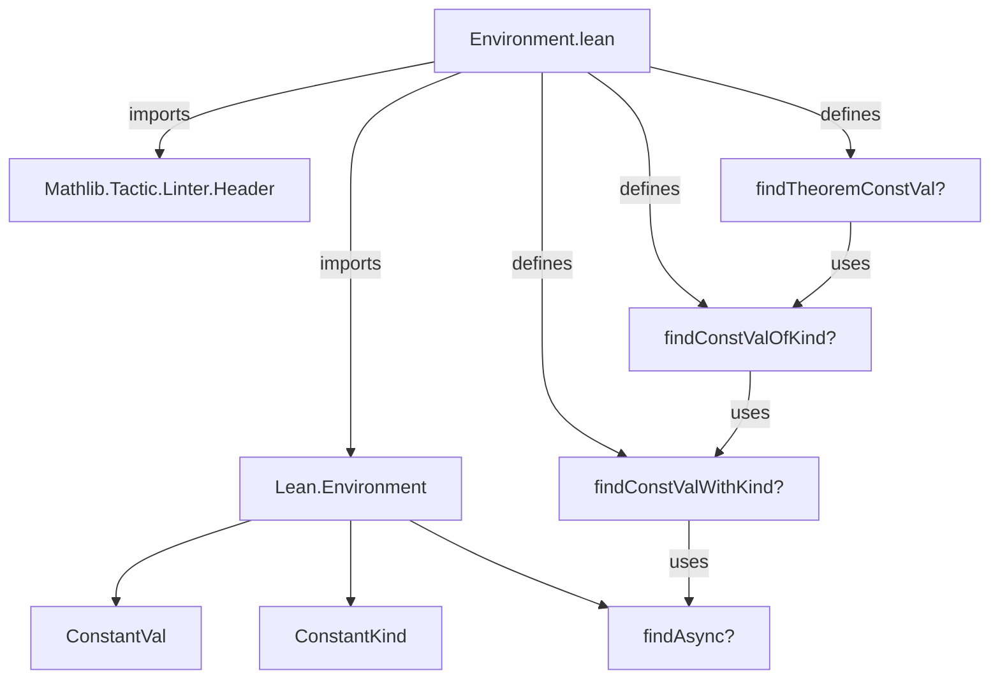
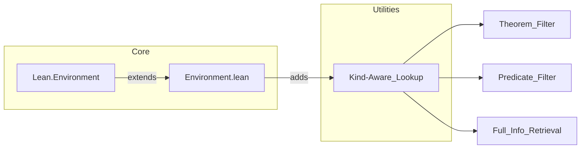

**Technical Brief: `Environment.lean` (Lean 4 Module)**  
*Domain: Lean 4 Metaprogramming / Core Library Utilities*  

---

### 1. KEY DEFINITIONS & THEOREMS  

| Name | Type | Purpose |
|------|------|---------|
| `findConstValWithKind?` | `Environment → Name → Bool → Option (ConstantVal × ConstantKind)` | Retrieves both the `ConstantVal` and `ConstantKind` of a declaration in one lookup, avoiding a second `find` call. Blocks on everything except the body (if any). |
| `findConstValOfKind?` | `Environment → (ConstantKind → Bool) → Name → Bool → Option ConstantVal` | Filters declarations by a predicate on `ConstantKind`; returns `ConstantVal` only if the kind satisfies the predicate. |
| `findTheoremConstVal?` | `Environment → Name → Bool → Option ConstantVal` | Specialization of `findConstValOfKind?` to retrieve only *theorems* (`ConstantKind.thm`). |

> **Note**: All three functions use `env.findAsync?` internally, and thus avoid blocking on the constant’s body (if present), improving efficiency for metadata-only queries.

---

### 2. NAMING CONVENTIONS  

- **Suffix `?`**: Indicates *partial* (i.e., `Option`-valued) operations (standard Lean convention).  
- **Prefix `find…?`**: Standard for lookup functions returning `Option`.  
- **`…WithKind` / `…OfKind` / `…Theorem`**: Hierarchical naming reflecting increasing specificity of kind-based filtering.  
- **`skipRealize` parameter**: Boolean flag (default `false`) controlling whether to skip realization (i.e., forcing evaluation of `Realized` declarations).  

---

### 3. TACTIC STACK  

- **`do`-notation**: Used for monadic sequencing (`Option` monad).  
- **`←`**: For binding `Option`-valued results.  
- **`return`**: To lift tuples/values into `Option`.  
- **`if … then … else`**: Conditional branching on `ConstantKind`.  
- **`· matches .thm`**: Anonymous lambda with pattern matching (syntax sugar for `fun k => k = ConstantKind.thm` or similar).  
- *No heavy tactics* — this is a low-level utility module; logic is purely functional.

---

### 4. PROOF LOGIC  

- **No proofs** in this file — it is a *definition-only* module.  
- Logic is *operational*:  
  1. Look up declaration via `findAsync?`.  
  2. If successful, project or filter based on `info.kind`.  
  3. Return appropriate value (tuple, `ConstantVal`, or `none`).  
- Relies on *typeclass inference* implicitly via `Option` monad, but no typeclasses used directly.

---

### 5. IMPORTS  

| Import | Purpose |
|--------|---------|
| `Lean.Environment` | Core environment representation and basic lookup functions (`findAsync?`, `ConstantVal`, `ConstantKind`). |
| `Mathlib.Tactic.Linter.Header` | Enforces header/linter compliance (e.g., copyright, module docstring). |

> **Scope**: Extends `Lean.Environment` with *kind-aware* constant lookups — useful for type-checking, elaboration, or metaprogramming where distinguishing the *kind* (e.g., `def`, `thm`, `axiom`) matters.

---

### 6. DEPENDENCY & OVERVIEW DIAGRAM  

---

### 7. SUMMARY  

This module provides *efficient, kind-aware* accessors for constants in `Lean.Environment`. It addresses a gap where `ConstantKind` is known at lookup time (via `ConstantInfo`) but not stored in `ConstantVal`, requiring redundant lookups or unsafe casts. The functions are designed for metaprogramming where distinguishing axioms, theorems, definitions, etc., is essential (e.g., proof irrelevance checks, tactic writing, or verification tools).
