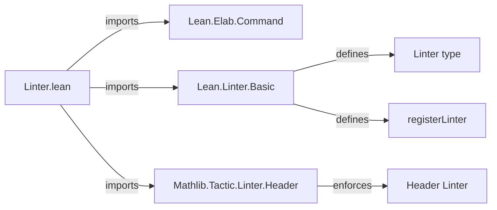
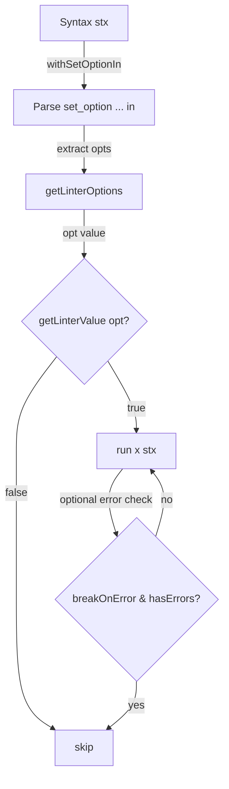

**Technical Brief: `Linter.lean`**

---

### 1. **Key Definitions & Theorems**

| Name | Type | Purpose |
|------|------|---------|
| `whenLinterOption` | `Lean.Option Bool → m Unit → m Unit` | Executes a monadic action `x` *iff* the given linter option is `true`. Assumes `withSetOptionIn` has already been applied. |
| `whenNotLinterOption` | `Lean.Option Bool → m Unit → m Unit` | Executes `x` *iff* the linter option is `false`. |
| `whenLinterActivated` | `Lean.Option Bool → CommandElab → (breakOnError := true) → CommandElab` | Wraps `withSetOptionIn`, checks linter activation, and optionally skips execution if errors are present. Primary entrypoint for linter implementations. |

All three are marked `@[expose, macro_inline]`, indicating they are intended for use at the *syntax level* (i.e., during elaboration) and should be inlined for performance.

---

### 2. **Naming Conventions**

- **Prefixes**:
  - `whenLinter*`: All functions begin with `whenLinter`, indicating conditional execution based on linter options.
  - `getLinterValue`: Standardized accessor for linter option values.
- **Suffixes**:
  - `Option`: Distinguishes functions operating on `Lean.Option Bool` (e.g., `whenLinterOption`).
  - `Activated`: Indicates higher-level wrapper that includes `withSetOptionIn` and error-handling (`whenLinterActivated`).

---

### 3. **Tactic Stack**

- **Core tactics & combinators**:
  - `do`-notation (monadic sequencing)
  - `if ... then ... else` / `unless ... do`
  - `<&&>` (monadic conjunction: `p <&&> q ≡ do b ← p; if b then q else pure ()`)
  - `pure`, `←`, `fun ↦`
- **No high-level tactics** (e.g., `aesop`, `ring`, `simp`) — this is *metaprogramming boilerplate*, not tactic script.

---

### 4. **Proof Logic / Execution Flow**

- **Control flow pattern**:
  1. Parse `set_option ... in` syntax via `withSetOptionIn`.
  2. Extract linter options via `getLinterOptions`.
  3. Evaluate `getLinterValue opt opts`.
  4. Conditionally run user-provided action `x`.
  5. In `whenLinterActivated`, additionally check `breakOnError` and `MonadLog.hasErrors`.

- **No inductive proofs** — this is *metaprogramming infrastructure*, not theorem proving.

---

### 5. **Imports**

| Import | Role |
|--------|------|
| `Lean.Elab.Command` | Provides `CommandElab`, `CommandElabM`, `withSetOptionIn`, etc. |
| `Lean.Linter.Basic` | Core linter types (`Linter`, `run`), option registration, basic utilities. |
| `Mathlib.Tactic.Linter.Header` | Enforces copyright/module header linter; included to *ensure* header validity. |

---

### 6. **Module Scope & Dependency Overview**

- **Purpose**: Provide *low-level, reusable combinators* for implementing linters in Lean 4.
- **Position in architecture**:
  - Bottom layer of the `Linter` API.
  - Used by higher-level linters (e.g., `unused_variables`, `deprecated`) to conditionally execute checks.

---

### 7. **Mermaid Diagrams**

#### Dependency Graph (Module-Level)

#### File Overview (Data Flow)

---

### 8. **Design Notes**

- **Macro-level safety**: `@[macro_inline]` ensures these combinators are expanded *before* type-checking, avoiding metavariable issues when referencing linter options defined in the same module.
- **Error resilience**: `breakOnError` flag prevents linter runs during elaboration errors — avoids cascading failures.
- **Extensibility**: The `m`-polymorphism (`[Monad m] [...]`) allows reuse in different monadic contexts (e.g., `CommandElabM`, `Elab.Term`).

--- 

*End of brief.*
