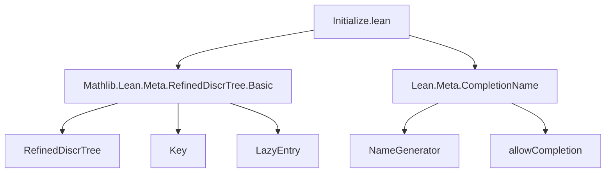
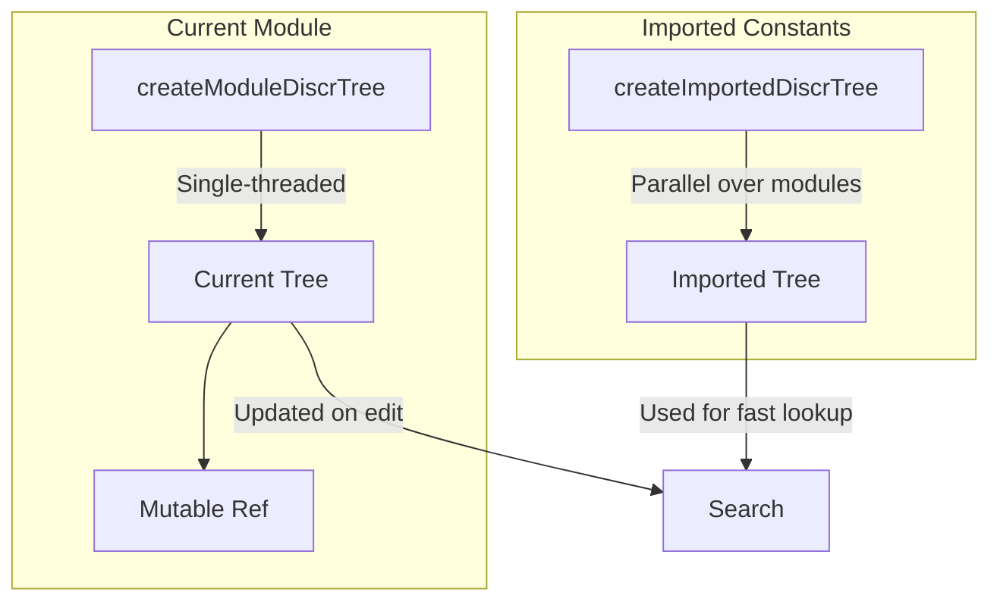

### Technical Brief: `Initialize.lean` — Construction of RefinedDiscrTree

---

#### **1. Key Definitions & Theorems**

| Name | Type / Signature | Purpose |
|------|------------------|---------|
| `insert` | `RefinedDiscrTree α → Key → LazyEntry × α → RefinedDiscrTree α` | Inserts a `(key, entry)` pair into a `RefinedDiscrTree`. Uses discriminant trie lookup/modification. |
| `PreDiscrTree` | `Type → Type` (structure) | Intermediate structure for batch initialization of `RefinedDiscrTree`, storing `root` (key→index map) and `tries` (array of pending entries). |
| `PreDiscrTree.push` | `PreDiscrTree α → Key → LazyEntry × α → PreDiscrTree α` | Adds a single `(key, entry)` to `PreDiscrTree`. |
| `PreDiscrTree.toRefinedDiscrTree` | `PreDiscrTree α → RefinedDiscrTree α` | Converts `PreDiscrTree` to final `RefinedDiscrTree` by wrapping each `Array (LazyEntry × α)` in a trie node. |
| `PreDiscrTree.append` | `PreDiscrTree α → PreDiscrTree α → PreDiscrTree α` | Merges two `PreDiscrTree`s, preferring larger root size for efficiency. |
| `ImportFailure` | `structure` | Captures module, constant, and exception info for failed imports. |
| `ImportErrorData` | `structure` | Holds `IO.Ref (Array ImportFailure)` for collecting errors during tree construction. |
| `blacklistInsertion` | `Environment → Name → Bool` | Filters out internal/metaprogramming/deprecated/sorryAx/inj* constants. |
| `addConstToPreDiscrTree` | `... → PreDiscrTree α → Name → ConstantInfo → BaseIO (PreDiscrTree α)` | Processes a single constant: runs user-provided `act`, extracts `(val, entries)`, and pushes entries into tree. Skips unsafe/blacklisted constants. |
| `InitResults` | `structure` | Bundles `PreDiscrTree` + error list for modular composition. |
| `InitResults.append` | `Append (InitResults α)` | Merges two `InitResults` (tree + errors). |
| `loadImportedModule` | `... → ModuleData → PreDiscrTree α → BaseIO (PreDiscrTree α)` | Recursively processes all constants in a module, updating tree via `addConstToPreDiscrTree`. |
| `createImportInitResults` | `... → Nat → BaseIO (InitResults α)` | Initializes parallel batch processing over module range `[start, stop)`. |
| `createImportedDiscrTree` | `NameGenerator → Environment → ... → CoreM (RefinedDiscrTree α)` | Parallel tree construction over *all imported modules*, using task-based concurrency. |
| `createModuleDiscrTree` | `(... → MetaM (List ...)) → CoreM (RefinedDiscrTree α)` | Builds tree over *current module only*, using `createModulePreDiscrTree`. |
| `createModuleTreeRef` | `(... → MetaM ...) → MetaM (ModuleDiscrTreeRef α)` | Wraps `createModuleDiscrTree` in an `IO.Ref` for mutable updates (e.g., during editing). |

> **Note**: No theorems are proven in this file — it is purely *procedural infrastructure*.

---

#### **2. Naming Conventions**

| Pattern | Examples | Meaning |
|--------|----------|---------|
| `is_` / `isUnsafe` | `constInfo.isUnsafe` | Boolean predicate on constants |
| `blacklist_` | `blacklistInsertion` | Exclusion filter for constants |
| `addConstTo_` | `addConstToPreDiscrTree` | Action: add one constant’s entries to tree |
| `create_` | `createImportedDiscrTree`, `createModuleDiscrTree` | Top-level builders |
| `load_` | `loadImportedModule` | Recursive traversal over module data |
| `to_` | `toRefinedDiscrTree`, `toInitResults` | Conversion functions |
| `modifyAt`, `push`, `append` | `PreDiscrTree.modifyAt`, `push`, `append` | Standard collection operations |
| `init_`, `result_` | `InitResults`, `ImportErrorData` | Data containers for intermediate state |

---

#### **3. Tactic Stack**

- **No tactics used** in definitions (all code is in `do`-blocks or pure functions).
- **CoreM / BaseIO** monads dominate; no `simp`, `ring`, or `aesop`.
- **`profileitM`** used for performance instrumentation.
- **`termination_by`** annotations for recursive functions (e.g., `go`, `loadImportedModule`).

---

#### **4. Proof Logic**

- **No proofs** — this is *implementation code*, not specification.
- Logic is **procedural & stateful**:
  - Iteration over constants/modules (via recursion or folds).
  - State threading via `IO.Ref`s (`Meta.State`, `Core.State`, error arrays).
  - Conditional skipping (`if constInfo.isUnsafe`, `blacklistInsertion`).
  - Error accumulation and logging (`logImportFailure`).
- Parallelism via `Task` and `asTask` in `createImportedDiscrTree`.

---

#### **5. Imports**

| Import | Purpose |
|--------|---------|
| `Mathlib.Lean.Meta.RefinedDiscrTree.Basic` | Core `RefinedDiscrTree`, `Key`, `LazyEntry`, `Node` definitions. |
| `Lean.Meta.CompletionName` | Name generation & completion utilities (e.g., `allowCompletion`). |

> **No external mathlib lemmas used** — only foundational types and monads.

---

#### **8. Mermaid Diagrams**

##### **Dependency Graph (Module-Level)**



##### **Data Flow Overview**

```mermaid
flowchart LR
  subgraph Input
    I1[Environment] 
    I2[ConstantInfo]
    I3[act : Name → ConstantInfo → MetaM ...]
  end

  subgraph PreProcessing
    I1 --> blacklistInsertion
    I2 --> isUnsafe?
    blacklistInsertion -->|skip| Skip
    isUnsafe? -->|skip| Skip
    Skip[Skip Insertion]
  end

  subgraph Entry Generation
    I2 --> act
    act -->|List (α × List (Key × LazyEntry))| Entries
  end

  subgraph Tree Building
    Entries --> PreDiscrTree.push
    PreDiscrTree.push --> PreDiscrTree
    PreDiscrTree --> toRefinedDiscrTree
    toRefinedDiscrTree --> RefinedDiscrTree
  end

  subgraph Parallelism
    createImportedDiscrTree -->|Task-based| ParallelTasks
    ParallelTasks --> foldl ++ --> InitResults
    InitResults --> toRefinedDiscrTree
  end

  RefinedDiscrTree --> Output[Discrimination Tree]
```

##### **Module vs Imported Tree Strategy**



> **Rationale**: Imported constants are static and numerous → parallel build.  
> Current module is small and dynamic → single-threaded, mutable reference.

--- 

✅ **Summary**: This file provides *low-level infrastructure* for building lazy discrimination trees over Lean constants, with support for parallelism, error handling, and separation of imported vs. local declarations. It is foundational for features like `discr_tree`-based search or completion.
