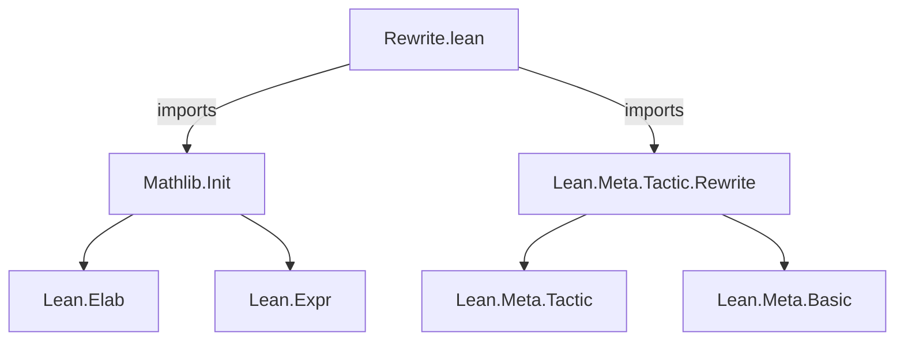
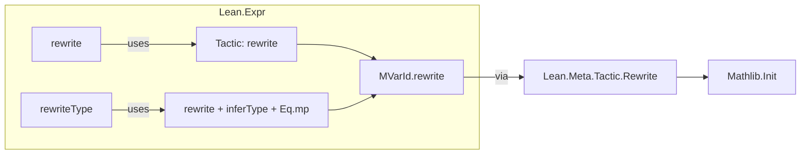

**Technical Brief: `Rewrite.lean` Module**

---

### 1. **Key Definitions & Theorems**

| Name | Type | Purpose |
|------|------|---------|
| `Lean.Expr.rewrite` | `Expr → Expr → MetaM Expr` | Rewrites an expression `e` using an equality `eq`, returning a new expression `e'` and a proof `e = e'`. Fails if subgoals remain. |
| `Lean.Expr.rewriteType` | `Expr → Expr → MetaM Expr` | Rewrites the *type* of `e` using `eq`, then transports `e` into the new type via `Eq.mp`. Also fails on subgoals. |

> Note: Both functions are *metaprogramming utilities* built atop `MetaM`, leveraging the `rewrite` tactic internally via `MVarId.rewrite`.

---

### 2. **Naming Conventions**

- **Prefixes**:  
  - `rewrite` and `rewriteType` follow the `Lean.Expr.*` namespace, indicating operations on `Expr` terms.
  - No special prefixes like `is_`, `mul_`, or `dist_` appear—this is a low-level metaprogramming module.

- **Suffixes**:  
  - `Type` suffix in `rewriteType` indicates operation on the *type* of an expression (as opposed to the expression itself).

---

### 3. **Tactic Stack**

- **Core tactics used**:
  - `mkFreshExprMVar` — introduces a fresh metavariable for the ambient goal.
  - `.mvarId!.rewrite` — invokes the underlying `rewrite` tactic on the metavariable.
  - `inferType` — computes the type of an expression.
  - `mkEqMP` — constructs `Eq.mp` (transport along equality) from a proof `p : a = b` and term `h : a`, yielding `b`.

- **No high-level tactics** (`simp`, `rw`, `aesop`, etc.) are used directly—this is a *primitive* metaprogram.

---

### 4. **Proof Logic / Operational Flow**

- **`rewrite e eq`**:
  1. Introduce fresh metavariable `?m`.
  2. Apply `rewrite` tactic on `?m` using `e` and `eq`.
  3. Expect *no subgoals*; if any, throw error.
  4. Return the rewritten metavariable instance (`eq'`), which is a proof `e = e'`.

- **`rewriteType e eq`**:
  1. Compute `t := inferType e`.
  2. Rewrite `t` using `eq` → yields `t'` and proof `p : t = t'`.
  3. Apply `mkEqMP p e` to get a term of type `t'`.

> Both rely on *metavariable-based tactic execution* and *strict failure on subgoals*.

---

### 5. **Imports**

| Import | Role |
|--------|------|
| `Mathlib.Init` | Core Lean 4 initialization (e.g., `MetaM`, `Expr`, basic utilities). |
| `Lean.Meta.Tactic.Rewrite` | Provides the low-level `rewrite` tactic and `MVarId.rewrite`. |

> This module is a *thin wrapper* over `Lean.Meta.Tactic.Rewrite`, exposing its core functionality at the `Expr` level.

---

### 6. **Mermaid Diagrams**

#### **Dependency Graph**

#### **Module Overview**

---

### 7. **Domain & Use Case**

- **Domain**: Metaprogramming, proof automation, and tactic development in Lean 4.
- **Use Case**: Enables *programmatic rewriting* of expressions and types inside tactics or elaborators, without exposing subgoals to the user.

> Designed for internal use in tactic scripts or custom automation—*not* for end-user proofs.

--- 

✅ **End of Brief**
