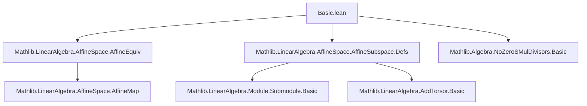

**Technical Brief: `Basic.lean` — Affine Spaces and Subspaces in Lean 4**

---

### 1. **Key Definitions & Theorems**

| Name | Type / Signature | Purpose |
|------|------------------|---------|
| `vectorSpan k s` | `Set P → Submodule k V` | Span of all pairwise differences $p_1 - p_2$ for $p_1, p_2 \in s$; direction of `affineSpan k s`. |
| `affineSpan k s` | `Set P → AffineSubspace k P` | Smallest affine subspace containing set $s$. |
| `AffineSubspace.direction s` | `Submodule k V` | Linear part (direction) of affine subspace $s$. |
| `AffineSubspace.mem_direction_iff_eq_vsub_right/left` | `p ∈ s → (p₂ -ᵥ p ∈ s.direction ↔ p₂ ∈ s)` | Characterizes membership in direction via vector subtraction. |
| `AffineSubspace.subtype s` | `s →ᵃ[k] P` | Canonical affine embedding of a nonempty affine subspace into ambient space. |
| `AffineSubspace.topEquiv` | `(⊤ : AffineSubspace k P) ≃ᵃ[k] P` | Affine equivalence between the top (whole space) affine subspace and $P$. |
| `AffineSubspace.map f s` | `s.map f : AffineSubspace k P₂` | Image of affine subspace $s$ under affine map $f$. |
| `AffineSubspace.comap f s` | `s.comap f : AffineSubspace k P₁` | Preimage of affine subspace $s$ under affine map $f$. |
| `AffineMap.lineMap_mem` | `p₀, p₁ ∈ Q ⇒ lineMap(p₀, p₁, c) ∈ Q` | Affine combinations stay in affine subspaces. |
| `mem_affineSpan_pair_iff_exists_lineMap_eq` | $p ∈ \text{affineSpan}\{p_1,p_2\} \iff \exists r,\ \text{lineMap}(p_1,p_2,r) = p$ | Points in 2-point span are exactly affine combinations. |
| `vectorSpan_pair` | `vectorSpan k ({p₁, p₂}) = k ∙ (p₁ -ᵥ p₂)` | Vector span of two points is 1D module span of their difference. |
| `direction_sup` | $(s_1 ⊔ s_2).\text{direction} = s_1.\text{direction} ⊔ s_2.\text{direction} ⊔ k ∙ (p_2 - p_1)$ | Direction of join of subspaces adds difference vector. |
| `AffineMap.ext_on` | If two affine maps agree on a spanning set, they are equal. | Uniqueness of affine maps from spanning sets. |
| `AffineEquiv.ext_on` | If two affine equivalences agree on a spanning set, they are equal. | Uniqueness of affine equivalences from spanning sets. |

---

### 2. **Naming Conventions**

- **Prefixes**:
  - `mem_`: membership criteria (e.g., `mem_direction_iff_eq_vsub_right`)
  - `coe_`: coercion lemmas (e.g., `coe_vsub`, `coe_subtype`)
  - `direction_`: direction-related properties (e.g., `direction_lt_of_nonempty`, `direction_sup`)
  - `vectorSpan_`: vector span lemmas (e.g., `vectorSpan_eq_span_vsub_set_left`)
  - `subtype_`, `map_`, `comap_`: structural operations on affine subspaces/maps
  - `lineMap_`: line-map related properties

- **Suffixes**:
  - `_iff`: biconditional characterizations (e.g., `mem_affineSpan_singleton`)
  - `_eq`: equality lemmas (e.g., `vectorSpan_pair`)
  - `_ne`: excluding self-differences (e.g., `vectorSpan_eq_span_vsub_set_left_ne`)
  - `_right`/`_left`: order of subtraction (e.g., `vsub_right_mem_direction_iff_mem`)
  - `_rev`: reversed arguments (e.g., `vectorSpan_pair_rev`, `mem_vectorSpan_pair_rev`)

- **Notation**:
  - `vadd`: $v +ᵥ p$
  - `vsub`: $p₁ -ᵥ p₂$
  - `line[k, p₁, p₂]`: affine span of two points, i.e., `affineSpan k {p₁, p₂}`

---

### 3. **Tactic Stack**

- **Core tactics**:
  - `simp`, `rw`, `ext`, `refine`, `apply`, `intro`, `cases`
- **Algebraic simplification**:
  - `ring`, `linarith`, `grind` (custom tactic for simplifying module/affine relations)
- **Set-theoretic reasoning**:
  - `grind`, `simp only`, `convert`, `congr`, `funext`
- **Subtype/extensionality**:
  - `Subtype.ext`, `AffineSubspace.ext_iff`, `Set.ext`
- **Induction**:
  - `affineSpan_induction'` (custom induction principle for affine spans)
- **Equational reasoning**:
  - `conv_lhs => rw [...]`, `symm at h`, `rw [← hv]`, `rw [and_comm]`

---

### 4. **Proof Logic**

- **Inductive structure**:
  - Proofs often proceed by induction on `affineSpan` using `affineSpan_induction'`, which requires:
    1. Base case: show property holds for all points in the generating set.
    2. Inductive step: show closure under affine combinations $t • (p₁ - p₂) + p₃$.

- **Direction-based reasoning**:
  - Many proofs reduce to comparing directions (submodules), using:
    - `ext_of_direction_eq`: two affine subspaces equal if same carrier and direction.
    - `direction_eq_vectorSpan`: direction = vector span of generating set.

- **Submodule lifting**:
  - Lemmas like `mem_vectorSpan_pair` reduce vector membership to scalar multiples.
  - `Submodule.mem_span` and `Submodule.mem_span_singleton` used heavily.

- **Equivalence via spanning sets**:
  - Uniqueness results (`ext_on`, `ext_on` for equivalences) rely on:
    - Agreement on a spanning set ⇒ agreement on affine span ⇒ global equality.

- **Nonemptiness handling**:
  - Many constructions require `Nonempty s`; `unique_affineSpan_singleton` and `topEquiv` use this.

---

### 5. **Imports**

| Import | Purpose |
|--------|---------|
| `Mathlib.LinearAlgebra.AffineSpace.AffineEquiv` | Affine equivalences, `AffineEquiv`, `AffineMap` structure |
| `Mathlib.LinearAlgebra.AffineSpace.AffineSubspace.Defs` | Basic definitions: `AffineSubspace`, `direction`, `affineSpan`, `vectorSpan` |
| `Mathlib.Algebra.NoZeroSMulDivisors.Basic` | Ensures $k$-module structure has no zero divisors (used implicitly in some span arguments) |

---

### 6. **Mermaid Diagrams**

#### **Dependency Graph (Module-Level)**



#### **Overview of Theory Flow**

```mermaid
flowchart LR
  A[Points P, Vectors V] --> B[AffineSpace V P]
  B --> C[AffineSubspace k P]
  C --> D[direction s : Submodule k V]
  C --> E[affineSpan k s : AffineSubspace]
  C --> F[vectorSpan k s : Submodule k V]
  C --> G[map/comap under AffineMap]
  C --> H[join/sup, meet/inf]
  B --> I[AffineMap P₁ →ᵃ[k] P₂]
  I --> J[map s, comap s]
  I --> K[ext_on, lineMap_mem]
  B --> L[AffineEquiv P₁ ≃ᵃ[k] P₂]
  L --> M[ext_on, span_eq_top_iff]
```

---

### 7. **Key Lemmas Summary (Algebraic Identities)**

- **Vector span of singleton**:  
  $$
  \text{vectorSpan}( \{p\} ) = \{0\}
  $$
- **Vector span of pair**:  
  $$
  \text{vectorSpan}(\{p_1, p_2\}) = k \cdot (p_1 - p_2)
  $$
- **Direction of affine span**:  
  $$
  \text{direction}(\text{affineSpan}(s)) = \text{vectorSpan}(s)
  $$
- **Join direction**:  
  $$
  \text{direction}(s_1 \sqcup s_2) = \text{direction}(s_1) \sqcup \text{direction}(s_2) \sqcup k \cdot (p_2 - p_1)
  $$
- **Affine span of two points**:  
  $$
  \text{affineSpan}(\{p_1, p_2\}) = \{ r \cdot (p_2 - p_1) + p_1 \mid r \in k \}
  $$

---

This file forms the foundational layer for affine geometry in Mathlib, enabling reasoning about affine combinations, subspaces, and equivalences in full generality over arbitrary rings.
