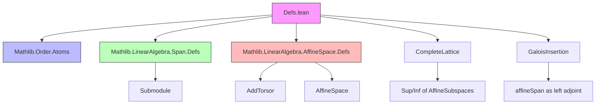
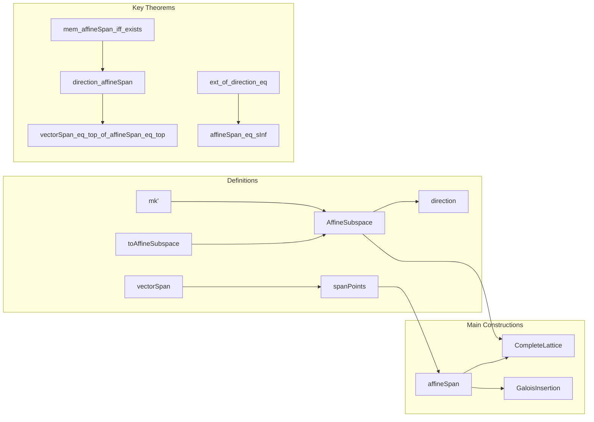

**Technical Brief: Affine Subspaces in Lean 4 (Defs.lean)**  
*Based on `Defs.lean` from the Mathlib repository (author: Joseph Myers)*

---

### 1. KEY DEFINITIONS & THEOREMS

| Name | Type / Signature | Purpose |
|------|------------------|---------|
| `vectorSpan` | `vectorSpan (k : Ring k) (s : Set P) : Submodule k V` | Computes the submodule spanned by pairwise differences $ s -_v s $ of points in $ s $. |
| `spanPoints` | `spanPoints (k : Ring k) (s : Set P) : Set P` | Explicit description of points in the affine span: $ \{ v +_v p_1 \mid p_1 \in s, v \in \text{vectorSpan}(s) \} $. |
| `AffineSubspace` | `structure AffineSubspace (k : Ring k) (V : AddCommGroup) (P : AffineSpace V P)` | Type of affine subspaces (possibly empty), defined as subsets closed under $ c \cdot (p_1 -_v p_2) +_v p_3 $. |
| `direction` | `direction (s : AffineSubspace k P) : Submodule k V` | Direction (linear part) of an affine subspace: $ \text{vectorSpan}(s) $. |
| `affineSpan` | `affineSpan (k : Ring k) (s : Set P) : AffineSubspace k P` | Smallest affine subspace containing $ s $; defined via `spanPoints`. |
| `mk'` | `mk' (p : P) (d : Submodule k V) : AffineSubspace k P` | Constructs affine subspace from a base point and direction: $ \{ q \mid q -_v p \in d \} $. |
| `toAffineSubspace` | `toAffineSubspace (p : Submodule k V) : AffineSubspace k V` | Embeds a submodule as an affine subspace over itself. |
| `CompleteLattice` instance | `CompleteLattice (AffineSubspace k P)` | Lattice operations: sup = `affineSpan(s₁ ∪ s₂)`, inf = intersection, top = `univ`, bot = `∅`. |
| `gi` | `GaloisInsertion (affineSpan k) ((↑) : AffineSubspace k P → Set P)` | Galois insertion linking set inclusion and affine span. |

**Key Theorems:**
- `mem_affineSpan_iff_exists`: Characterizes membership in `affineSpan`.
- `direction_affineSpan`: $ \text{direction}(\text{affineSpan}(s)) = \text{vectorSpan}(s) $.
- `ext_of_direction_eq`: Two affine subspaces with same direction and nonempty intersection are equal.
- `affineSpan_eq_sInf`: $ \text{affineSpan}(s) = \inf\{ s' \mid s \subseteq s' \} $.
- `vectorSpan_eq_top_of_affineSpan_eq_top`: If affine span is full space, vector span is full module.
- `affineSpan_eq_top_iff_vectorSpan_eq_top_of_nonempty`: Equivalence for nonempty sets.

---

### 2. NAMING CONVENTIONS

- **Prefixes:**
  - `vectorSpan_`: Relating to `vectorSpan`.
  - `spanPoints_`: Relating to `spanPoints`.
  - `mem_`, `subset_`, `coe_`, `direction_`, `mk'_`, `toAffineSubspace_`, `affineSpan_`.
- **Suffixes:**
  - `_def`: Definition rewriting lemmas (e.g., `vectorSpan_def`).
  - `_iff`: Biconditional characterizations (e.g., `mem_direction_iff_eq_vsub`).
  - `_mono`: Monotonicity (e.g., `vectorSpan_mono`).
  - `_eq`: Equality lemmas (e.g., `direction_mk'`, `direction_top`).
  - `_iff`: iff-characterizations (e.g., `mem_mk'_iff_vsub_mem`, deprecated alias).
- **Structure fields:** `carrier`, `smul_vsub_vadd_mem`.

---

### 3. TACTIC STACK

Frequently used tactics in proofs:
- `rw`, `simp`, `simp_all`, `simp_rw`
- `exact`, `refine`, `convert`
- `rcases`, `obtain`, `cases`
- `ext`, `apply_fun`, `congr`
- `grind` (custom tactic for simplification of algebraic goals)
- `intro`, `intro!`, `intro h`, `intro hp`, etc.
- `apply`, `apply'`, `apply _ with ...`
- `have`, `suffices`, `by_contra`, `contrapose`
- `exact?`, `aesop`, `linarith`, `ring` (less frequent, but present in some proofs)

---

### 4. PROOF LOGIC

**Typical proof structure:**
1. **Extensionality (`ext`)**: For equality of affine subspaces or sets, reduce to pointwise membership.
2. **Rewrite definitions**: Unfold `carrier`, `direction`, `vectorSpan`, `spanPoints`, `affineSpan`.
3. **Case analysis**: On `Subsingleton`, `Nonempty`, or `eq_empty_or_nonempty`.
4. **Module-theoretic reasoning**: Use submodule properties (`add_mem`, `smul_mem`, `sub_mem`) for `vectorSpan` and `direction`.
5. **Affine geometry lemmas**: Use `vadd_mem_of_mem_direction`, `vsub_mem_direction`, `vadd_vsub_assoc`, `vsub_vadd_eq_vsub_sub`.
6. **Lattice reasoning**: Use `le_def`, `le_sup_left`, `inf_le_left`, `sInf_le`, etc.
7. **Galois insertion machinery**: Use `AffineSubspace.gi` to lift set-theoretic properties to affine subspaces.

**Common pattern:**
- Prove inclusion both ways (`le_antisymm`), often via:
  - `Submodule.span_le` / `Submodule.span_mono`
  - `subset_spanPoints`, `spanPoints_subset_coe_of_subset_coe`
  - `vsub_mem_vectorSpan`, `vadd_mem_of_mem_direction`

---

### 5. IMPORTS & DEPENDENCIES

**Core imports:**
- `Mathlib.Order.Atoms`
- `Mathlib.LinearAlgebra.Span.Defs`
- `Mathlib.LinearAlgebra.AffineSpace.Defs`

**Underlying structures assumed:**
- `Ring k`, `AddCommGroup V`, `Module k V`, `AffineSpace V P`

**Key dependencies:**
- `Set.pointwise` (`vsub`, `+ᵥ`, `•`)
- `Submodule` lattice operations
- `Set` operations (`vsub`, `image`, `iInter`, `iUnion`, `subset`, `nonempty`)
- `GaloisInsertion` infrastructure

---

### 6. MERMAID DIAGRAMS

#### Dependency Graph (High-Level)

#### Overview of File Structure

---

### 7. SUMMARY

This file provides the foundational algebraic theory of affine subspaces over modules, including:
- Explicit descriptions (`spanPoints`, `vectorSpan`)
- Structural properties (`direction`, `mk'`, `toAffineSubspace`)
- Lattice-theoretic behavior (`CompleteLattice`, `gi`)
- Equivalences between geometric and algebraic conditions (e.g., `affineSpan = ⊤ ↔ vectorSpan = ⊤` for nonempty sets)

It serves as the base for further developments in analysis/topology (e.g., `Analysis.Normed.Affine.AddTorsor`, `Topology.Algebra.Affine`), and is designed for maximum reuse of module-theoretic infrastructure.

--- 

*End of Technical Brief.*
