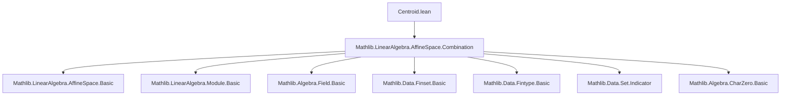

### Technical Brief: `Centroid.lean` (Lean 4)

---

#### **1. Key Definitions & Theorems**

| Name | Type / Signature | Purpose |
|------|------------------|---------|
| `centroidWeights` | `s.centroidWeights k : ι → k` | Constant weight function assigning $1/|s|$ to each index in `s`. |
| `centroidWeights_apply` | `∀ i, s.centroidWeights k i = (#s : k)⁻¹` | Confirms weight at any index is reciprocal of cardinality. |
| `centroidWeights_eq_const` | `s.centroidWeights k = Function.const ι (#s : k)⁻¹` | States `centroidWeights` is a constant function. |
| `sum_centroidWeights_eq_one_of_cast_card_ne_zero` | `(#s : k) ≠ 0 ⇒ ∑ i ∈ s, s.centroidWeights k i = 1` | Ensures weights sum to 1 when $|s|$ is invertible in $k$. |
| `centroid` | `s.centroid k p : P` | Affine combination of points `p : ι → P` using `centroidWeights`. |
| `centroid_def` | `s.centroid k p = s.affineCombination k p (s.centroidWeights k)` | Definition of centroid as affine combination. |
| `centroid_singleton` | `({i}).centroid k p = p i` | Centroid of a singleton set is the point itself. |
| `centroid_pair` | `(#{i₁, i₂}).centroid k p = 2⁻¹ • (p i₂ -ᵥ p i₁) +ᵥ p i₁` | Explicit formula for centroid of two distinct points. |
| `centroid_map` | `(s₂.map e).centroid k p = s₂.centroid k (p ∘ e)` | Centroid commutes with embedding (reindexing). |
| `centroidWeightsIndicator` | `Set.indicator (↑s) (s.centroidWeights k)` | Extends weights to zero outside `s`, useful for `Fintype` sums. |
| `centroid_eq_affineCombination_fintype` | `s.centroid k p = univ.affineCombination k p (s.centroidWeightsIndicator k)` | Centroid expressed over full type via indicator weights. |
| `centroid_eq_centroid_image_of_inj_on` | Under injectivity on `s`, centroid over domain = centroid over image set. | Enables working with sets instead of indexed families. |
| `centroid_eq_of_inj_on_of_image_eq` | If both families injective on their sets and images equal, centroids equal. | Allows comparing centroids of different indexings. |
| `centroid_vsub_const` | `centroid k s p -ᵥ p₀ = centroid k s (λ i, p i -ᵥ p₀)` | Centroid commutes with translation (characteristic 0 needed). |
| `centroid_mem_affineSpan_*` (several variants) | `s.centroid k p ∈ affineSpan k (range p)` | Centroid lies in affine span under invertibility/nonempty/card conditions. |

---

#### **2. Naming Conventions**

- **Prefixes**:
  - `centroidWeights*`: weight-related functions/properties.
  - `centroid*`: centroid-related definitions/theorems.
  - `sum_*`: sums over weights (often over `s` or `univ`).
- **Suffixes**:
  - `_of_*`: conditions under which a property holds (e.g., `of_nonempty`, `of_card_ne_zero`).
  - `_eq_*`: equality statements (e.g., `eq_one`, `eq_affineCombination_fintype`).
  - `_indicator`: extended weight function using `Set.indicator`.
  - `_map`, `_image`, `_vsub_const`: structural properties (functoriality, translation).
- **Constants**:
  - `k`: division ring (scalar field).
  - `V`: vector space over `k`.
  - `P`: affine space over `V`.
  - `s`, `s₂`: finite sets (`Finset`).
  - `p`, `p₂`: point families (`ι → P`).

---

#### **3. Tactic Stack**

Frequently used tactics in proofs:
- `simp` / `simp_all`: simplification using lemmas, especially `centroid_def`, `centroidWeights_apply`, `sum_centroidWeights_eq_one_*`.
- `rw`: rewriting using equalities like `centroid_def`, `affineCombination_eq_weightedVSubOfPoint_vadd_of_sum_eq_one_*`.
- `by_cases`: for branching on equality (`i₁ = i₂`) or membership.
- `convert`: for matching up to definitional equality (e.g., `centroid_pair_fin`).
- `congr`: for functional extensionality or congruence closure.
- `ext`: extensionality for functions/sets.
- `grind`: custom tactic (likely from Mathlib’s `Grind` module) for simplifying affine combinations using linear algebra identities.
- `norm_num`: for numeric normalization (e.g., `2 ≠ 0`).
- `exact`, `assumption`, `intro`, `apply`: standard proof scripting.

---

#### **4. Proof Logic**

- **Induction**: Not used directly (no explicit induction on `s` or `n`), but structural reasoning via `Finset` induction principles is implicit.
- **Case analysis**: Common on `i₁ = i₂`, `s.Nonempty`, `#s ≠ 0`, or `CharZero k`.
- **Weight normalization**: Most proofs rely on verifying that weights sum to 1 (via `sum_centroidWeights_eq_one_*`) to apply `affineCombination_*` lemmas.
- **Reduction to standard forms**:
  - Reduce general centroids to singletons/pairs via `centroid_singleton`, `centroid_pair`.
  - Reduce indexed families to sets via `centroid_eq_centroid_image_of_inj_on`.
  - Use `affineCombination_indicator_subset` to switch between sums over `s` and `univ`.
- **Translation invariance**: Proven via `grind` + `sum_smul_vsub_const_eq_affineCombination_vsub`, requiring `CharZero k` to ensure $|s| ≠ 0$ implies invertibility.

---

#### **5. Imports & Dependencies**

- **Core dependency**:
  ```lean
  import Mathlib.LinearAlgebra.AffineSpace.Combination
  ```
  Provides:
  - `AffineSpace`, `affineCombination`, `affineSpan`, `vsub`, `smul_vsub`, etc.
- **Implicit dependencies** (via `AffineSpace` and `DivisionRing`):
  - `Mathlib.Algebra.Field.Basic` (for `DivisionRing`, inverses).
  - `Mathlib.Data.Finset.Basic`, `Mathlib.Data.Fintype.Basic`.
  - `Mathlib.Data.Set.Indicator`.
  - `Mathlib.Algebra.CharZero.Basic` (for characteristic-zero lemmas).
  - `Mathlib.LinearAlgebra.AffineSpace.Basic` (for `affineSpan`, `vsub`, etc.).

---

#### **6. Mermaid Diagrams**

##### **Dependency Graph (Module-Level)**



##### **Overview of File Structure**

```mermaid
flowchart LR
  subgraph Definitions
    D1[centroidWeights]
    D2[centroidWeightsIndicator]
    D3[centroid]
  end

  subgraph Weight Properties
    W1[sum = 1 (≠0)]
    W2[sum = 1 (CharZero)]
    W3[sum = 1 (Fintype)]
  end

  subgraph Centroid Properties
    C1[Singleton]
    C2[Pair]
    C3[Map/Embedding]
    C4[Image/Injectivity]
    C5[Translation]
  end

  subgraph Geometric Properties
    G1[Mem affineSpan]
  end

  D1 --> W1
  D1 --> W2
  D2 --> W3
  D3 --> C1
  D3 --> C2
  D3 --> C3
  D3 --> C4
  D3 --> C5
  D3 --> G1
```

##### **Theoretical Context**

- **Affine Geometry**: Centroid is a canonical point in the affine span of a finite set.
- **Characteristic Sensitivity**: Many results require `CharZero k` to ensure $|s| ≠ 0 ⇒ |s|^{-1}$ exists.
- **Set vs. Indexed Families**: The file bridges indexed families (`ι → P`) and sets (`Finset P`) via injectivity and image conditions.
- **Computational Use**: Explicit formulas (`centroid_pair`, `centroid_singleton`) support concrete computation; general lemmas support abstraction.

--- 

This file is foundational for affine geometry in Lean, enabling robust reasoning about barycenters, mass points, and convex combinations in general affine settings over division rings.
