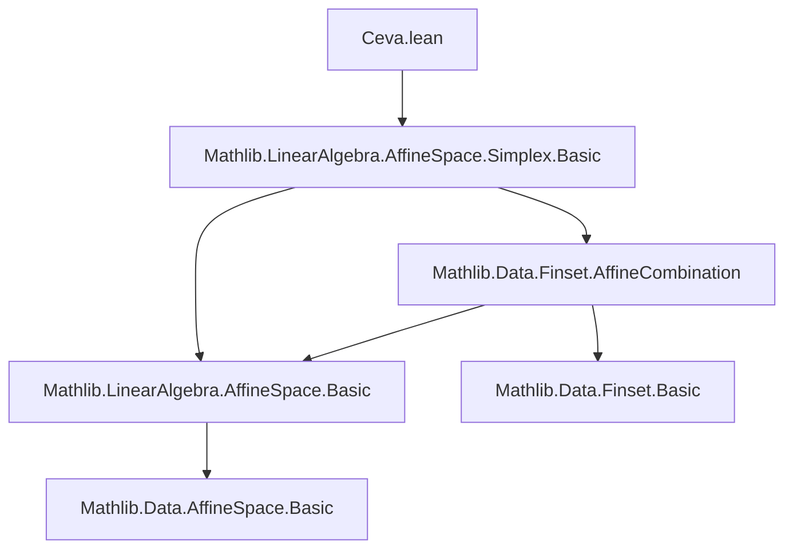

### Technical Brief: Ceva.lean — Formalization of Ceva’s Theorem in Lean 4

---

#### **1. Key Definitions & Theorems**

| Name | Type / Signature | Purpose |
|------|------------------|---------|
| `exists_affineCombination_eq_smul_eq_aux` | `AffineIndependent k p → s.Nonempty → ... → ∃ w', fs', ...` | Auxiliary lemma to construct a global affine combination `p'` from local line-concurrency data. |
| `exists_affineCombination_eq_smul_eq` | `AffineIndependent k p → s.Nonempty → ... → ∃ w', fs', ...` | General Ceva-type result: concurrency of lines through affinely independent points implies existence of a global affine combination proportional to local weights. |
| `exists_affineCombination_eq_smul_eq_of_fintype` | `[Fintype ι] → AffineIndependent k p → ... → ∃ w', ...` | Specialization to finite index sets (using `Finset.univ`), yielding a cleaner statement with full-space affine combinations. |
| `prod_eq_prod_one_sub_of_mem_line_point_lineMap` | `Triangle k P → Fin 3 → k → P → ... → ∏ r i = ∏ (1 - r i)` | Classical Ceva’s theorem for a triangle: concurrency of cevians implies product of ratios equals product of complements. |
| `prod_div_one_sub_eq_one_of_nonzero` | `[Field k] → ... → ∏ r i / (1 - r i) = 1` | Divisibility version of Ceva’s theorem over a field, assuming nonzero weights (so division is valid). |

All theorems express **Ceva’s concurrency condition** in increasingly specialized settings:
- General affine setting (arbitrary index set, affine independence),
- Finite index case,
- Triangle case (classical geometry), first multiplicatively, then multiplicatively invertibly.

---

#### **2. Naming Conventions**

- **Prefixes**:
  - `exists_..._eq_smul_eq`: Existence of a global affine combination with proportionality condition.
  - `prod_...`: Multiplicative statements (product equalities).
- **Suffixes**:
  - `_aux`: Internal auxiliary lemmas.
  - `_of_mem_line_point_lineMap`: Hypothesis pattern: point lies on a line through a vertex and an affine combination of the other two.
  - `_of_fintype`: Finite-type specialization.
- **Variable names**:
  - `p : ι → P`: family of points.
  - `w`, `w'`: weight functions.
  - `r : Fin 3 → k`: ratio parameters for cevians in triangle case.
  - `fs`, `fs'`: finite index sets (support of weights).
  - `hp'`: concurrency hypothesis.

---

#### **3. Tactic Stack**

Frequent tactics used:
- `simp_rw`, `simp`, `simp only`: Simplification with rewrite rules, especially for `affineCombination`, `lineMap`, `indicator`, and `Finset.sum`.
- `grind`: Custom automation (likely a wrapper over `aesop`, `ring`, `linarith`).
- `aesop`: For propositional reasoning and basic arithmetic.
- `ring`: For polynomial/commutative ring identities (e.g., distributivity, sums).
- `convert ... using n`: Precision in equational reasoning.
- `obtain ⟨...⟩ := ...`: Destructuring existential or product types.
- `by_cases`, `by_contra`: Case analysis and contradiction.
- `convert ... using 1/2/4`: Fine-grained unification control.

---

#### **4. Proof Logic**

**General Strategy**:
1. **Local-to-Global Construction**:
   - Given concurrency on lines through each `p i`, lift to a global affine combination using auxiliary lemmas.
   - Use `AffineMap.lineMap` to parametrize points on lines.
   - Insert missing index `i` into support sets (`fsx i := insert i (fs i)`) to ensure full support.

2. **Proportionality Extraction**:
   - From concurrency, derive existence of weights `w'` such that each local weight is a scalar multiple of `w'` outside `i`.
   - Use `AffineIndependent` to ensure uniqueness of affine combinations.

3. **Triangle Case**:
   - Encode triangle cevians via `AffineMap.lineMap` with parameter `r i`.
   - Use the finite-case Ceva lemma to get `w'`.
   - Relate `w'` to `r` via linear equations (`c i * r i = w'(i+2)`, `c i * (1 - r i) = w'(i+1)`).
   - Multiply equations to get `∏ r i = ∏ (1 - r i)`.
   - In field case, divide to get `∏ r i / (1 - r i) = 1`.

**Induction/Case Analysis**:
- No explicit induction on `n`; instead, structural reasoning on finite sets and `Fin 3`.
- Case split on `∏ c i = 0` to handle degenerate vs. nondegenerate configurations.

---

#### **5. Imports & Dependencies**

- **Core dependency**:
  ```lean
  import Mathlib.LinearAlgebra.AffineSpace.Simplex.Basic
  ```
  Provides:
  - `AffineIndependent`, `affineCombination`, `lineMap`, `AffineMap.lineMap`.
  - `Triangle`, `AffineSpace`, `Finset.affineCombination`, `indicator`.

- **Implicit dependencies**:
  - `Mathlib.LinearAlgebra.AffineSpace.Basic` (via `AffineSpace`, `line`).
  - `Mathlib.Data.Finset.Basic`, `Mathlib.Data.Fintype.Basic`, `Mathlib.Data.Fin.Basic`.
  - `Mathlib.RingTheory.NoZeroDivisors`, `Mathlib.FieldTheory.Field`.

---

#### **6. Mermaid Diagrams**

##### **Dependency Graph (Module-Level)**



##### **Theoretical Overview (Ceva.lean)**


##### **Proof Strategy Flow (Triangle Case)**

```mermaid
flowchart LR
  H[Concurrency: p' ∈ line[p i, affineCombination of others]] 
    --> I[Apply finite Ceva lemma]
  I --> J[Get w' with proportionality]
  J --> K[Relate w' to r via linear equations]
  K --> L[Multiply equations]
  L --> M[Cancel ∏c i (case split on 0)]
  M --> N[∏ r i = ∏ (1 - r i)]
  N --> O[Divide (field case) ⇒ ∏ r i/(1 - r i) = 1]
```

---

#### **7. Summary**

This file formalizes **Ceva’s theorem** in multiple levels of generality:
- **Abstract affine setting** (arbitrary dimension, arbitrary index set),
- **Finite index case** (practical for computation),
- **Classical triangle geometry** (classical statement with ratios).

It leverages:
- `AffineIndependent` for uniqueness of affine combinations,
- `Finset.affineCombination` for weighted combinations,
- `lineMap` to parametrize cevians,
- `indicator` to manage support of weights.

The proofs are constructive in nature (existential lemmas), with careful handling of degenerate cases (e.g., zero products) and field-specific simplifications.

--- 

Let me know if you'd like a formalized summary for inclusion in a documentation system or a proof outline for teaching.
