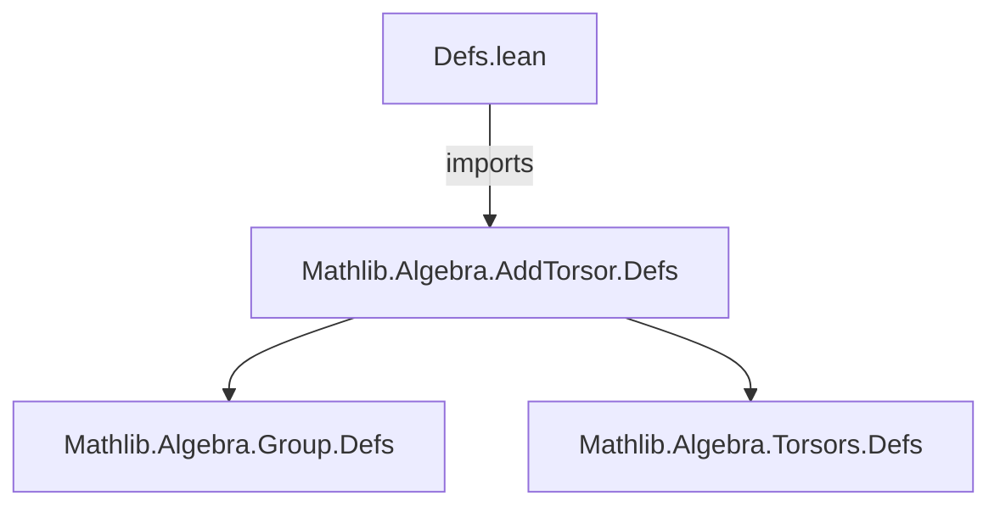
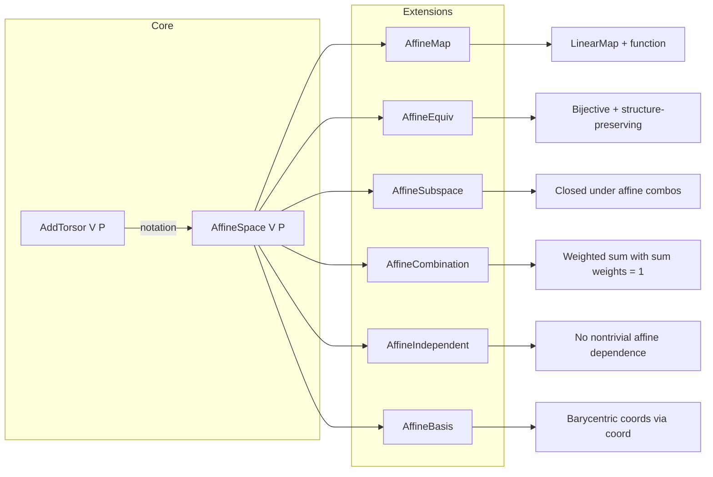

**Technical Brief: `Defs.lean` (Affine Space Notation Module)**

---

### 1. **Key Definitions & Theorems**

| Name / Notation | Type / Purpose |
|----------------|----------------|
| `AffineSpace V P` | **Localized notation** (scoped under `Affine`) for `AddTorsor V P`. Intended to improve readability and usability of affine space concepts in Lean. Replaces `AddTorsor` with `AffineSpace` when `open Affine` is active. |
| `AddTorsor V P` | Underlying mathematical structure: a torsor for an additive group `V` over a type `P`. Defines the affine space structure (points `P`, vectors `V`, and subtraction/addition operations). |
| `MonoidWithZero` | **Explicitly excluded** (via `assert_not_exists`) — ensures no conflicting or ambiguous typeclass instances interfere with the torsor/affine setup. |

> **Note**: No theorems are proven in this file; it is purely definitional/notation setup.

---

### 2. **Naming Conventions**

- **Prefixes / Scopes**:
  - `Affine` scoped notation (`scoped[Affine]`) — indicates this is a *localized* notation, active only when `open Affine` is in scope.
  - `is_`, `mul_`, `dist_` — *not used* in this file (not applicable here).
- **Suffixes**:
  - None in this file; the focus is on *type synonym* via notation, not predicate naming.

---

### 3. **Tactic Stack**

- **Tactics used**:
  - `assert_not_exists` — to verify absence of `MonoidWithZero` instance (prevents accidental interference).
  - `scoped` — not a tactic, but a *module-level attribute* for defining scoped notations.
- **No heavy automation** (`aesop`, `ring`, `simp`, etc.) — this is a low-level definition file.

---

### 4. **Proof Logic**

- **No proofs** in this file.
- **Logical structure**: purely *syntactic/notation-level* — defines how Lean should render `AffineSpace` as `AddTorsor` (and vice versa) under the `Affine` scope.
- **Elaboration strategy**: avoids `abbreviation` (as noted in comment) due to elaboration bugs; uses `notation` instead for robustness.

---

### 5. **Imports**

| Import | Role |
|--------|------|
| `Mathlib.Algebra.AddTorsor.Defs` | Provides the core definition of `AddTorsor`, the underlying structure for affine spaces. |

> This file is a *thin layer* on top of `AddTorsor`, so its scope is narrow and foundational.

---

### 6. **Module Scope & Dependencies**

- **Module name**: `Defs` (implied by filename `Defs.lean`).
- **Public import**: `Mathlib.Algebra.AddTorsor.Defs` — so any module importing this one gets access to `AddTorsor` and the `AffineSpace` notation.
- **No other dependencies** — minimal footprint.

---

### 7. **Mermaid Diagrams**

#### Dependency Graph (File-Level)

#### Overview of Affine Space Theory (Top-Level)

---

### 8. **Design Rationale & Notes**

- **Why notation instead of abbreviation?**  
  As stated in the comment: abbreviations caused *elaboration errors* (likely due to typeclass inference ambiguity or metavariable resolution issues). Notation avoids premature type inference and preserves clarity in both input and goal state.

- **Scoped notation**:  
  `scoped[Affine]` ensures `AffineSpace` is only active when `open Affine` is declared — avoids polluting global namespace and prevents conflicts.

- **Future work**:  
  Affine frames (via `AffineEquiv` to `Finsupp` or `ι →₀ V`) are planned but not yet formalized.

--- 

✅ **Summary**: This file is a *notation layer* for `AddTorsor`, enabling cleaner syntax for affine spaces in Lean. It sets the stage for the broader affine geometry library (`AffineMap`, `AffineSubspace`, etc.) without adding new mathematical content.
