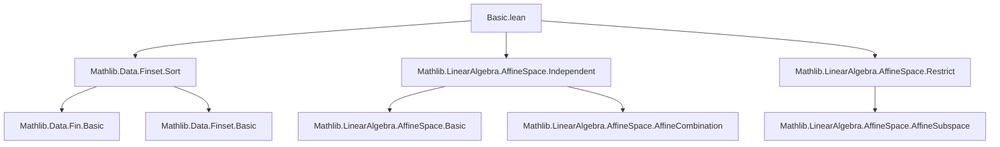
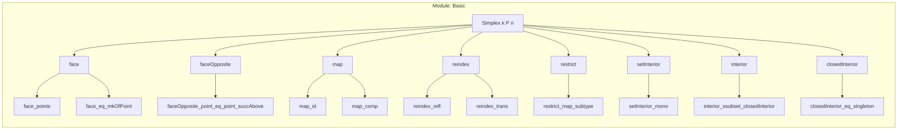
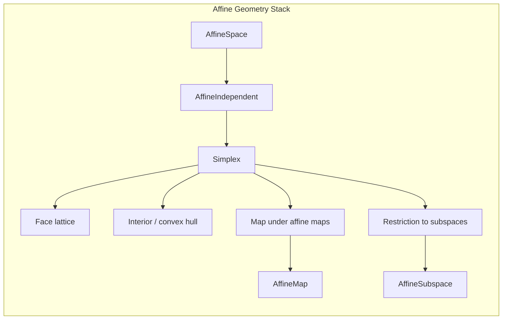

**Technical Brief: `Basic.lean` — Simplex in Affine Space (Lean 4)**  
*Prepared for Domain-Specific AI Agent Training*

---

### 1. KEY DEFINITIONS & THEOREMS

| Name | Type / Signature | Purpose |
|------|------------------|---------|
| `Simplex k P n` | `Structure` | Bundled collection of `n+1` affinely independent points in affine space `P` over ring `k`. |
| `Triangle k P` | `abbrev := Simplex k P 2` | Abbreviation for a 2-simplex (triangle). |
| `mkOfPoint p` | `Simplex k P 0` | Constructs a 0-simplex (single point) from a point `p : P`. |
| `face s h` | `Simplex k P m` | Face of `s : Simplex k P n` determined by subset `fs : Finset (Fin (n+1))` with `#fs = m+1`. |
| `faceOpposite s i` | `Simplex k P (n-1)` | Face opposite vertex `i`, i.e., removing point `i`. |
| `map s f hf` | `Simplex k P₂ n` | Pushforward of simplex `s` along injective affine map `f`. |
| `reindex s e` | `Simplex k P n` | Reindex simplex along equivalence `e : Fin (m+1) ≃ Fin (n+1)`. |
| `restrict s S hS` | `Simplex (S.direction) S n` | Restrict simplex to affine subspace `S` containing it. |
| `setInterior I s` | `Set P` | Points expressible as affine combinations with weights in `I`. |
| `interior s` | `Set P` | `setInterior (Set.Ioo 0 1) s` — intrinsic interior of simplex. |
| `closedInterior s` | `Set P` | `setInterior (Set.Icc 0 1) s` — convex hull / closure of interior. |

#### Key Theorems

| Name | Statement (informal) |
|------|----------------------|
| `ext` | Two simplices equal iff all corresponding points equal. |
| `face_eq_mkOfPoint` | A singleton-face equals `mkOfPoint` of that point. |
| `range_face_points` | Points of a face are image of subset under original `points`. |
| `affineCombination_mem_interior_iff` | A combination lies in interior iff all weights ∈ `(0,1)`. |
| `point_notMem_interior` | Vertices are not in interior. |
| `interior_ssubset_closedInterior` | Interior is strictly contained in closed interior (under `0 ≤ 1`). |
| `affineCombination_mem_interior_face_iff_pos` | In interior of face iff weights positive on face, zero outside (ordered ring). |
| `reindex_range_points` | Reindexing does not change set of points. |
| `map_id`, `map_comp`, `face_map`, `faceOpposite_map` | Functoriality of `map`. |
| `restrict_map_subtype` | Restriction then re-inclusion recovers original simplex. |

---

### 2. NAMING CONVENTIONS

| Pattern | Meaning | Examples |
|--------|---------|----------|
| `is_`, `mem_`, `range_`, `set_` | Predicate / set construction | `mem_affineSpan`, `range_face_points`, `setInterior`, `closedInterior` |
| `face_`, `faceOpposite_` | Face-related operations | `face_points`, `faceOpposite_point_eq_point_succAbove` |
| `map_`, `restrict_`, `reindex_` | Structural transformations | `map_id`, `restrict_map_restrict`, `reindex_trans` |
| `affineCombination_mem_..._iff` | Characterization of membership in interior-like sets | `affineCombination_mem_interior_iff`, `affineCombination_mem_closedInterior_face_iff_nonneg` |
| `..._eq_...` | Equality lemmas (often `rfl` or `ext`-based) | `face_eq_mkOfPoint`, `reindex_reindex_symm` |
| `..._mono`, `..._subset`, `..._ssubset` | Inclusion relations | `setInterior_mono`, `interior_subset_closedInterior`, `interior_ssubset_closedInterior` |

---

### 3. TACTIC STACK

| Tactic | Frequency | Role |
|--------|-----------|------|
| `simp` / `simp_rw` | Very High | Simplify using `@[simp]` lemmas, especially for `points`, `range`, `affineCombination`. |
| `ext` | High | Prove equality of simplices or maps by extensionality. |
| `rw` | High | Rewrite using lemmas (especially `affineCombination_mem_..._iff`, `face_points`, etc.). |
| `grind` | Medium | Custom tactic (likely from `Mathlib.Tactic`) for grinding through algebraic simplifications. |
| `rcases` / `obtain` | Medium | Extract witnesses from existential quantifiers (e.g., in `affineCombination_mem_setInterior_iff`). |
| `convert` | Medium | Align goals modulo definitional equality (e.g., in `affineCombination_mem_setInterior_face_iff_mem`). |
| `have`, `by_cases`, `by_contra` | Medium | Local assumptions and case splits (e.g., `hj : j = i`). |
| `rwa`, `apply`, `exact` | Medium | Standard proof scripting. |
| `intro`, `intro!`, `funext` | Medium | Lambda abstraction and extensionality. |
| `aesop` | Low | Not used in this file (no heavy automation). |

---

### 4. PROOF LOGIC

**Typical proof structure**:

1. **Extensionality**: For structural equality (`Simplex`, `AffineMap`), use `ext` + `rfl` or `simp`.
2. **Rewrite using definitions**: Expand `points`, `affineCombination`, `range`, `interior`, etc.
3. **Use `affineIndependent` properties**:
   - `mem_affineSpan_iff`
   - `indicator_extend_eq_of_affineCombination_comp_embedding_eq`
   - `eq_zero_of_affineCombination_mem_affineSpan`
4. **Case analysis on index types**:
   - `Fin 0`, `Fin 1`, `Fin 2` handled via `Fin.isValue`, `Fin.default_eq_zero`, `univ_unique`.
   - `Fin.succAbove`, `Fin.rev`, `Finset.orderEmbOfFin` used for face indexing.
5. **Weight decomposition**:
   - For membership in `interior`/`closedInterior`, decompose weights into support on face vs complement.
   - Use `Finset.sum_subset`, `Finset.single_lt_sum`, `Finset.single_le_sum` for inequalities.
6. **Equivalence handling**:
   - `reindex` lemmas often reduce to `Equiv.range_eq_univ`, `sum_comp_equiv`, `Function.comp_assoc`.
7. **Subsingleton / nontrivial cases**:
   - `subsingleton_or_nontrivial k` splits proofs over whether `k` is trivial.

---

### 5. IMPORTS & DEPENDENCIES

| Module | Purpose |
|--------|---------|
| `Mathlib.Data.Finset.Sort` | Finite subsets, ordering embeddings (`orderEmbOfFin`), cardinality. |
| `Mathlib.LinearAlgebra.AffineSpace.Independent` | `AffineIndependent`, `affineSpan`, `affineCombination`, independence lemmas. |
| `Mathlib.LinearAlgebra.AffineSpace.Restrict` | Affine subspaces, inclusion maps, restriction of affine maps. |

**Core dependencies**:
- `Ring`, `AddCommGroup`, `Module`, `AffineSpace`
- `Finset`, `Fintype`, `Equiv`, `Set`
- `PartialOrder`, `ZeroLEOneClass`, `IsOrderedAddMonoid` (for order-theoretic lemmas)

---

### 6. MERMAID DIAGRAMS

#### Dependency Graph (Top-Level)

#### File Overview (Structure)

#### Theory Context (Affine Geometry)

---

### 7. SUMMARY FOR AI AGENT

- **Domain**: Affine geometry over arbitrary rings, with emphasis on combinatorial structure of simplices.
- **Key abstraction**: `Simplex` as a *bundled* structure with proof-carrying independence.
- **Proof style**: Highly structured, leveraging `simp`, `ext`, and algebraic properties of `affineCombination`.
- **Critical lemmas**: Membership criteria for interior/closed interior in terms of weights (`Ioo`, `Icc`, positivity/nonnegativity).
- **Pattern**: Reindexing and restriction commute with face/map operations — functorial behavior.
- **Useful for**: Formalizing convex geometry, barycentric coordinates, simplicial complexes, and topological arguments in affine settings.

Let me know if you'd like a **Lean 4 tactic cheat sheet** or **automated proof sketch generator** for this theory.
