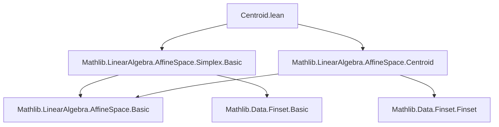
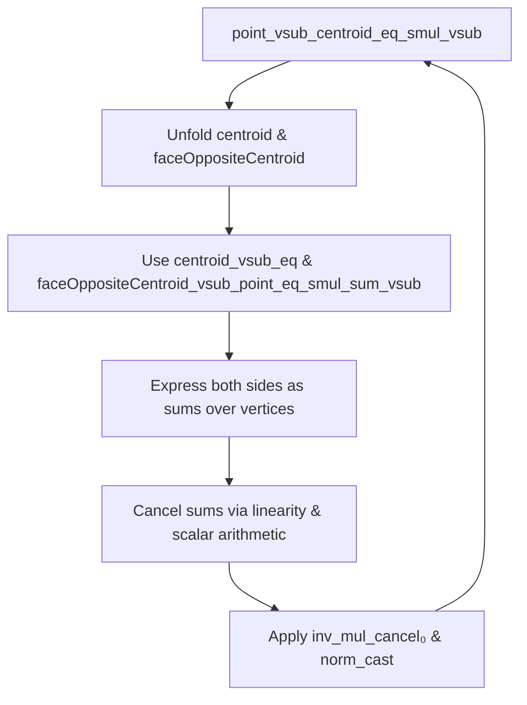

### Technical Brief: Centroid.lean — Affine Simplex Centroid Theory in Lean 4

---

#### **1. Key Definitions & Theorems**

| Name | Type / Signature | Purpose |
|------|------------------|---------|
| `centroid` | `Simplex k P n → P` | Centroid of a simplex: `Finset.univ.centroid k s.points` |
| `faceOppositeCentroid` | `Simplex k P n → Fin (n + 1) → P` | Centroid of the facet opposite vertex `i` |
| `median` | `Simplex k P n → Fin (n + 1) → AffineSubspace k P` | Line through vertex `i` and `faceOppositeCentroid i` |
| `medial` | `Simplex k P n → Simplex k P n` | Simplex formed by all `faceOppositeCentroid`s |
| `centroid_eq_affineCombination` | `s.centroid = affineCombination k univ s.points (centroidWeights k univ)` | Centroid as equal-weight affine combination |
| `centroid_notMem_affineSpan_of_ne_univ` | `s.centroid ∉ affineSpan k (s.points '' t)` if `t ≠ univ` | Centroid lies outside any proper affine subspace of vertices |
| `point_vsub_centroid_eq_smul_vsub` | `s.points i -ᵥ s.centroid = n • (s.centroid -ᵥ s.faceOppositeCentroid i)` | **Commandino’s theorem** in arbitrary dimension: centroid divides median in ratio `n : 1` |
| `faceOppositeCentroid_vsub_faceOppositeCentroid` | `s.faceOppositeCentroid i -ᵥ s.faceOppositeCentroid j = n⁻¹ • (s.points j -ᵥ s.points i)` | Medial simplex is homothetic to original with ratio `n⁻¹` |
| `centroid_mem_median` | `s.centroid ∈ s.median i` | Centroid lies on every median |
| `eq_centroid_of_forall_mem_median` | If `p ∈ s.median i` for all `i`, then `p = s.centroid` | Medians concur uniquely at centroid |
| `centroid_eq_iff` | `fs₁.centroid = fs₂.centroid ↔ fs₁ = fs₂` (char. 0) | Centroid uniquely determines its defining face |
| `medial.independent` | `AffineIndependent k s.medial.points` | Medial simplex is non-degenerate |

---

#### **2. Naming Conventions**

- **Prefixes**:
  - `centroid_`: properties of the centroid (e.g., `centroid_eq_affineCombination`, `centroid_vsub_eq`)
  - `faceOppositeCentroid_`: properties of face-opposite centroids (e.g., `faceOppositeCentroid_vsub_point_eq_smul_sum_vsub`)
  - `point_vsub_`, `vsub_point`: vector from point to centroid / vertex
  - `smul_`, `vadd_`, `vsub_`: vector operations (scalar mult., vector addition, subtraction)
- **Suffixes**:
  - `_eq`: equality statements
  - `_mem_`: membership in affine subspaces / medians
  - `_of_`: conditional versions (e.g., `notMem_of_ne_univ`)
  - `_reindex`, `_map`, `_restrict`: behavior under affine maps / reindexing / restriction
- **Special**:
  - `medial`: noun used as adjective (`medial` simplex)
  - `median`: line (affine subspace), not the segment

---

#### **3. Tactic Stack**

| Tactic | Frequency | Role |
|--------|-----------|------|
| `rw` | Very High | Rewriting definitions, lemmas, and equalities |
| `simp` / `simp_rw` | Very High | Simplifying sums, `Finset`, `affineCombination`, weights |
| `congr` / `congrArg` | Medium | Proving function extensionality / equality of terms |
| `have` / `set` | High | Introducing intermediate equalities / definitions |
| `apply`, `exact`, `intro` | Medium | Standard proof structure |
| `norm_cast`, `grind` | Medium | Handling casts, ring arithmetic, and simplifications |
| `convert` | Medium | Matching up structures with minor differences |
| `ext`, `funext` | Medium | Extensionality for functions / sets |
| `linarith`, `ring` | Low | Linear/ring reasoning (mostly handled by `norm_cast`/`grind`) |
| `grind only [...]` | Medium | Custom tactic for simplifying vector space arithmetic |

> **Note**: `grind` is a custom tactic (likely from the project’s infrastructure) used for automated simplification of affine/vector arithmetic.

---

#### **4. Proof Logic**

- **Induction**: Not used directly; proofs rely on structural properties of finite sets and affine combinations.
- **Core Strategy**:
  1. **Unfold definitions** (`centroid`, `faceOppositeCentroid`, `median`, etc.)
  2. **Rewrite using key lemmas** (e.g., `centroid_eq_affineCombination`, `faceOppositeCentroid_eq_affineCombination`)
  3. **Simplify sums** using `sum_const`, `sum_sub_distrib`, `smul_sum`
  4. **Apply injectivity / independence** (e.g., `affineIndependent_iff_linearIndependent_vsub`)
  5. **Use vector space arithmetic** (e.g., `vsub_vadd`, `vsub_sub_vsub_cancel_right`)
  6. **Conclude via `le_antisymm`** for subspace equalities, or `eq_of_vsub_eq_zero` for point equalities.

- **Typical Flow**:
  ```text
  unfold → rw [centroid_eq_affineCombination] → simp [sum_const, card_univ] →
  apply linear independence / injectivity → simplify scalar factors → conclude
  ```

- **Key Insight**: All proofs exploit the **equal-weight centroid weights** (`1/(n+1)` or `1/n`) and the **characteristic-zero** assumption to avoid division-by-zero and ensure uniqueness.

---

#### **5. Imports & Dependencies**

| Module | Purpose |
|--------|---------|
| `Mathlib.LinearAlgebra.AffineSpace.Simplex.Basic` | Basic simplex theory: `Simplex`, `face`, `reindex`, `map`, `restrict`, `affineSpan`, `independent` |
| `Mathlib.LinearAlgebra.AffineSpace.Centroid` | General centroid on finite sets: `Finset.centroid`, `centroidWeights`, basic lemmas |

> **Core Dependencies**:
- `AffineSpace`, `AffineIndependent`, `affineSpan`, `affineCombination`
- `Finset`, `Fintype`, `Fin`, `card`, `univ`, `compl`
- `Module`, `AddCommGroup`, `DivisionRing`, `CharZero`, `NeZero`

---

#### **6. Mermaid Diagrams**

##### **Dependency Graph (Module-Level)**



##### **Conceptual Overview of Theory Flow**

```mermaid
graph LR
  A[Simplex s] --> B[Vertices: s.points : Fin (n+1) → P]
  B --> C[Centroid: s.centroid]
  B --> D[Face opposite i: s.faceOpposite i]
  D --> E[faceOppositeCentroid i]
  C --> F[Median line: line[s.points i, faceOppositeCentroid i]]
  E --> F
  C --> G[Medial simplex: points i ↦ faceOppositeCentroid i]
  G --> H[Homothetic to s, ratio n⁻¹]
  F --> I[All medians concur at C]
  C --> J[Commandino: point - centroid = n·(centroid - faceOppositeCentroid)]
```

##### **Proof Structure for Commandino’s Theorem**



---

#### **7. Summary**

This file formalizes **centroid geometry of simplices** over arbitrary-dimensional affine spaces over characteristic-zero division rings. It establishes foundational properties of centroids, face centroids, medians, and the **medial simplex**, culminating in a high-dimensional version of **Commandino’s theorem**. The proofs are largely computational, leveraging:
- Equal-weight affine combinations,
- Linear independence of vertices,
- Vector space arithmetic,
- Characteristic-zero to invert `n` and `n+1`.

The theory is robust under affine maps (`map`), restrictions (`restrict`), and reindexing (`reindex`), making it suitable for further development in computational geometry or combinatorial topology.

--- 

Let me know if you'd like a **dependency graph of theorems**, **proof automation patterns**, or a **formalization checklist** for extending this theory (e.g., barycentric coordinates, simplicial complexes).
