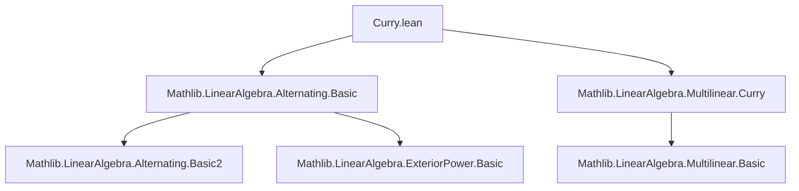

### Technical Brief: Curry.lean — Currying Alternating Forms

---

#### **1. Key Definitions & Theorems**

| Name | Type | Purpose |
|------|------|---------|
| `curryLeft` | `M [⋀^Fin n.succ]→ₗ[R] N →ₗ[R] M →ₗ[R] M [⋀^Fin n]→ₗ[R] N` | Currying: interprets an alternating $(n+1)$-linear map as a linear map into alternating $n$-linear maps. |
| `curryLeft_apply_apply` | `∀ f x v, curryLeft f x v = f (Matrix.vecCons x v)` | Describes the action of `curryLeft` on inputs. |
| `curryLeft_zero`, `curryLeft_add`, `curryLeft_smul` | `simp`-friendly equalities | Show `curryLeft` preserves zero, addition, and scalar multiplication (hence is linear). |
| `curryLeftLinearMap` | `(M [⋀^Fin n.succ]→ₗ[R] N) →ₗ[R] M →ₗ[R] M [⋀^Fin n]→ₗ[R] N` | Linear map version of `curryLeft`, for dot-notation compatibility. |
| `curryLeft_same` | `∀ f m, (f.curryLeft m).curryLeft m = 0` | Alternating property: currying twice with the same argument yields zero. |
| `curryLeft_compAlternatingMap` | `∀ g f m, (g.compAlternatingMap f).curryLeft m = g.compAlternatingMap (f.curryLeft m)` | Compatibility with post-composition (functoriality in codomain). |
| `curryLeft_compLinearMap` | `∀ g f m, (f.compLinearMap g).curryLeft m = (f.curryLeft (g m)).compLinearMap g` | Compatibility with pre-composition (functoriality in domain). |

---

#### **2. Naming Conventions**

- **Prefixes**:
  - `curryLeft_`: for currying on the *first* argument (consistent with `MultilinearMap.curryLeft`).
  - `compAlternatingMap`, `compLinearMap`: standard for composition with alternating/linear maps.
- **Suffixes**:
  - `_apply_apply`: for double-application lemmas (`f x v`).
  - `_same`: for repeated-argument vanishing lemmas.
  - `_linearMap`: for linear-map versions of higher-order operations.

---

#### **3. Tactic Stack**

- `ext`: used to prove equality of alternating maps (extensionality).
- `simp`: for simplification using `@[simp]` lemmas.
- `congr_arg`, `funext`: for pointwise equality reasoning.
- `cases i using Fin.cases`: case analysis on finite indices.
- `simpa`: to discharge goals using simplifier + assumptions.
- `by aesop` (implied via `ext` + `simp` patterns, though not explicit here).

---

#### **4. Proof Logic**

- **Structure**: Most proofs are *definitionally* or *extensionally* straightforward:
  - **Extensionality**: Prove two alternating maps equal by showing they agree on all inputs (`ext` + `funext`).
  - **Linearity**: Use `ext` + properties of `MultilinearMap.curryLeft` and alternating map axioms.
  - **Vanishing on repeats**: Use `map_eq_zero_of_eq` with `Fin.succ_injective` or `Fin.zero_ne_one`.
  - **Functoriality**: Direct computation using definitions of `compAlternatingMap`, `compLinearMap`, and `curryLeft`.

- **Induction**: Not used explicitly — the structure is inductive on `n`, but proofs are pointwise and rely on `Fin n` recursion implicitly.

---

#### **5. Imports & Dependencies**

- **Core**:
  - `Mathlib.LinearAlgebra.Alternating.Basic`: foundational alternating map theory.
  - `Mathlib.LinearAlgebra.Multilinear.Curry`: `MultilinearMap.curryLeft`, which `AlternatingMap.curryLeft` extends.

- **Implicit Dependencies**:
  - `Mathlib.LinearAlgebra.Determinant` (via `⋀^n` notation).
  - `Mathlib.LinearAlgebra.Matrix.VecCons` (for `Matrix.vecCons`).
  - `Mathlib.Algebra.Module.Basic`, `AddCommMonoid`, `CommSemiring`.

---

#### **6. Mermaid Diagrams**

##### **Dependency Graph (Module-Level)**



##### **Theoretical Overview (Currying Alternating Maps)**

```mermaid
graph LR
  A[M [⋀^n.succ]→ₗ N] -->|curryLeft| B[M →ₗ (M [⋀^n]→ₗ N)]
  B -->|apply x| C[M [⋀^n]→ₗ N]
  C -->|apply v| D[N]
  A -->|f(x, v)| D
  B -->|g(x)(v)| D
  A -.->|same x twice| E[0]
  A -->|post ∘ g| A'
  B -->|post ∘ g| B'
  A -->|pre ∘ h| A''
  B -->|pre ∘ h| B''
```

##### **Functoriality Square ( naturality of `curryLeft` )**

```mermaid
graph LR
  A[M [⋀^n.succ]→ₗ N] -->|curryLeft| B[M →ₗ M [⋀^n]→ₗ N]
  A -->|compAlternatingMap g| A2[M [⋀^n.succ]→ₗ N₂]
  B -->|compAlternatingMap g| B2[M →ₗ M [⋀^n]→ₗ N₂]
  A2 -->|curryLeft| B2
  A -- g ∘ - --> A2
  B -- g ∘ - --> B2
  square[ naturality ]:::square
  A --curryLeft--> B
  A --curryLeft--> B
  A2 --curryLeft--> B2
  A --g∘- --> A2
  B --g∘- --> B2
  A --curryLeft--> B
  A2 --curryLeft--> B2
  A --g∘- --> A2
  B --g∘- --> B2
  A --curryLeft--> B
  A2 --curryLeft--> B2
  A --g∘- --> A2
  B --g∘- --> B2
  classDef square fill:#f9f,stroke:#333,stroke-width:2px;
```

*(Note: Simplified as a commutative square: `curryLeft ∘ compAlternatingMap g = compAlternatingMap g ∘ curryLeft`)*

---

#### **7. Summary**

This file formalizes the *currying isomorphism* for alternating maps, mirroring the well-known isomorphism  
$$
\mathrm{Hom}\left(\bigwedge^{n+1} M, N\right) \cong \mathrm{Hom}\left(M, \mathrm{Hom}\left(\bigwedge^n M, N\right)\right),
$$  
and proves its compatibility with composition and alternating structure. It builds directly on `MultilinearMap.curryLeft`, ensuring the alternating condition is preserved under currying. The lemmas are designed for `simp`-based automation and are foundational for higher-algebra constructions (e.g., exterior algebra, determinant theory).
