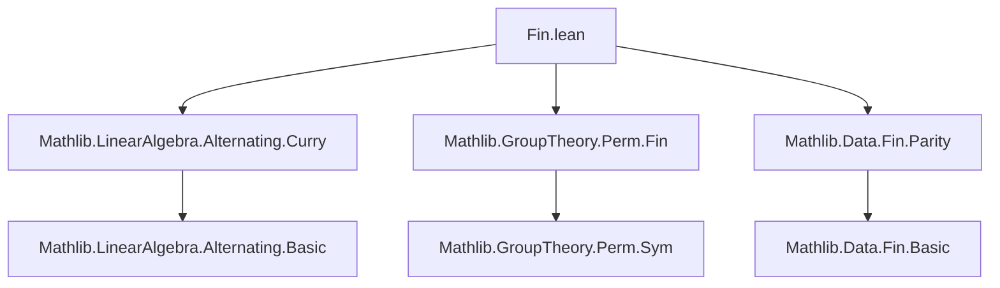

### Technical Brief: `Fin.lean` — Uncurrying Alternating Maps

---

#### **1. Key Definitions & Theorems**

| Name | Type / Signature | Purpose |
|------|------------------|---------|
| `map_insertNth` | `f (p.insertNth x v) = (-1)^p • f (Matrix.vecCons x v)` | Relates inserting a vector at position `p` to prepending it, up to sign. |
| `neg_one_pow_smul_map_insertNth` | `(-1)^p • f (p.insertNth x v) = f (Matrix.vecCons x v)` | Inverse of `map_insertNth`; used to eliminate signs in proofs. |
| `neg_one_pow_smul_map_removeNth_add_eq_zero_of_eq` | `(-1)^i • f (i.removeNth v) + (-1)^j • f (j.removeNth v) = 0` under `v i = v j`, `i ≠ j` | Shows cancellation of two terms in the alternating sum when two inputs coincide. |
| `alternatizeUncurryFin` | `(M →ₗ[R] M [⋀^Fin n]→ₗ[R] N) → M [⋀^Fin (n+1)]→ₗ[R] N` | Constructs an alternating `(n+1)`-map from a linear map into an alternating `n`-map. Defined by: <br> `∑ i, (-1)^i • f (v i) (removeNth i v)` |
| `alternatizeUncurryFin_apply` | `alternatizeUncurryFin f v = ∑ i, (-1)^i • f (v i) (removeNth i v)` | Explicit evaluation formula. |
| `alternatizeUncurryFin_curryLeft` | `alternatizeUncurryFin (curryLeft f) = (n + 1) • f` | Round-trip identity: uncurrying then re-currying scales by `n+1`. |
| `alternatizeUncurryFinLM` | `(M →ₗ[R] M [⋀^Fin n]→ₗ[R] N) →ₗ[R] M [⋀^Fin (n+1)]→ₗ[R] N` | Linear map version of `alternatizeUncurryFin`. |
| `alternatizeUncurryFin_alternatizeUncurryFinLM_comp_apply` | Explicit double-uncurrying formula for bilinear `f` into alternating maps. | General expansion of twice-uncurried bilinear map in terms of pairwise swaps. |
| `alternatizeUncurryFin_alternatizeUncurryFinLM_comp_of_symmetric` | If `f` symmetric, then `alternatizeUncurryFin (alternatizeUncurryFinLM ∘ₗ f) = 0` | Key result: twice-uncurried symmetric bilinear alternating-valued map vanishes. |

---

#### **2. Naming Conventions**

- **Prefixes**:
  - `alternatizeUncurryFin*`: Main construction and variants.
  - `map_*`: Basic properties of alternating maps (e.g., `map_insertNth`, `map_eq_zero_of_eq`).
  - `neg_one_pow_smul_*`: Sign-handling lemmas.
- **Suffixes**:
  - `_apply`: Evaluation formula.
  - `_add`, `_smul`: Linearity properties.
  - `_LM`: Linear map version (e.g., `alternatizeUncurryFinLM`).
  - `_comp_*`: Composition with other maps (e.g., `curryLeft`, `alternatizeUncurryFinLM ∘ₗ f`).
- **Variables**:
  - `p`, `i`, `j`: Indices in `Fin (n+1)` or `Fin (n+2)`.
  - `v`: Vector tuple.
  - `f`, `g`: Maps.
  - `hvij`, `hij`: Hypotheses for equality/disequality of inputs.

---

#### **3. Tactic Stack**

- **Core tactics**:
  - `simp`, `rw`, `ext`, `refine`, `cases`, `rcases`, `obtain`
- **Domain-specific**:
  - `Finset.sum_congr`, `Fintype.sum_eq_add`, `sum_sum_eq_sum_triangle_add`
  - `mul_smul`, `smul_smul`, `pow_add`, `neg_one_pow_*`, `sq`, `pow_mul`
  - `removeNth`, `insertNth`, `succAbove`, `predAbove`, `castSucc`, `succ`
- **Simplification & rewriting**:
  - `simp only [...]`, `congr 4`, `rw [removeNth_removeNth_eq_swap]`
- **Algebraic simplification**:
  - `ring`, `abel`, `linarith` (implicit via `neg_add_cancel`, etc.)

---

#### **4. Proof Logic**

- **Inductive structure**: Not used directly; proofs rely on finite combinatorics over `Fin n`.
- **Typical flow**:
  1. **Expand definitions** using `simp [alternatizeUncurryFin_apply]`.
  2. **Reduce sums** using `Fintype.sum_eq_add` or `Finset.sum_congr`, isolating relevant terms.
  3. **Apply sign lemmas** (`map_insertNth`, `neg_one_pow_smul_*`) to handle permutations.
  4. **Cancel terms** using `neg_one_pow_smul_map_removeNth_add_eq_zero_of_eq` when inputs repeat.
  5. **Use symmetry or antisymmetry** (e.g., `hf : f x y = f y x`) to show cancellation.
- **Key insight**: Alternating sums over permutations yield cancellation when inputs repeat or maps are symmetric/antisymmetric.

---

#### **5. Imports & Dependencies**

| Module | Purpose |
|--------|---------|
| `Mathlib.LinearAlgebra.Alternating.Curry` | Curry/uncurry theory for alternating maps (`curryLeft`, `uncurryMid`, etc.). |
| `Mathlib.GroupTheory.Perm.Fin` | Permutations on `Fin n`, especially cycle permutations and sign calculations. |
| `Mathlib.Data.Fin.Parity` | Parity of permutations, `(-1)^n`, and related arithmetic. |

---

#### **6. Mermaid Diagrams**

##### **Dependency Graph (Module-Level)**



##### **Overview of Theory Flow**

```mermaid
flowchart LR
  A[Alternating Maps] --> B[Currying]
  B --> C[Uncurrying via alternatizeUncurryFin]
  C --> D[Round-trip identity: (n+1)•f]
  C --> E[Double uncurrying]
  E --> F[Vanishing for symmetric f]
  F --> G[Exterior derivative d² = 0]
```

##### **Data Flow in `alternatizeUncurryFin` Construction**

```mermaid
flowchart LR
  f[M →ₗ M[⋀^n]→ₗ N] -->|define| sum[∑_i (-1)^i • f(v i) (removeNth i v)]
  sum -->|prove alternating| altMap[M[⋀^(n+1)]→ₗ N]
  altMap -->|linearity| LM[→ₗ[R] M[⋀^(n+1)]→ₗ N]
  LM -->|round-trip| curryLeft[curryLeft f]
  curryLeft -->|scale| (n+1)•f
```

---

#### **7. Applications & Motivation**

- **Exterior algebra**: Provides a canonical way to extend alternating maps by one argument.
- **Differential geometry**: The vanishing of twice-uncurried symmetric bilinear alternating-valued maps is used to prove $d^2 = 0$ for exterior derivatives (see comment in `alternatizeUncurryFin_alternatizeUncurryFinLM_comp_of_symmetric`).
- **Avoids division**: No division by $n+1$, so works over arbitrary commutative rings.

---

#### **8. Deprecations**

All aliases use `uncurryFin*` and are deprecated as of `2025-09-30`, replaced by `alternatizeUncurryFin*`.

--- 

This file formalizes a foundational step in exterior algebra over arbitrary rings, with careful attention to sign conventions and combinatorial cancellation.
