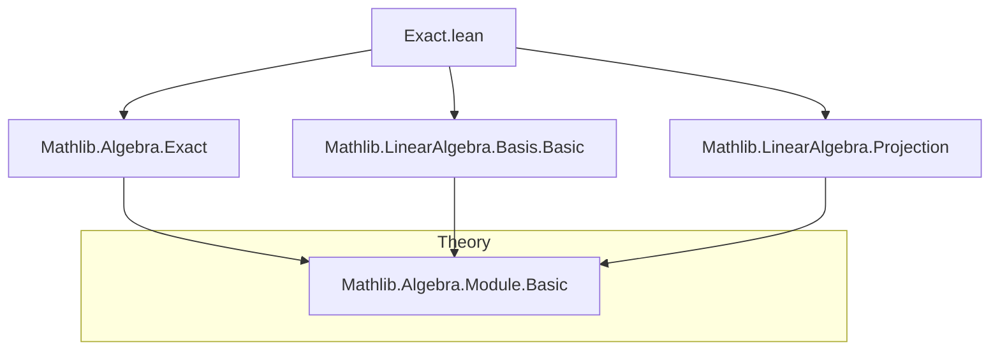
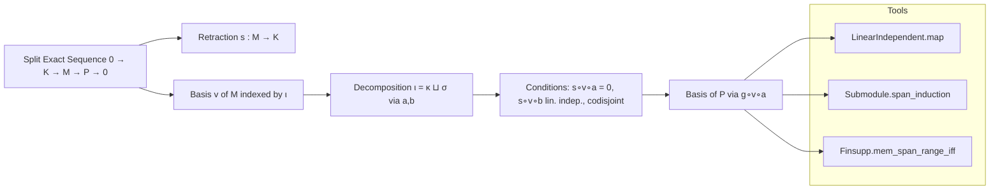

### Technical Brief: `Exact.lean` — Basis from a Split Exact Sequence

---

#### **1. Key Definitions & Theorems**

| Name | Type / Signature | Purpose |
|------|------------------|---------|
| `LinearIndependent.linearIndependent_of_exact_of_retraction` | `∀ {a : κ → ι}, Function.Injective a → (∀ i, s (v (a i)) = 0) → LinearIndependent R v → LinearIndependent R (g ∘ v ∘ a)` | Shows that if a family `v` is linearly independent and `s ∘ v ∘ a = 0`, then its image under `g` (modulo `K`) remains linearly independent in `P`. |
| `Submodule.top_le_span_of_exact_of_retraction` | `hg : Function.Surjective g → (∀ i, s (v (a i)) = 0) → LinearIndependent R (s ∘ v ∘ b) → Codisjoint (range a) (range b) → ⊤ ≤ span(range (g ∘ v ∘ a))` | Proves that the span of `g ∘ v ∘ a` is all of `P`, assuming the original `v` spans `M`, and the decomposition is codisjoint. |
| `Module.Basis.ofSplitExact` | `Basis κ R P` | Constructs a basis of `P` indexed by `κ`, using a basis `v` of `M` indexed by `ι`, under the splitting and exactness assumptions. |
| `Module.Basis.ofSplitExact_apply` | `ofSplitExact … k = g (v (a k))` | Specifies how the constructed basis acts: it picks the image under `g` of the `a(k)`-th basis vector of `M`. |
| `Submodule.linearProjOfIsCompl_comp_surjective_of_exact` | `Function.Surjective (linearProjOfIsCompl p q hpq ∘ₗ f)` | Under exactness and surjectivity of `g|_q`, the projection onto `p` composed with `f` is surjective. |
| `Submodule.linearProjOfIsCompl_comp_bijective_of_exact` | `Function.Bijective (linearProjOfIsCompl p q hpq ∘ₗ f)` | Strengthens the above to bijectivity under injectivity of `f` and disjointness of `ker g` and `q`. |
| `LinearMap.linearProjOfIsCompl_comp_bijective_of_exact` | `Function.Bijective (linearProjOfIsCompl q i hi h ∘ₗ f)` | Generalizes the previous result to arbitrary embeddings `i : E → M`. |

---

#### **2. Naming Conventions**

- **Prefixes**:
  - `linearIndependent_`: properties about linear independence.
  - `top_le_span_`: proving that the whole module is contained in a span.
  - `linearProjOfIsCompl_`: projections associated with complementary submodules.
- **Suffixes**:
  - `_of_exact_of_retraction`: conditions derived from an exact sequence with a retraction.
  - `_comp_surjective_of_exact`, `_comp_bijective_of_exact`: composition with `f` under exactness.
- **Variables**:
  - `a : κ → ι`, `b : σ → ι`: embeddings of index types into a larger index set.
  - `v : ι → M`: a family in `M`, often a basis.
  - `s : M → K`: retraction of `f`, i.e., `s ∘ f = id`.
  - `hg : Function.Surjective g`, `hfg : Function.Exact f g`: standard assumptions.

---

#### **3. Tactic Stack**

- **Core tactics**:
  - `rw`, `simp`, `simp_all`, `simp_rw`: for rewriting and simplifying using lemmas like `LinearMap.id_coe`, `map_zero`, etc.
  - `induction`: used with `Submodule.span_induction` to handle membership in spans.
  - `intro`, `rintro`, `obtain`, `replace`: for hypothesis management.
  - `wlog`: "without loss of generality", used to reduce to the case `m ∈ ker s`.
  - `convert`, `apply`, `exact`: standard proof construction.
  - `rwa`, `rw [← ...]`: reverse rewriting with post-processing.
  - `have`, `replace`: intermediate lemma introduction.
  - `ext`, `funext`: extensionality for functions/submodules.

- **Specialized**:
  - `Finsupp.mem_span_range_iff_exists_finsupp.mp`: to extract finite support expressions.
  - `Finset.sum_sum_eq_sum_toLeft_add_sum_toRight`: decomposition over `κ ⊕ σ`.

---

#### **4. Proof Logic**

- **Structure of main proof (`ofSplitExact`)**:
  1. **Linear independence**: Use `linearIndependent_of_exact_of_retraction`, which:
     - Pulls independence through `g` using exactness (`ker g = im f`).
     - Uses the retraction `s` to show that any linear relation in `g ∘ v ∘ a` lifts to one in `v`, which must be trivial.
  2. **Spanning**: Use `top_le_span_of_exact_of_retraction`, which:
     - Reduces to showing `m ∈ M` can be written using `v`, then decomposes `m` into `ker s` and `im f` parts.
     - Uses codisjointness of `range a` and `range b` to separate contributions.
     - Leverages linear independence of `s ∘ v ∘ b` to kill the `σ`-part.

- **Auxiliary lemmas**:
  - `top_le_span_of_aux`: handles the `κ ⊕ σ` case explicitly, then generalizes via `elim`.
  - Proofs often use:
    - `hfg.linearMap_ker_eq`: `ker g = im f`.
    - `hs : s ∘ f = id`: to split `m = f(s(m)) + (m - f(s(m)))`.
    - `Finsupp` machinery to extract finite linear combinations.

---

#### **5. Imports & Dependencies**

| Import | Purpose |
|--------|---------|
| `Mathlib.Algebra.Exact` | Core definitions: `Function.Exact`, `LinearMap.ker_eq`, etc. |
| `Mathlib.LinearAlgebra.Basis.Basic` | `Basis`, `LinearIndependent`, `span`, `linearIndependent_iff'`, etc. |
| `Mathlib.LinearAlgebra.Projection` | `Submodule.linearProjOfIsCompl`, `IsCompl`, projections onto complements. |

---

#### **6. Mermaid Diagrams**

##### **Dependency Graph (Module Level)**



##### **Overview of Theoretical Flow**



##### **Proof Strategy Flow (Main Lemma)**

```mermaid
graph TD
  Start[Given: split exact seq., basis v, maps a,b] --> LinIndep[Prove g∘v∘a lin. indep.]
  Start --> Span[Prove span(g∘v∘a) = ⊤]

  LinIndep --> LinIndepAux[Use hfg: ker g = im f]
  LinIndepAux --> LinIndepRetract[Use hs: s∘f = id to lift relations]
  
  Span --> SpanDecomp[Decompose m ∈ M via s]
  SpanDecomp --> SpanFinsupp[Express m via finite combination of v]
  SpanFinsupp --> SpanSplit[Split sum over κ, σ using inl/inr]
  SpanSplit --> SpanKillσ[Use lin. indep. of s∘v∘b to kill σ-part]
  SpanKillσ --> SpanConclusion[Conclude ⊤ ≤ span(g∘v∘a)]

  LinIndep --> BuildBasis
  Span --> BuildBasis
  BuildBasis --> Module.Basis.ofSplitExact
```

---

#### **7. Summary**

This file formalizes a classical homological algebra result: given a *split* exact sequence of modules  
$$
0 \to K \xrightarrow{f} M \xrightarrow{g} P \to 0,
$$  
and a basis $v$ of $M$ indexed by $\iota = \kappa \sqcup \sigma$, if the basis vectors indexed by $\kappa$ lie in $\ker s$ (i.e., map to zero under retraction), and the $s$-images of the $\sigma$-indexed vectors are linearly independent, then the $g$-images of the $\kappa$-indexed vectors form a basis of $P$.

The proof is constructive and leverages:
- Exactness to identify $\ker g = \operatorname{im} f$,
- The retraction $s$ to decompose elements of $M$,
- Finsupp-based span arguments to handle finite linear combinations,
- Codisjointness to separate contributions from $\kappa$ and $\sigma$.

The auxiliary lemmas on projections show how complements interact with exact sequences — useful for future work on module decompositions and spectral sequences.

--- 

Let me know if you'd like a formalized summary in Lean syntax or a diagram of the `Module.Basis.ofSplitExact` construction pipeline.
