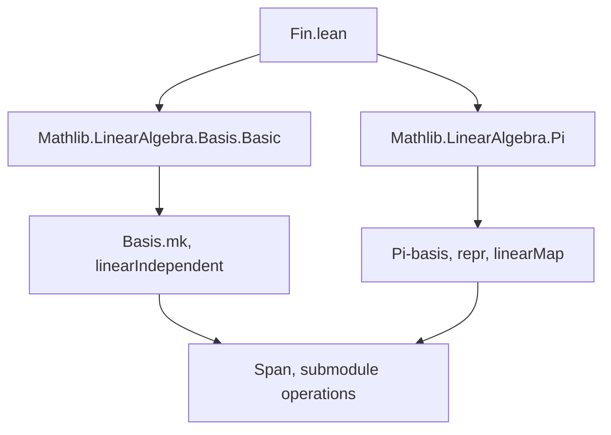
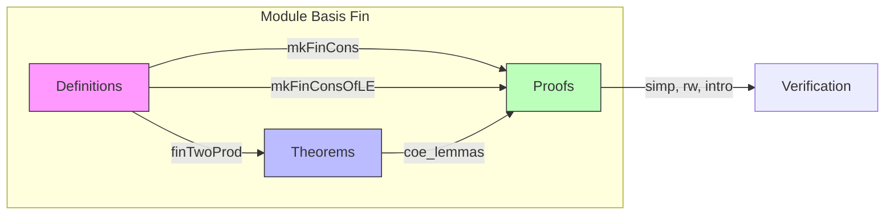

### Technical Brief: `Fin.lean` — Bases Indexed by `Fin`

---

#### **1. Key Definitions & Theorems**

| Name | Type / Signature | Purpose |
|------|------------------|---------|
| `mkFinCons` | `{n : ℕ} → {N : Submodule R M} → M → Basis (Fin n) R N → (∀ c x, c • y + x = 0 → c = 0) → (∀ z, ∃ c, z + c • y ∈ N) → Basis (Fin (n + 1)) R M` | Constructs a basis for the whole module `M` by extending a basis `b` of a submodule `N` with a vector `y` linearly independent of `N` and spanning modulo `N`. |
| `mkFinConsOfLE` | `{n : ℕ} → {N O : Submodule R M} → M → y ∈ O → Basis (Fin n) R N → N ≤ O → (lin. indep.) → (span condition on O) → Basis (Fin (n + 1)) R O` | Same as `mkFinCons`, but works within a larger submodule `O` containing `N`. |
| `finTwoProd` | `Basis (Fin 2) R (R × R)` | Standard basis of the free module `R × R`, indexed by `Fin 2`. |
| `coe_mkFinCons` | `(mkFinCons … : Fin (n+1) → M) = Fin.cons y ((↑) ∘ b)` | Shows the coercion of the constructed basis to a function matches the expected `Fin.cons` form. |
| `coe_mkFinConsOfLE` | `(mkFinConsOfLE … : Fin (n+1) → O) = Fin.cons ⟨y, yO⟩ (inclusion ∘ b)` | Coercion lemma for `mkFinConsOfLE`. |
| `finTwoProd_zero`, `finTwoProd_one` | `Basis.finTwoProd R 0 = (1, 0)`, `Basis.finTwoProd R 1 = (0, 1)` | Explicit values of the standard basis vectors. |
| `coe_finTwoProd_repr` | `repr(x) = ![x.fst, x.snd]` | Coordinates of a vector in the `finTwoProd` basis are just its components. |

---

#### **2. Naming Conventions**

- **Prefixes**:
  - `mkFinCons*`: “Make” a basis using `Fin.cons`.
  - `finTwoProd*`: “Product” basis on `Fin 2`.
- **Suffixes**:
  - `OfLE`: For variants where the ambient space is a submodule `O` with `N ≤ O`.
- **General patterns**:
  - `coe_*`: Coercion lemmas (to functions).
  - `*_zero`, `*_one`: Special cases for `Fin 2`.

---

#### **3. Tactic Stack**

Frequent tactics used in proofs:

- `rw`: Rewriting using equalities (e.g., `span_b`, `b.span_eq`, `Submodule.map_subtype_top`).
- `intro` / `rintro`: Introducing hypotheses and destructuring.
- `exact`: Closing goals directly.
- `simp`: Simplification, especially for coercion and `repr`.
- `congr_arg`: For proving equality of coerced terms.
- `Submodule.mem_span_insert'`, `Submodule.span_image`, `Set.range_comp`: Standard submodule span lemmas.
- `Submodule.ker_subtype`, `Submodule.comapSubtypeEquivOfLe`: For working with submodules and inclusions.

No heavy automation (e.g., `aesop`, `ring`, `linarith`) is used — proofs are mostly manual and structural.

---

#### **4. Proof Logic**

- **Inductive-style extension**: Proofs follow the logic of extending a basis by one vector:
  1. Show linear independence of the extended family (`Fin.cons y b`) using `linearIndependent.map'` and `fin_cons'`.
  2. Show spanning via `mem_span_insert'` and the hypothesis `hsp`.
- **Submodule containment handling**:
  - In `mkFinConsOfLE`, pull back the basis via `Submodule.comapSubtypeEquivOfLe` to reduce to the `mkFinCons` case.
  - Use `Submodule.mem_comap` and coercion properties to translate conditions.
- **Simp-based verification**:
  - Coercion lemmas are proven by unfolding definitions and applying `coe_mk`, then simplifying.

---

#### **5. Imports & Dependencies**

- **Core imports**:
  ```lean
  Mathlib.LinearAlgebra.Basis.Basic
  Mathlib.LinearAlgebra.Pi
  ```
- **Key imported modules/types**:
  - `LinearMap`, `Submodule`, `Finsupp`, `Set`, `Function`
  - `Basis`, `linearIndependent`, `span`, `repr`, `subtype`, `map`, `comap`
  - `LinearEquiv`, `Fin`, `Fin.cons`, `Fin.range_cons`

---

#### **6. Mermaid Diagrams**

##### **Dependency Graph (Module-Level)**



##### **Overview of File Structure**



##### **Theoretical Context**

This file sits in the **basis theory** layer of `Mathlib`, specifically handling **finite-indexed bases** (`Fin n`) and their extension properties. It connects to:

- **Free modules**: `finTwoProd` gives the canonical basis for `R²`.
- **Dimension theory**: `mkFinCons` is a step toward proving that finite bases have well-defined cardinality.
- **Quotient & extension lemmas**: Underpins constructions like `basis_of_le_of_card_eq`.

---

Let me know if you'd like a formalized dependency graph of the `Basis` namespace or a proof sketch of `mkFinCons`.
