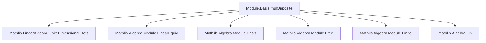
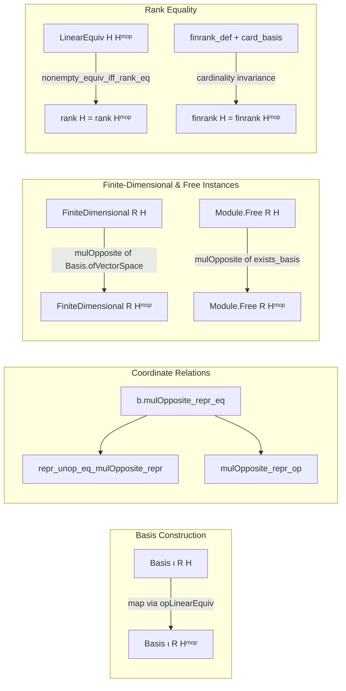
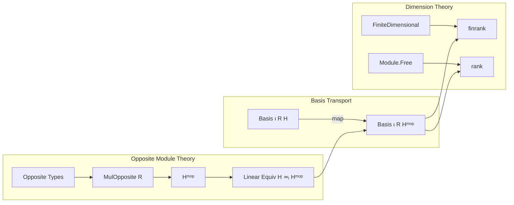

### Technical Brief: `MulOpposite.lean`

---

#### **1. Key Definitions & Theorems**

| Name | Type / Signature | Purpose |
|------|------------------|---------|
| `mulOpposite` | `Basis ι R H → Basis ι R Hᵐᵒᵖ` | Constructs the basis of the multiplicative opposite module `Hᵐᵒᵖ` from a basis `b` of `H`, via `b.map (opLinearEquiv R)`. |
| `mulOpposite_apply` | `∀ b i, b.mulOpposite i = op (b i)` | Describes how `mulOpposite` acts on basis elements. |
| `mulOpposite_repr_eq` | `b.mulOpposite.repr = (opLinearEquiv R).symm.trans b.repr` | Relates coordinate representations w.r.t. `b.mulOpposite` and `b`. |
| `repr_unop_eq_mulOpposite_repr` | `∀ x, b.repr (unop x) = b.mulOpposite.repr x` | Connects coordinates in original space (via `unop`) to those in opposite space. |
| `mulOpposite_repr_op` | `∀ x, b.mulOpposite.repr (op x) = b.repr x` | Shows that applying `op` before taking coordinates w.r.t. `b.mulOpposite` yields same coordinates as w.r.t. `b`. |
| `FiniteDimensional.instance` | `[DivisionRing R] [AddCommGroup H] [Module R H] [FiniteDimensional R H] → FiniteDimensional R Hᵐᵒᵖ` | Proves that if `H` is finite-dimensional, so is `Hᵐᵒᵖ`. |
| `Module.Free.instance` | `[Semiring R] [AddCommMonoid H] [Module R H] [Module.Free R H] → Module.Free R Hᵐᵒᵖ` | Shows freeness descends to opposite module. |
| `rank` | `[Semiring R] [StrongRankCondition R] [Module.Free R H] → rank Hᵐᵒᵖ = rank H` | Equality of ranks (cardinalities of bases) for `H` and its opposite. |
| `finrank` | `[DivisionRing R] [AddCommGroup H] [Module R H] → finrank R Hᵐᵒᵖ = finrank R H` | Equality of *finite* ranks (natural numbers) for `H` and `Hᵐᵒᵖ`. |

---

#### **2. Naming Conventions**

- **Prefixes**:
  - `mulOpposite_`: for definitions and lemmas about the induced basis on the opposite module.
  - `repr_`: for coordinate representation lemmas.
- **Suffixes**:
  - `_eq`: for equalities (e.g., `mulOpposite_repr_eq`).
  - `_op`, `_unop`: for operations involving `op`/`unop`.
- **Structure**:
  - `b.mulOpposite` — method-style application of the `mulOpposite` construction to a basis `b`.
  - `opLinearEquiv R` — canonical linear equivalence `H ≃ₗ[R] Hᵐᵒᵖ`.

---

#### **3. Tactic Stack**

- **Core tactics**:
  - `rfl` — used extensively for definitional equalities (e.g., `mulOpposite_apply`, `mulOpposite_repr_eq`, etc.).
  - `rw` — rewriting using lemmas like `finrank_eq_nat_card_basis`.
  - `let` + `rw` — for introducing intermediate basis constructions.
  - `mp` (from `Nonempty.equiv`) — in `rank` proof: `LinearEquiv.nonempty_equiv_iff_rank_eq.mp`.
  - `of_basis` — used in `FiniteDimensional.of_finite_basis` and `Module.Free.of_basis`.

No heavy automation (e.g., `aesop`, `ring`, `simp_rw`) is used — proofs are mostly definitional or rely on pre-existing equivalences.

---

#### **4. Proof Logic**

- **Structure**:
  - **Basis construction**: Use `b.map (opLinearEquiv R)` to transport basis along linear equivalence.
  - **Coordinate lemmas**: Derive directly from definitions and properties of `opLinearEquiv`, `repr`, and `map`.
  - **Finite-dimensionality / freeness**: Use existence of a finite/free basis for `H`, then apply `mulOpposite` to get one for `Hᵐᵒᵖ`.
  - **Rank equality**:
    - For *free* modules: Use `LinearEquiv.nonempty_equiv_iff_rank_eq`, noting `opLinearEquiv R` gives an equivalence `H ≃ₗ Hᵐᵒᵖ`.
    - For *finite-dimensional* modules: Use `finrank_eq_nat_card_basis` and card equality of bases.

- **Induction**: Not used — all arguments are structural or rely on equivalence-based reasoning.

---

#### **5. Imports**

- **Primary dependency**:
  ```lean
  Mathlib.LinearAlgebra.FiniteDimensional.Defs
  ```
- **Implicit dependencies** (via `Module`, `MulOpposite`, `LinearEquiv`, `Basis`):
  - `Mathlib.Algebra.Module.Basic`
  - `Mathlib.Algebra.Module.Free`
  - `Mathlib.Algebra.Module.Finite`
  - `Mathlib.Algebra.Module.LinearEquiv.Basic`
  - `Mathlib.Algebra.Module.Basis`
  - `Mathlib.Algebra.Op`

---

#### **8. Mermaid Diagrams**

##### **Dependency Graph (Module-Level)**



##### **Overview of File Structure**



##### **Theory Context**



--- 

This file formalizes the elementary but foundational fact that taking the multiplicative opposite preserves finite-dimensionality, freeness, and dimension — via explicit basis transport along the canonical linear equivalence `opLinearEquiv`.
