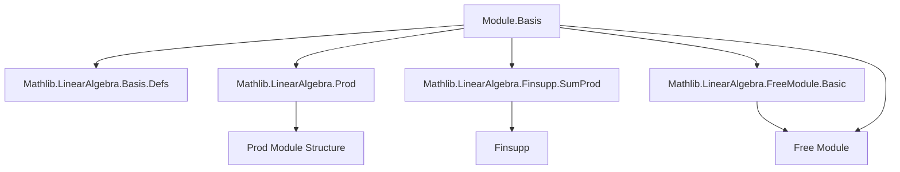

**Technical Brief: `Prod.lean` — Bases for Product Modules**

---

### 1. **Key Definitions & Theorems**

| Name | Type / Signature | Purpose |
|------|------------------|---------|
| `Module.Basis.prod` | `Basis ι R M → Basis ι' R M' → Basis (ι ⊕ ι') R (M × M')` | Constructs a basis for the product module $M \times M'$ from bases of $M$ and $M'$. |
| `prod_repr_inl` | `(b.prod b').repr x (Sum.inl i) = b.repr x.1 i` | Describes how the representation function of the product basis acts on left injections (`inl`). |
| `prod_repr_inr` | `(b.prod b').repr x (Sum.inr i) = b'.repr x.2 i` | Describes how the representation function acts on right injections (`inr`). |
| `prod_apply_inl_fst` | `(b.prod b' (Sum.inl i)).1 = b i` | The first component of the product basis vector indexed by `inl i` is exactly the original basis vector `b i`. |
| `prod_apply_inr_fst` | `(b.prod b' (Sum.inr i)).1 = 0` | The first component of a basis vector indexed by `inr i` is zero. |
| `prod_apply_inl_snd` | `(b.prod b' (Sum.inl i)).2 = 0` | The second component of a basis vector indexed by `inl i` is zero. |
| `prod_apply_inr_snd` | `(b.prod b' (Sum.inr i)).2 = b' i` | The second component of a basis vector indexed by `inr i` is `b' i`. |
| `prod_apply` | `b.prod b' i = Sum.elim (inl ∘ b) (inr ∘ b') i` | Closed-form expression for the product basis vectors using `Sum.elim`. |
| `Free.prod` | Instance: `Module.Free R M → Module.Free R N → Module.Free R (M × N)` | Shows that the product of free modules is free, using `prod` on chosen bases. |

---

### 2. **Naming Conventions**

- **Prefixes**:
  - `prod_`: Relates to the product construction (`prod_repr`, `prod_apply`, etc.).
  - `inl_`, `inr_`: Refers to left/right injections in the sum type `ι ⊕ ι'`.
- **Suffixes**:
  - `_fst`, `_snd`: Denote projection to first/second component of the product module.
- **Structure**:
  - `ofRepr`: Used to define a basis via a linear equivalence to `ι →₀ R`.
  - `repr`: Refers to the representation map (inverse of `basis fun i => b i`).

---

### 3. **Tactic Stack**

- `simp only [...]`: Heavily used to simplify goals using known lemmas and `@[simp]` theorems.
- `ext`: Extensionality for functions/linear maps.
- `cases i`: Case analysis on sum type index `i : ι ⊕ ι'`.
- `apply ...`: Often used after `ext` or `simp` to finish proofs.
- `rfl`: Used for definitional equalities (e.g., `prod_repr_inl`, `prod_repr_inr`).
- `Finsupp.single_eq_of_ne`, `Finsupp.single_apply_left`: Standard lemmas for finite support functions.
- `Sum.inl_injective`, `Sum.inl_ne_inr`, etc.: Properties of `Sum` constructors used to distinguish indices.

---

### 4. **Proof Logic**

- **Structure**: Proofs follow a pattern of:
  1. **Extensionality** (`ext`) to reduce to pointwise equality.
  2. **Case analysis** on the sum index (`Sum.inl i` vs `Sum.inr i`).
  3. **Simplification** using `@[simp]` lemmas and definitions of `prod`, `repr`, and `LinearMap.inl/inr`.
  4. **Application of injectivity** of `b.repr` or `b'.repr` to reduce to equalities in `ι →₀ R`.
  5. **Finsupp reasoning** to handle support and singletons.

- **Induction**: Not used explicitly; instead, structural reasoning on `ι ⊕ ι'` and finite support functions suffices.

---

### 5. **Imports & Dependencies**

| Import | Role |
|--------|------|
| `Mathlib.LinearAlgebra.Prod` | Basic theory of product modules (additive/multiplicative structure, module instance). |
| `Mathlib.LinearAlgebra.Basis.Defs` | Definitions of `Basis`, `repr`, `ofRepr`, etc. |
| `Mathlib.LinearAlgebra.Finsupp.SumProd` | Equivalence `ι ⊕ ι' →₀ R ≃ (ι →₀ R) × (ι' →₀ R)` (`sumFinsuppLEquivProdFinsupp`). |
| `Mathlib.LinearAlgebra.FreeModule.Basic` | Free modules, `Free.chooseBasis`, `Free.of_basis`. |

---

### 6. **Mermaid Diagrams**

#### **Dependency Graph (Module Theory)**



#### **Overview of `Prod.lean`**

```mermaid
flowchart LR
  subgraph "Basis Construction"
    B1[B : Basis ι R M] -->|prod| B3[Basis (ι ⊕ ι') R (M × M')]
    B2[B' : Basis ι' R M'] -->|prod| B3
  end

  subgraph "Properties"
    P1[repr inl] --> B3
    P2[repr inr] --> B3
    P3[apply inl fst] --> B3
    P4[apply inr snd] --> B3
  end

  subgraph "Free Module Instance"
    F1[Free M] -->|prod basis| F2[Free (M × N)]
    F3[Free N] -->|prod basis| F2
  end

  B3 --> F2
```

---

### 7. **Summary**

This file formalizes the standard result that the product of two modules $M \times M'$ inherits a basis from bases of $M$ and $M'$, indexed by the disjoint union of their index types. The construction is canonical via `ofRepr` and leverages the equivalence between finite support functions on a sum and pairs of finite support functions. The proofs are mostly computational, relying on simplification and properties of `Sum`, `Finsupp`, and linear maps. The `Free.prod` instance shows that freeness is preserved under finite products.
