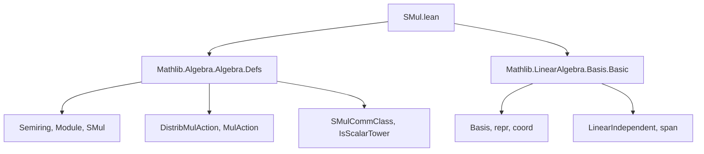

**Technical Brief: `SMul.lean` — Scalar Multiplication on Bases in Mathlib**

---

### 1. **Key Definitions & Theorems**

| Name | Type / Signature | Purpose |
|------|------------------|---------|
| `SMul G (Basis ι R M)` | `instance` | Defines scalar multiplication of a group `G` on a basis `b : Basis ι R M` by acting on each basis vector via `DistribMulAction.toLinearEquiv`. |
| `smul_apply` | `(g • b) i = g • b i` | Shows pointwise action of `g • b` coincides with the underlying action on vectors. |
| `coe_smul` | `⇑(g • b) = g • ⇑b` | Casts the action on the basis (as a function) to the action on the underlying function. |
| `smul_eq_map` | `g • b = b.map g` | When `g` is a linear equivalence, `•` coincides with `Basis.map`. |
| `repr_smul` | `(g • b).repr = (DistribMulAction.toLinearEquiv _ _ g).symm.trans b.repr` | Describes how coordinate representations change under group action. |
| `MulAction G (Basis ι R M)` | `instance` | Proves that the `SMul` action satisfies the axioms of a `MulAction`. |
| `SMulCommClass G G' (Basis ι R M)` | `instance` | Ensures commutativity of actions from `G` and `G'` lifts to bases. |
| `IsScalarTower G G' (Basis ι R M)` | `instance` | Ensures associativity of towered actions lifts to bases. |
| `groupSMul_span_eq_top` | `Submodule.span R (Set.range (w • v)) = ⊤` | Shows that scaling a spanning set by a group action still spans the whole module. |
| `groupSMul` | `Basis ι R M → (ι → G) → Basis ι R M` | Constructs a new basis by scaling each basis vector by a group element. |
| `groupSMul_apply` | `(v.groupSMul w) i = w i • v i` | Describes the action of `groupSMul` on indices. |
| `unitsSMul` | `Basis ι R M → (ι → Rˣ) → Basis ι R M` | Constructs a new basis by scaling with units in `R`. |
| `unitsSMul_apply` | `(unitsSMul v w) i = w i • v i` | Explicit form of `unitsSMul`. |
| `coord_unitsSMul` | `(unitsSMul e w).coord i = (w i)⁻¹ • e.coord i` | Describes how coordinate functionals transform under unit scaling. |
| `repr_unitsSMul` | `(e.unitsSMul w).repr v i = (w i)⁻¹ • e.repr v i` | Coordinate representation under unit-scaled basis. |
| `isUnitSMul` | `Basis ι R M → (∀ i, IsUnit (w i)) → Basis ι R M` | Variant of `unitsSMul` using `IsUnit` instead of `Rˣ`. |
| `repr_isUnitSMul` | `(v.isUnitSMul hw).repr x i = (hw i).unit⁻¹ • v.repr x i` | Coordinate representation under `isUnitSMul`. |

---

### 2. **Naming Conventions**

- **Prefixes**:
  - `groupSMul`, `unitsSMul`, `isUnitSMul`: indicate construction of a new basis via scaling.
  - `smul_`, `coe_smul`, `repr_smul`: denote properties of the `SMul` action.
- **Suffixes**:
  - `_apply`: gives evaluation at an index.
  - `_span_eq_top`: proves spanning property after scaling.
  - `_coord`, `_repr`: relate to coordinate functionals or representation maps.
- **Pattern**: `action_type_basis_construction` (e.g., `groupSMul`, `unitsSMul`), or `action_type_property` (e.g., `smul_apply`, `repr_smul`).

---

### 3. **Tactic Stack**

Frequently used tactics in proofs:
- `rw` / `rwa`: rewriting using equalities and assumptions.
- `simp only [...]`: simplification with precise lemmas.
- `split_ifs`: handles `if ... then ... else ...` cases.
- `exact`, `refine`, `apply`: for constructing proofs.
- `congr_arg`: for congruence of function application.
- `trans`: transitivity chaining.
- `intro`, `intro h`, `obtain ⟨i, rfl⟩`: destructuring and introduction.
- `dfunext` / `DFunLike.ext`: extensionality for dependent functions (e.g., basis as functions).
- `rwa`, `rw [...] at *`: rewriting in goals and hypotheses.

---

### 4. **Proof Logic**

- **Structure**: Most proofs follow a pattern:
  1. **Unfold definitions** (e.g., `groupSMul`, `unitsSMul`, `smul`).
  2. **Apply extensionality** (`DFunLike.ext`) to reduce to pointwise equality.
  3. **Simplify** using `simp only` with lemmas like `Basis.repr_self`, `Basis.coord_apply`, `smul_one_smul`, `inv_smul_smul`.
  4. **Use algebraic properties** (e.g., `inv_smul_smul`, `smul_assoc`) to simplify expressions.
  5. **Case analysis** (`split_ifs`) for `if-then-else` in `Finsupp.single_apply`.
- **Induction**: Not used here — mostly algebraic reasoning and extensionality.
- **Key idea**: Lift actions on modules to actions on bases via `DistribMulAction.toLinearEquiv`, and verify that spanning + linear independence are preserved.

---

### 5. **Imports**

| Import | Purpose |
|--------|---------|
| `Mathlib.Algebra.Algebra.Defs` | Defines `SMul`, `DistribMulAction`, `SMulCommClass`, `IsScalarTower`, etc. |
| `Mathlib.LinearAlgebra.Basis.Basic` | Defines `Basis`, `repr`, `coord`, `span`, `LinearIndependent`, `Basis.mk`, etc. |

---

### 6. **Mermaid Diagrams**

#### **Dependency Graph (Module-Level)**



#### **Overview of Theory Flow**

```mermaid
flowchart LR
  subgraph Setup
    R[Semiring R] --> M[Module R M]
    G[Group G] --> D[DistribMulAction G M]
    D --> S[SMul G M]
    S --> C[SMulCommClass G R M]
  end

  subgraph Construction
    S -->|lifts to| B[Basis ι R M]
    B -->|via| groupSMul[groupSMul]
    B -->|via| unitsSMul[unitsSMul]
    B -->|via| isUnitSMul[isUnitSMul]
  end

  subgraph Properties
    groupSMul --> span_eq_top[Span = ⊤]
    unitsSMul --> coord_change[Coord transforms by inverse]
    isUnitSMul --> repr_change[Repr transforms by inverse]
  end

  S -->|MulAction| A[MulAction G (Basis)]
  C -->|commutes| A
```

---

### 7. **Summary**

This file formalizes how scalar multiplication (by groups, units, or invertible scalars) lifts from module elements to bases. It constructs new bases via pointwise scaling (`groupSMul`, `unitsSMul`, `isUnitSMul`) and proves key properties: spanning, linear independence, and transformation of coordinates/representations. The proofs rely heavily on `DistribMulAction.toLinearEquiv`, `DFunLike.ext`, and algebraic simplifications in `Module` and `Basis` theory.

--- 

Let me know if you'd like a formalized dependency graph (e.g., `.dot` format) or a summary of related files (e.g., `Basis.lean`, `LinearEquiv.lean`).
