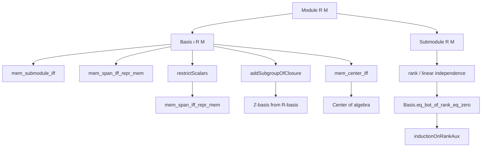

### Technical Brief: `Submodule.lean` — Bases of Submodules in Lean 4

---

#### **1. Key Definitions & Theorems**

| Name | Type / Signature | Purpose |
|------|------------------|---------|
| `mem_submodule_iff` | `x ∈ P ↔ ∃ c : ι →₀ R, x = Finsupp.sum c fun i x => x • (b i)` | Characterizes membership in a submodule $P$ via finite linear combinations of its basis vectors. |
| `mem_submodule_iff'` | `[Fintype ι] ⇒ x ∈ P ↔ ∃ c : ι → R, x = ∑ i, c i • (b i)` | Finite-basis version of `mem_submodule_iff`, using standard finite sums instead of `Finsupp.sum`. |
| `Basis.eq_bot_of_rank_eq_zero` | `[IsDomain R] ⇒ (∀ m v, LinearIndependent R v → m = 0) ⇒ N = ⊥` | If no nontrivial linearly independent subset exists in a submodule $N$, then $N = \bot$ (zero submodule). |
| `Submodule.inductionOnRankAux` | `def` | Inductive construction over rank: builds proofs for submodules by adjoining linearly independent elements. Used for structural induction on submodule rank. |
| `mem_center_iff` | `z ∈ center A ↔ (∀ i, Commute (b i) z) ∧ ∀ i j, z*(b i * b j) = (z*b i)*b j ∧ ...` | Describes when an element lies in the center of a non-unital non-associative algebra in terms of its behavior on a basis. |
| `restrictScalars` | `Basis ι R (span R (Set.range b))` | Given an $S$-basis $b$ of $M$, constructs an $R$-basis of the $R$-span of $b$, assuming $R \to S$ is an algebra with torsion-free scalars. |
| `mem_span_iff_repr_mem` | `m ∈ span R (Set.range b) ↔ ∀ i, b.repr m i ∈ range (algebraMap R S)` | Membership in the $R$-span of an $S$-basis is equivalent to all coordinates lying in $R$. |
| `addSubgroupOfClosure` | `Basis ι ℤ A.toIntSubmodule` | Converts an $R$-basis generating an additive subgroup $A$ into a $\mathbb{Z}$-basis of $A$ (viewed as a $\mathbb{Z}$-module). |

---

#### **2. Naming Conventions**

- **Prefixes**:
  - `mem_`: membership criteria (e.g., `mem_submodule_iff`, `mem_span_iff_repr_mem`)
  - `eq_bot_`: characterizations of zero submodule (e.g., `eq_bot_of_rank_eq_zero`)
  - `inductionOnRankAux`: auxiliary induction principle over rank
  - `restrictScalars_`: operations related to scalar restriction
  - `addSubgroupOfClosure_`: constructions involving additive subgroups and closures

- **Suffixes**:
  - `_iff`: biconditional characterizations
  - `_apply`: projection or evaluation lemmas (e.g., `restrictScalars_apply`, `addSubgroupOfClosure_repr_apply`)
  - `_repr_apply`: lemmas about coordinate functions (representations w.r.t. basis)

- **General patterns**:
  - `b`, `v`, `N`, `P`: standard variable names for basis, vectors, submodules.
  - `h`, `hli`, `rank_eq`: hypotheses often named descriptively.

---

#### **3. Tactic Stack**

Frequently used tactics in this file:

| Tactic | Usage |
|--------|-------|
| `conv_lhs` | Rewriting left-hand side of equations in equational reasoning. |
| `rw` / `simp_rw` | Rewriting using lemmas, often with `←` for reverse direction. |
| `simp` | Simplification using definitional equalities and known lemmas. |
| `exact`, `convert`, `refine` | Constructing proofs with partial goals. |
| `intro`, `cases`, `induction` | Standard proof structure: introducing variables, destructing hypotheses, inducting on natural numbers. |
| `ext` | Extensionality for functions/sets. |
| `apply`, `exfalso` | Goal-directed proof steps. |
| `convert hli.fin_cons' x _ ?_` | Advanced use of `convert` to adapt linear independence proofs. |
| `Fintype.linearIndependent_iff` | Rewriting linear independence for finite types. |
| `sum_mem`, `subset_span`, `smul_mem` | Module-theoretic membership lemmas. |

---

#### **4. Proof Logic**

The logical flow across proofs follows these patterns:

- **Inductive proofs over natural numbers**:
  - Base case (`n = 0`) → show $N = \bot$ using `eq_bot_of_rank_eq_zero`.
  - Inductive step (`n+1`) → assume IH for smaller rank, adjoin a linearly independent element to build up.

- **Equational reasoning**:
  - Use `conv_lhs` + `rw` to transform expressions into known forms (e.g., `b.span_eq`, `map_span`).
  - `simp` + `Finsupp` lemmas to reduce sums and representations.

- **Basis extensionality**:
  - `Basis.ext` used to prove equality of bases by checking action on basis elements.

- **Coordinate-wise reasoning**:
  - Prove properties of elements in modules by analyzing their coordinates w.r.t. a basis (`repr`, `linearCombination_repr`).

- **Algebraic manipulation**:
  - For center lemmas: expand using basis representation, apply commutativity/associativity assumptions, and simplify using `smul_mul_assoc`, `mul_smul_comm`.

---

#### **5. Imports & Dependencies**

**Primary imports**:
```lean
Mathlib.Algebra.Algebra.Basic
Mathlib.LinearAlgebra.Basis.Basic
```

**Implicit dependencies** (via `open` and `variable`):
- `Function`, `Set`, `Submodule`, `Finsupp`, `Module`
- `LinearMap`, `Ring`, `Semiring`, `AddCommMonoid`, `AddCommGroup`
- `Fintype`, `DecidableEq`, `IsDomain`, `IsTorsionFree`, `AddSubgroup`

**Key algebraic structures modeled**:
- Modules over semirings/rings
- Submodules and their bases
- Algebras (non-unital, non-associative)
- Scalar restriction and extension
- Additive subgroups as $\mathbb{Z}$-modules

---

#### **6. Mermaid Diagrams**

##### **Dependency Graph (Module Theory Scope)**



##### **Overview of File Structure**

```mermaid
flowchart LR
  subgraph "Bases of Submodules"
    B1[mem_submodule_iff]
    B2[mem_submodule_iff']
    B3[eq_bot_of_rank_eq_zero]
    B4[inductionOnRankAux]
  end

  subgraph "Scalar Restriction"
    S1[restrictScalars]
    S2[mem_span_iff_repr_mem]
  end

  subgraph "Additive Subgroups"
    A1[addSubgroupOfClosure]
    A2[repr equality]
  end

  subgraph "Algebra Center"
    C1[mem_center_iff]
  end

  B1 --> B2
  B3 --> B4
  S1 --> S2
  A1 --> A2
  B1 & B2 & B3 & B4 & S1 & S2 & A1 & A2 & C1 --> "Module Theory Core"
```

---

#### **7. Summary**

This file formalizes foundational results about bases of submodules in Lean 4, emphasizing:
- Characterization of submodule membership via basis expansions.
- Structural induction on submodule rank using linear independence.
- Behavior of bases under scalar restriction and additive subgroup generation.
- Central elements in algebras via basis commutation.

It serves as a theoretical backbone for more advanced linear algebra in Mathlib, especially in contexts involving module rank, torsion-freeness, and base change.

--- 

Let me know if you'd like a formalized dependency graph or a summary of proof automation patterns.
