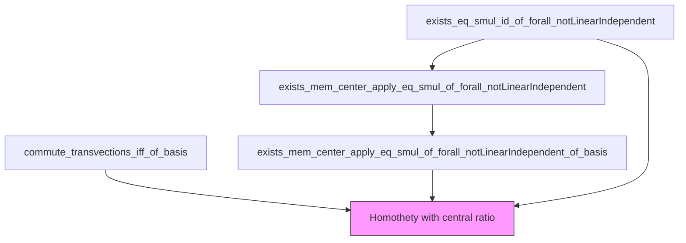

**Technical Brief: `Center.lean` — Center of the Algebra of Linear Endomorphisms**

---

### **1. Key Definitions & Theorems**

| Name | Type / Signature | Purpose |
|------|------------------|---------|
| `commute_transvections_iff_of_basis` | `∀ f, (∀ i j r, i ≠ j → Commute f (transvection (b.coord i) (r • b j))) → ∃ a ∈ Z(R), f = a • 1` | Characterizes endomorphisms commuting with all transvections (in a basis) as homotheties with *central* ratio. Requires nontrivial index set. |
| `exists_mem_center_apply_eq_smul_of_forall_notLinearIndependent_of_basis` | `∀ f, (∀ v, ¬LinIndep ![v, f v]) → ∃ a ∈ Z(R), f = a • 1` | If every $v$ and $f(v)$ are linearly dependent, then $f$ is a homothety with *central* ratio. Requires a basis and nontrivial rank; works over noncommutative domains. |
| `exists_mem_center_apply_eq_smul_of_forall_notLinearIndependent` | Same conclusion, but assumes `Free R V` + `StrongRankCondition R` + `finrank ≠ 1`. | Variant without explicit basis, using `Free.ChooseBasisIndex`. |
| `exists_eq_smul_id_of_forall_notLinearIndependent` | `∀ f, (∀ v, ¬LinIndep ![v, f v]) → ∃ a ∈ R, f = a • 1` | Commutative domain version: homothety ratio lies in $R$, not just its center. |
| `Subring.center R` | `Subring R` | Center of ring $R$: elements commuting with all of $R$. |
| `Homothety` (implicit) | `f = a • 1` for some $a \in Z(R)$ | Endomorphism scaling all vectors by a central scalar. |

> **Note**: In noncommutative setting, `a` must lie in `Subring.center R`; in commutative case, `Subring.center R = R`.

---

### **2. Naming Conventions**

- **Prefixes**:
  - `commute_...`: properties involving commutation with transvections.
  - `exists_...`: existence of a scalar (central or not) such that $f = a • 1$.
  - `mem_center_...`: conclusion involves membership in `Subring.center R`.
- **Suffixes**:
  - `_of_basis`: proofs rely on an explicit basis.
  - `_of_forall_notLinearIndependent`: hypothesis is $\forall v, \neg \text{LinIndep} [v, f v]$.
- **Other**:
  - `transvection`: elementary transvection maps (used in `commute_...`).
  - `coord`, `repr`, `linearCombination`: basis-dependent constructions.

---

### **3. Tactic Stack**

Frequent tactics used in proofs:

| Tactic | Role |
|--------|------|
| `simp` / `simp only` | Simplify using definitions (e.g., `LinearMap.ext`, `Basis.coord_apply`, `Finsupp` lemmas). |
| `rw` / `ext` | Rewrite using extensionality or equality lemmas; prove equality of maps/vectors. |
| `rcases` / `obtain` | Extract witnesses from existential hypotheses (e.g., dependence data). |
| `by_cases` / `split_ifs` | Handle case distinctions (e.g., $i = j$, $\text{finrank} = 1$). |
| `congr` / `congr_arg` | Apply congruence to equalities (e.g., apply `b.coord i` to both sides). |
| `have` / `suffices` | Introduce intermediate lemmas or rephrase goals. |
| `apply` / `exact` | Apply known lemmas or hypotheses. |
| `sum_congr`, `mul_assoc`, `add_assoc`, etc. | Algebraic rewrites in module/ring arithmetic. |
| `contrapose`, `simp at` | Logical manipulations (e.g., turn negated universal into existential). |

---

### **4. Proof Logic**

#### **General Strategy**
- **Step 1**: Reduce to basis-dependent computation (via `Basis.ext`, `repr`, `coord`).
- **Step 2**: Use dependence hypothesis (`¬LinIndep ![v, f v]`) to derive algebraic constraints on $f(b_i)$.
- **Step 3**: Show all diagonal coefficients $b^\text{coord}_i(f(b_i))$ are equal and central.
- **Step 4**: Conclude $f = a • 1$ for $a = b^\text{coord}_i(f(b_i))$.

#### **Specific Flows**

- **`commute_transvections_iff_of_basis`**:
  - Use commutation with transvections to derive:
    $$
    r • f(b_j) = b^\text{coord}_i(f(b_i)) • r • b_j
    $$
  - Show $b^\text{coord}_i(f(b_i)) = b^\text{coord}_j(f(b_j))$ for all $i,j$.
  - Prove centrality via $r • a = a • r$ (from transvection commutation with scalar multiples).
  - Extend to all $x$ via linear combination.

- **`exists_mem_center_apply_eq_smul_of_forall_notLinearIndependent_of_basis`**:
  - From dependence of $[b_i, f(b_i)]$, deduce $f(b_i) = a_i • b_i$.
  - From dependence of $[b_i + r • b_j, f(b_i + r • b_j)]$, derive $a_i r = r a_j$.
  - Conclude $a_i = a_j =: a ∈ Z(R)$.
  - Extend to all $x$.

- **`exists_eq_smul_id_of_forall_notLinearIndependent`** (commutative case):
  - If $\text{finrank} = 1$, directly extract scalar from $f(b())$.
  - Else, apply noncommutative theorem and use centrality = whole ring.

---

### **5. Imports & Dependencies**

| Module | Role |
|--------|------|
| `Mathlib.LinearAlgebra.Transvection` | Defines transvections and their basic properties. |
| `Mathlib.LinearAlgebra.Dual.Lemmas` | Provides lemmas on dual maps, coordinates, and linear combinations. |
| `Mathlib.LinearAlgebra.FreeModule` (via `Module`, `LinearMap`) | Provides `Basis`, `repr`, `coord`, `linearCombination`, `Free`, `finrank`. |
| `Mathlib.RingTheory.Subring.Center` | Defines `Subring.center`. |
| `Mathlib.RingTheory.Domain.IsDomain` | Provides `IsDomain` (integral domain). |
| `Mathlib.LinearAlgebra.FiniteDimensional.StrongRankCondition` | Used in `exists_mem_center_apply_eq_smul_of_forall_notLinearIndependent`. |

---

### **6. Mermaid Diagrams**

#### **Dependency Graph (Theorems)**



#### **Overview of File Structure**

```mermaid
flowchart LR
  subgraph Theory
    A[Center of End(V)] --> B[Homotheties = Center(End(V))]
    B --> C[Characterizations]
    C --> D[Commutation with transvections]
    C --> E[Colinearity of v, f(v)]
  end

  subgraph Proofs
    D --> D1[commute_transvections_iff_of_basis]
    E --> E1[exists_mem_center_apply_eq_smul_of_forall_notLinearIndependent_of_basis]
    E --> E2[exists_mem_center_apply_eq_smul_of_forall_notLinearIndependent]
    E --> E3[exists_eq_smul_id_of_forall_notLinearIndependent]
  end

  subgraph Assumptions
    D1 --> N[Nontrivial ι]
    E1 --> N
    E2 --> S[StrongRankCondition R]
    E2 --> F[Free R V]
    E3 --> C[CommRing R]
  end
```

---

### **7. Critical Notes & Edge Cases**

- **Rank 1 failure (noncommutative)**:  
  If $\text{rank}(V) = 1$ and $R$ noncommutative, maps $f(x) = x • a$ (right multiplication) satisfy $\forall v, \neg \text{LinIndep} [v, f v]$, but are not left multiplications by central elements.  
  → Hence the rank ≠ 1 assumption is essential.

- **Basis vs. finrank**:  
  Theorems with `_of_basis` avoid `StrongRankCondition` and `Free` assumptions by using an explicit basis.

- **Commutative simplification**:  
  In `CommRing R`, `Subring.center R = R`, so homothety ratios lie in $R$ directly.

---

### **8. Summary**

This file formalizes a classical result in linear algebra: *If every vector is mapped to a colinear vector, then the linear map is a scalar multiple of the identity*. It distinguishes between:

- **Commutative** vs **noncommutative** base rings (center matters),
- **Explicit basis** vs **abstract finite-dimensionality**,
- **Transvection-commuting** vs **colinearity-preserving** characterizations.

The proofs rely heavily on basis computations, `Finsupp` representations, and careful handling of linear dependence.
