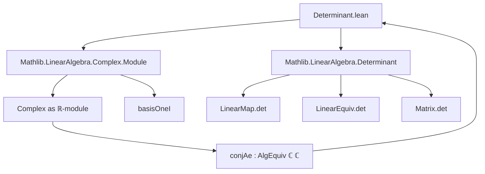

**Technical Brief: Determinant of Complex Conjugation over ℝ**

---

### 1. Key Definitions & Theorems

| Name | Type / Signature | Purpose |
|------|------------------|---------|
| `conjAe` | `Complex →ₗ[ℝ] Complex` (via `.toLinearMap`) or `Complex ≃ₗ[ℝ] Complex` (via `.toLinearEquiv`) | Complex conjugation, viewed as an ℝ-linear map / equivalence. |
| `det_conjAe` | `LinearMap.det conjAe.toLinearMap = -1` | Computes the determinant of complex conjugation as an ℝ-linear *map*. |
| `linearEquiv_det_conjAe` | `LinearEquiv.det conjAe.toLinearEquiv = -1` | Computes the determinant of complex conjugation as an ℝ-linear *equivalence*. |

- **Note**: `conjAe` is short for *complex conjugation as an algebra equivalence* (`AlgEquiv`). Its underlying linear map/equiv is used in both theorems.

---

### 2. Naming Conventions

- **Prefixes**:
  - `det_`: for determinant theorems (`det_conjAe`, `linearEquiv_det_conjAe`).
  - `conjAe`: standard abbreviation for *conjugation algebra equivalence* (used consistently in Mathlib).
- **Suffixes**:
  - `.toLinearMap`, `.toLinearEquiv`: standard coercion from algebra equivalence to linear (equiv) map.
  - `toMatrix`: coercion to matrix representation w.r.t. a basis.

---

### 3. Tactic Stack

- `rw [...]`: rewriting using lemmas about determinants, matrices, and basis.
- `toMatrix_conjAe`: specific lemma converting `conjAe` to its matrix representation.
- `Matrix.det_fin_two_of`: computes determinant of a 2×2 matrix with known entries.
- `simp`: simplification, especially for unit coercion (`Units.coe_neg_one`, `Units.val_inj`).
- `←` (reverse rewriting) used to unfold definitions (e.g., `← LinearMap.det_toMatrix`).

No heavy automation (e.g., `aesop`, `linarith`) — proof is mostly symbolic manipulation.

---

### 4. Proof Logic

1. **For `det_conjAe`**:
   - Rewrite determinant via matrix representation w.r.t. `basisOneI` (standard ℝ-basis `[1, i]`).
   - Use `toMatrix_conjAe` to get the matrix of conjugation:  
     $$
     \begin{bmatrix}
     1 & 0 \\
     0 & -1
     \end{bmatrix}
     $$
   - Apply `Matrix.det_fin_two_of` to compute determinant = $1 \cdot (-1) - 0 = -1$.
   - Simplify unit coercions.

2. **For `linearEquiv_det_conjAe`**:
   - Use `LinearEquiv.coe_det` to relate linear equivalence determinant to linear map determinant.
   - Use `AlgEquiv.toLinearEquiv_toLinearMap` to identify underlying maps.
   - Apply `det_conjAe` and simplify unit equality (`Units.val_inj`, `Units.coe_neg_one`).

---

### 5. Imports & Dependencies

| Import | Role |
|--------|------|
| `Mathlib.LinearAlgebra.Complex.Module` | Provides `Complex` as an ℝ-module, basis `basisOneI`, and scalar multiplication structure. |
| `Mathlib.LinearAlgebra.Determinant` | Core determinant theory: `LinearMap.det`, `LinearEquiv.det`, `det_toMatrix`, matrix determinant lemmas. |

Additional implicit dependencies:
- `Mathlib.Algebra.Module.LinearMap.Basic`
- `Mathlib.Algebra.Module.Basis`
- `Mathlib.Algebra.Algebra.Determinant` (for `AlgEquiv.toLinearEquiv`)

---

### 6. Mermaid Diagrams

#### Dependency Graph (Module-Level)



#### Overview of File Structure

```mermaid
flowchart LR
  subgraph Theory
    conjAe[conjAe : ℂ ≃ₐ[ℝ] ℂ]
    conjAe_lm[conjAe.toLinearMap]
    conjAe_le[conjAe.toLinearEquiv]
  end

  subgraph Theorems
    det_conjAe[det_conjAe : det = -1]
    linearEquiv_det_conjAe[linearEquiv_det_conjAe : det = -1]
  end

  conjAe --> conjAe_lm
  conjAe --> conjAe_le
  conjAe_lm --> det_conjAe
  conjAe_le --> linearEquiv_det_conjAe

  det_conjAe -.->|uses| matrix_det[Matrix.det computation]
  linearEquiv_det_conjAe -.->|uses| det_conjAe
```

---

### 7. Mathematical Context

- View ℂ as a 2-dimensional vector space over ℝ with basis `[1, i]`.
- Complex conjugation $z \mapsto \overline{z}$ is ℝ-linear but not ℂ-linear.
- Matrix w.r.t. `basisOneI`:  
  $$
  [\overline{1}] = 1,\quad [\overline{i}] = -i \implies 
  \begin{bmatrix}
  1 & 0 \\
  0 & -1
  \end{bmatrix}
  $$
- Determinant = $-1$: reflects orientation-reversing nature (reflection across real axis).

---

### 8. Summary

This file formalizes a foundational fact: **complex conjugation, as an ℝ-linear automorphism, has determinant $-1$**. It demonstrates how algebraic structures (`AlgEquiv`) interact with linear algebraic invariants (`det`) via coercion and matrix representation. The proofs are concise and rely on standard linear algebra lemmas in Mathlib.
