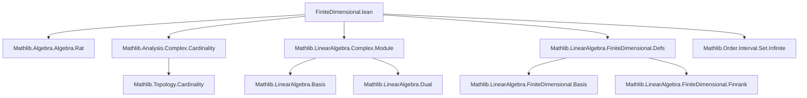
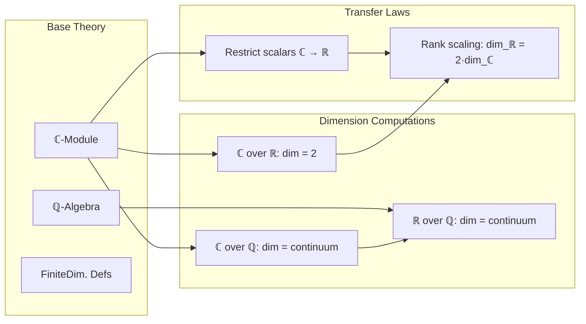

**Technical Brief: `FiniteDimensional.lean` — Complex Numbers as a Finite-Dimensional Real Vector Space**

---

### 1. **Key Definitions & Theorems**

| Name | Type / Statement | Purpose |
|------|------------------|---------|
| `FiniteDimensional.complexToReal` | `[AddCommGroup E] [Module ℂ E] [FiniteDimensional ℂ E] → FiniteDimensional ℝ E` | Transfers finite-dimensionality from `ℂ` to `ℝ` via scalar restriction (tower law). |
| `finrank_real_complex` | `finrank ℝ ℂ = 2` | Computes the finite dimension of `ℂ` over `ℝ` using the standard basis `{1, i}` (`basisOneI`). |
| `rank_real_complex` | `Module.rank ℝ ℂ = 2` | Extends the above to arbitrary rank (cardinal-valued), using `finrank_eq_rank`. |
| `rank_real_complex'.{u}` | `Cardinal.lift.{u} (Module.rank ℝ ℂ) = 2` | Ensures compatibility across universe levels via `Cardinal.lift`. |
| `finrank_real_complex_fact` | `Fact (finrank ℝ ℂ = 2)` | Wraps the dimension fact for local use (e.g., in circle definitions). |
| `rank_real_of_complex` | `Module.rank ℝ E = 2 * Module.rank ℂ E` | Relates real and complex ranks for any `ℂ`-module `E`. |
| `finrank_real_of_complex` | `Module.finrank ℝ E = 2 * Module.finrank ℂ E` | Finite-dimensional version of the above. |
| `Real.rank_rat_real` | `Module.rank ℚ ℝ = continuum` | Shows `ℝ` has uncountable dimension over `ℚ`. |
| `Complex.rank_rat_complex` | `Module.rank ℚ ℂ = continuum` | Same for `ℂ` over `ℚ`. |
| `Complex.nonempty_linearEquiv_real` | `Nonempty (ℂ ≃ₗ[ℚ] ℝ)` | Consequence: `ℂ` and `ℝ` are `ℚ`-linearly isomorphic (as vector spaces or additive groups). |

---

### 2. **Naming Conventions**

- **Prefixes**:
  - `finrank_`: finite-dimensional rank (`finrank` = finite rank).
  - `rank_`: general (possibly infinite) module rank.
  - `Complex.`, `Real.`: namespace qualifiers.
- **Suffixes**:
  - `_fact`: wraps equality into `Fact`.
  - `_real_complex`, `_rat_real`, `_rat_complex`: specifies base and extension fields.
  - `_of_complex`: indicates passage from `ℂ`-structure to `ℝ`-structure.

---

### 3. **Tactic Stack**

- `rw`: rewriting using equalities (e.g., `finrank_eq_card_basis`, `finrank_eq_rank`).
- `simp`: simplification with lemmas like `finrank_real_complex`, `lift_rank_mul_lift_rank`.
- `simp_rw`: combination of `simp` + `rw` (used implicitly via `simp only`).
- `exact`, `refine`, `apply`: constructing proofs via known lemmas.
- `Cardinal.lift_inj`: injectivity of cardinal lift used to compare ranks across universes.
- `mk_real`, `aleph0_lt_continuum`: cardinal arithmetic lemmas for continuum-sized bases.

---

### 4. **Proof Logic**

- **Structure**: Most proofs follow a *chain of equalities* using:
  - Definitions (`finrank`, `Module.rank`, `basisOneI`).
  - Known lemmas (`finrank_eq_card_basis`, `finrank_mul_finrank`, `lift_rank_mul_lift_rank`).
  - Cardinal arithmetic facts (`aleph0_lt_continuum`, `mk_real`, `lift_id'`).
- **Induction**: Not used here — proofs are algebraic/combinatorial.
- **Case analysis**: Minimal; relies on structural properties of `ℂ` over `ℝ` and `ℚ`.
- **Key idea**: Use the fact that `ℂ ≅ ℝ²` as `ℝ`-vector spaces, and that `ℂ` is a degree-2 extension of `ℝ`.

---

### 5. **Imports**

| Import | Role |
|--------|------|
| `Mathlib.Algebra.Algebra.Rat` | Rational scalars, algebra structure. |
| `Mathlib.Analysis.Complex.Cardinality` | Cardinality facts about `ℂ`, `ℝ`. |
| `Mathlib.LinearAlgebra.Complex.Module` | Module structure of `ℂ` over subfields. |
| `Mathlib.LinearAlgebra.FiniteDimensional.Defs` | Core definitions: `FiniteDimensional`, `finrank`, `basis`. |
| `Mathlib.Order.Interval.Set.Infinite` | Tools for infinite sets (used in rank proofs over `ℚ`). |

---

### 6. **Mermaid Diagrams**

#### **Dependency Graph (Module-Level)**

#### **Overview of Theory Flow**

---

### 7. **Summary**

This file formalizes foundational facts about complex numbers as a finite-dimensional real vector space, emphasizing:
- The degree-2 extension `ℝ ⊆ ℂ`.
- Cardinal arithmetic for infinite-dimensional spaces over `ℚ`.
- Compatibility of ranks under scalar restriction (`ℂ` → `ℝ`).
- Applications to linear equivalence and module theory.

It serves as a building block for analysis and geometry over `ℂ`, especially where dimension counting matters (e.g., Lie groups, measure theory, functional analysis).
