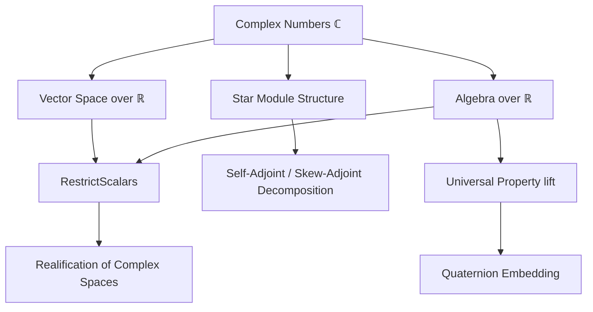
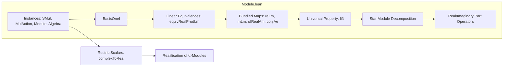

### Technical Brief: `Module.lean` — Complex Numbers as a Vector Space over `ℝ`

---

#### **1. Key Definitions & Theorems**

| Name | Type / Signature | Purpose |
|------|------------------|---------|
| `basisOneI` | `Basis (Fin 2) ℝ ℂ` | Shows `ℂ` is a 2D vector space over `ℝ` with basis `[1, I]`. |
| `reLm`, `imLm` | `ℂ →ₗ[ℝ] ℝ` | Bundled ℝ-linear maps for real and imaginary parts. |
| `ofRealAm` | `ℝ →ₐ[ℝ] ℂ` | Bundled ℝ-algebra morphism embedding `ℝ` into `ℂ`. |
| `conjAe` | `ℂ ≃ₐ[ℝ] ℂ` | Bundled ℝ-algebra equivalence for complex conjugation. |
| `liftAux` | `I' : A → I'*I' = -1 → ℂ →ₐ[ℝ] A` | Constructs an ℝ-algebra map from `ℂ` to any ℝ-algebra `A` with a square root of `-1`. |
| `lift` | `{ I' : A // I'*I' = -1 } ≃ (ℂ →ₐ[ℝ] A)` | Universal property: bijection between square roots of `-1` in `A` and ℝ-algebra maps `ℂ → A`. |
| `equivRealProdLm` | `ℂ ≃ₗ[ℝ] ℝ × ℝ` | Linear equivalence between `ℂ` and `ℝ²`. |
| `realPart`, `imaginaryPart` | `A →ₗ[ℝ] selfAdjoint A` | Bundled ℝ-linear maps extracting real/imaginary parts in a `StarModule ℂ A`. |
| `realPart_add_I_smul_imaginaryPart` | `ℜ a + I • ℑ a = a` | Decomposition of any element in a `StarModule ℂ A` into self-adjoint components. |
| `skewAdjoint.negISMul` | `skewAdjoint A →ₗ[ℝ] selfAdjoint A` | Multiplication by `-I` identifies skew-adjoint and self-adjoint parts. |
| `real_algHom_eq_id_or_conj` | `f : ℂ →ₐ[ℝ] ℂ ⇒ f = id ∨ f = conjAe` | Only two ℝ-algebra endomorphisms of `ℂ`. |

---

#### **2. Naming Conventions**

- **Prefixes**:
  - `reLm`, `imLm`: Bundled linear maps (`Lm` = linear map).
  - `ofRealAm`: Bundled algebra morphism (`Am` = algebra morphism).
  - `conjAe`: Bundled algebra equivalence (`Ae` = algebra equivalence).
  - `liftAux`, `lift`: Auxiliary and main universal property constructions.
  - `realPart`, `imaginaryPart`: Real/imaginary part operators.
  - `skewAdjoint.*`: Operations on skew-adjoint elements.

- **Suffixes**:
  - `Lm`: Linear map (`→ₗ[ℝ]`).
  - `Am`: Algebra morphism (`→ₐ[ℝ]`).
  - `Ae`: Algebra equivalence (`≃ₐ[ℝ]`).
  - `comp`: Composition of linear maps.

- **Notation**:
  - `ℜ`, `ℑ`: Localized notations for `realPart`, `imaginaryPart` in `ComplexStarModule`.

---

#### **3. Tactic Stack**

Frequently used tactics:
- `ext`: Extensionality for complex numbers and linear maps.
- `simp`: Simplification using `smul_re`, `smul_im`, `map_add`, etc.
- `rw`: Rewriting with lemmas like `I_mul_I`, `conj_I`, `re_add_im`.
- `congr`: Congruence for structural equality.
- `abel`: For abelian group/ring simplifications.
- `with_reducible_and_instances`: For definitional equality checks.
- `fin_cases`: For finite index cases (e.g., `Fin 2`).
- `exact`, `refine`, `intro`: Proof construction.
- `simpa`: Simplify and apply target.

---

#### **4. Proof Logic**

- **Structure induction** on complex numbers (`⟨x, y⟩`, `z.re`, `z.im`) is common.
- **Bundled maps** are defined by verifying linearity/algebra properties via `map_add'`, `map_smul'`, etc.
- **Universal properties** (e.g., `lift`) use:
  - `ext` to reduce to equality on generators (`I`).
  - `liftAux_apply_I` to relate `I'` to `I`.
- **Star module decompositions** rely on:
  - `realPart_add_I_smul_imaginaryPart` as a key identity.
  - `skewAdjointPart`, `selfAdjointPart` interplay.
- **Instances** (e.g., `Module.complexToReal`) use `RestrictScalars` and `with_reducible_and_instances` to avoid diamonds.

---

#### **5. Imports**

| Import | Purpose |
|--------|---------|
| `Mathlib.Algebra.Algebra.RestrictScalars` | Base for `complexToReal` instances. |
| `Mathlib.Algebra.CharP.Invertible` | Possibly used for invertibility of scalars (e.g., `2⁻¹`). |
| `Mathlib.Data.Complex.Basic` | Core complex number definitions (`re`, `im`, `I`, `conj`). |
| `Mathlib.Data.Real.Star` | Star structure on `ℝ`. |
| `Mathlib.LinearAlgebra.Matrix.ToLin` | For `toMatrix_conjAe`. |

---

#### **6. Mermaid Diagrams**

##### **Dependency Graph (High-Level)**

##### **File Overview**

---

#### **7. Theory Scope**

This module formalizes the foundational relationship between complex and real structures in linear algebra and operator theory:

- **Complex as a 2D real vector space** (`basisOneI`, `equivRealProdLm`).
- **Scalar restriction**: Any `ℂ`-module is an `ℝ`-module (`Module.complexToReal`).
- **Universal property**: `ℂ` is the free ℝ-algebra on a square root of `-1`.
- **Star module theory over `ℂ`**: Decomposition into self-adjoint and skew-adjoint parts, with `ℜ`, `ℑ` as linear operators.
- **Applications**: Embedding `ℂ` into algebras like quaternions, analysis of operators with complex scalars.

---

#### **8. Notable Lemmas & Identities**

- $ z = \Re(z) + I \cdot \Im(z) $
- $ \Re(z \cdot w) = \Re(z)\Re(w) - \Im(z)\Im(w) $
- $ \Im(z \cdot w) = \Re(z)\Im(w) + \Im(z)\Re(w) $
- $ \Re(a) + I \cdot \Im(a) = a $ in any `StarModule ℂ A`
- $ \star a = \Re(a) - I \cdot \Im(a) $
- $ \Re(r) = r $, $ \Im(r) = 0 $ for $ r \in \mathbb{R} $
- $ \Re(I \cdot a) = -\Im(a) $, $ \Im(I \cdot a) = \Re(a) $

---

This module is a cornerstone for complex linear algebra in Lean, enabling transfer between real and complex structures and supporting advanced analysis (e.g., Hilbert spaces, operator algebras).
