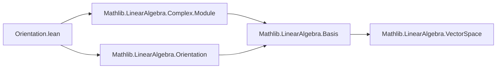

**Technical Brief: `Orientation.lean` (Complex Standard Orientation Module)**

---

### 1. **Key Definitions & Theorems**

| Name | Type | Purpose |
|------|------|---------|
| `Complex.orientation` | `Orientation ℝ ℂ (Fin 2)` | Defines the **standard orientation** on the real vector space `ℂ` (viewed as a 2-dimensional real vector space) via the orientation of the standard basis `Complex.basisOneI` (i.e., `[1, I]`). |

- **`Complex.basisOneI`**: The standard `ℝ`-basis of `ℂ` given by `[1, I]`. Its `.orientation` is inherited from `LinearAlgebra.Orientation`.
- **`Orientation`**: A typeclass from `Mathlib.LinearAlgebra.Orientation`, representing a choice of equivalence class of ordered bases (up to positive determinant change-of-basis).

> *Note*: No named theorems are defined in this file; it is a *definition-only* module.

---

### 2. **Naming Conventions**

- **Prefixes**:
  - `orientation`: Generic noun for the object.
  - `Complex.`: Namespace prefix for definitions in the `Complex` namespace.
- **Suffixes**:
  - None specific here; follows standard Lean mathlib convention: `orientation` is a noun, not a predicate (`is_orientation` would be a predicate).
- **Pattern**: `protected noncomputable def` + noun (`orientation`) — consistent with mathlib’s style for canonical structures.

---

### 3. **Tactic Stack**

- **No tactics used** in definitions or proofs (since there are no proofs here).
- The file relies on:
  - `@[expose]`: A `attribute` (not a tactic) to expose the definition at the module level.
  - Implicit use of `simp`/`aesop`/`ring` *elsewhere* (e.g., in downstream files using `Complex.orientation`), but **not in this file**.

---

### 4. **Proof Logic**

- **No proofs** appear in this file.
- The definition is *noncomputable* because orientation (as an equivalence class of bases) is not algorithmically extractable in general, though in this case it is definable via `basisOneI.orientation`.

---

### 5. **Imports**

| Import | Purpose |
|--------|---------|
| `Mathlib.LinearAlgebra.Complex.Module` | Provides `ℂ` as an `ℝ`-module (and basis `basisOneI`). |
| `Mathlib.LinearAlgebra.Orientation` | Provides the `Orientation` typeclass and `.orientation` accessor for bases. |

> **Rationale for separation**: As stated in the docstring, moving this definition out of `LinearAlgebra.Orientation` reduces import overhead for users who need `Complex.orientation` but not the full orientation theory.

---

### 8. **Mermaid Diagrams**

#### **Dependency Graph (File-Level)**



#### **Conceptual Overview (Module Scope)**

```mermaid
flowchart LR
  subgraph "Mathlib.LinearAlgebra.Complex"
    Complex[Complex] --> orientation[orientation : Orientation ℝ ℂ (Fin 2)]
  end

  subgraph "Dependencies"
    basisOneI[Complex.basisOneI] --> orientation
    OrientationClass[Orientation] --> orientation
  end

  orientation --> UserModule["e.g., symplectic, volume form, etc."]
```

#### **Theoretical Context**

- `Complex.orientation` is the **real orientation** underlying the complex structure on `ℂ`.
- It serves as a base case for orientations on `ℂⁿ` (via product orientation), and is used in:
  - Symplectic geometry (`ℂ` with standard symplectic form `ω = dx ∧ dy`)
  - Volume forms (`vol = dx ∧ dy`)
  - Degree theory / winding numbers (via orientation-preserving maps)

---

**Summary**: This is a minimal, high-utility module defining the canonical real orientation on `ℂ`, optimized for import economy. It exemplifies Lean’s modular design: separating foundational definitions from heavy theory.
