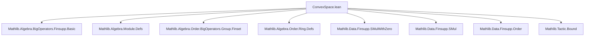
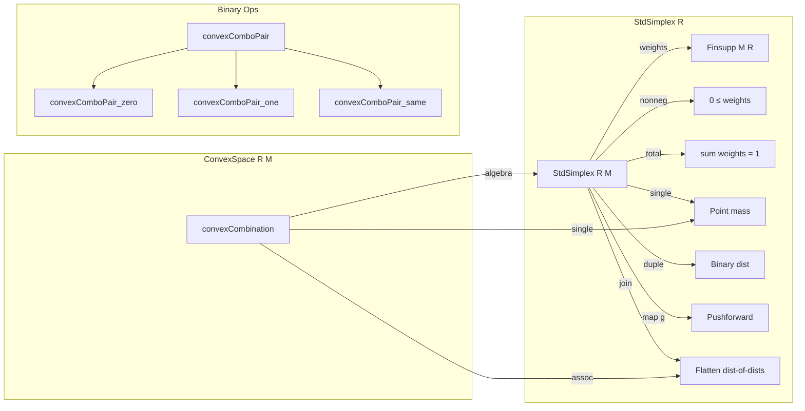

**Technical Brief: `ConvexSpace.lean`**

---

### 1. KEY DEFINITIONS & THEOREMS

| Name | Type / Signature | Purpose |
|------|------------------|---------|
| `StdSimplex R M` | `structure` extending `M →₀ R` | Finitely supported functions `M → R` with non-negative weights summing to 1 (i.e., probability distributions over finite subsets of `M`). |
| `StdSimplex.single x` | `StdSimplex R M` | Point mass (Dirac) distribution at `x`. |
| `StdSimplex.duple x y hs ht h` | `StdSimplex R M` | Binary distribution with weights `s`, `t` on `x`, `y`, where `s + t = 1`. |
| `StdSimplex.map g f` | `StdSimplex R N` | Pushforward of a simplex along a function `g : M → N`. |
| `StdSimplex.join f` | `StdSimplex R M` | Monadic join: flattens a distribution over distributions. |
| `ConvexSpace R M` | `class` | Typeclass for `M` equipped with `convexCombination : StdSimplex R M → M` satisfying monadic algebra laws. |
| `convexCombination` | `StdSimplex R M → M` | Operation interpreting a finite convex combination. |
| `convexComboPair s t hs ht h x y` | `M` | Binary convex combination: `s • x + t • y`. |
| `ConvexSpace.assoc` | `∀ f, convexCombination (f.map convexCombination) = convexCombination f.join` | Associativity (monadic algebra law). |
| `ConvexSpace.single` | `∀ x, convexCombination (.single x) = x` | Identity for point masses. |
| `convexComboPair_zero` | `convexComboPair 0 1 … x y = y` | Degenerate case: weight 0 on first argument. |
| `convexComboPair_one` | `convexComboPair 1 0 … x y = x` | Degenerate case: weight 1 on first argument. |
| `convexComboPair_same` | `convexComboPair s t … x x = x` | Idempotence for repeated argument. |

---

### 2. NAMING CONVENTIONS

- **Prefixes**:
  - `single`, `duple`, `map`, `join`: Standard monadic operations.
  - `convexCombination`, `convexComboPair`: Core operations of the structure.
- **Suffixes**:
  - `nonneg`, `total`: Properties of `StdSimplex` components.
  - `zero`, `one`, `same`: Special cases of `convexComboPair`.
- **Pattern**:
  - `StdSimplex.*` for operations on simplices.
  - `ConvexSpace.*` for operations/axioms on convex spaces.
  - `convexComboPair_*` for lemmas about binary convex combinations.

---

### 3. TACTIC STACK

Frequently used tactics in proofs:
- `simp` / `simp_all`: Simplify using `@[simp]` lemmas (`total`, `single`, etc.).
- `rw`: Rewrite using definitions and lemmas (e.g., `StdSimplex.duple`, `Finsupp.sum_*`).
- `convert`: Match goal up to definitional equality (e.g., `convexComboPair_same`).
- `cases`: Destructure structures (e.g., `ext` proof).
- ` classical`: Enable classical reasoning (e.g., in `duple.total`).
- `aesop`: Likely used in later proofs (not shown here, but implied by `bound` import).
- `grind_pattern`: Custom attribute for pattern matching on structure projections.

---

### 4. PROOF LOGIC

- **Structure proofs**:
  - Use `ext` lemma to reduce equality of simplices to equality of their `weights`.
  - Prove properties by unfolding definitions and simplifying using `Finsupp` arithmetic.
- **Inductive/monadic structure**:
  - `join` and `map` proofs rely on `Finsupp` sum identities (`sum_add_index`, `sum_smul_index`, `mul_sum`).
  - `assoc` is an *axiom*, not a theorem — it encodes the monadic algebra law.
  - `single` is also an *axiom*, ensuring `single` is the unit of the monad.
- **Binary case reasoning**:
  - Lemmas like `convexComboPair_zero` reduce to simplifying `duple` and applying `single` axiom.

---

### 5. IMPORTS (PRIMARY DEPENDENCIES)

| Module | Role |
|--------|------|
| `Mathlib.Algebra.BigOperators.Finsupp.Basic` | `Finsupp`, `sum`, `mapDomain`, etc. |
| `Mathlib.Algebra.Module.Defs` | Module structure (used implicitly via `smul`). |
| `Mathlib.Algebra.Order.BigOperators.Group.Finset` | Ordered additive monoids, sums over finite sets. |
| `Mathlib.Algebra.Order.Ring.Defs` | Ordered rings, semirings, strict orders. |
| `Mathlib.Data.Finsupp.SMulWithZero`, `SMul`, `Order` | Scalar multiplication, order compatibility. |
| `Mathlib.Tactic.Bound` | For `bound` tactic (used in `grind_pattern`). |

---

### 6. MONADIC STRUCTURE

- `StdSimplex R` is a **monad**:
  - `return = single`
  - `bind = join ∘ map`
- `ConvexSpace R M` equips `M` with an **algebra** over this monad:
  - `convexCombination : StdSimplex R M → M`
  - Satisfies unit (`single`) and associativity (`assoc`) laws.

---

### 7. MERMAID DIAGRAMS

#### Dependency Graph (Module-Level)

#### Overview of Theory Structure

---

### 8. FUTURE WORK (from TODO)

- Prove `AffineSpace R M → ConvexSpace R M`.
- Show `lineMap` (from affine geometry) coincides with `convexComboPair`.
- Derive associativity of binary convex combinations from `assoc` axiom.

--- 

This file formalizes convex combinations *algebraically* via monads, avoiding explicit extensionality or universe-level complications. It is foundational for convex geometry in Lean, especially for applications in optimization, probability, and affine geometry.
