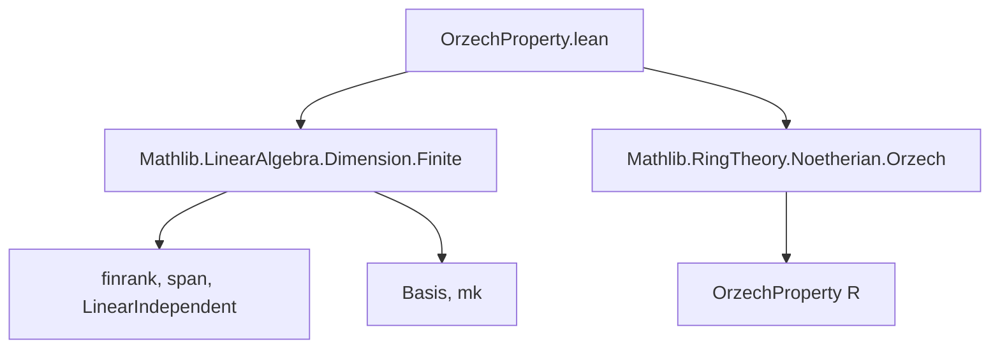

**Technical Brief: `OrzechProperty.lean`**

---

### 1. **Key Definitions & Theorems**

| Name | Type / Signature | Purpose |
|------|------------------|---------|
| `linearIndependent_of_top_le_span_of_card_le_finrank` | `{b : ι → M} → (⊤ ≤ span R (range b)) → (Fintype.card ι ≤ finrank R M) → LinearIndependent R b` | Shows that any spanning family of size ≤ rank is linearly independent over a ring with Orzech property. |
| `linearIndependent_of_top_le_span_of_card_eq_finrank` | Same as above, with equality instead of ≤ | Special case of the above when cardinality equals rank. |
| `linearIndependent_iff_card_eq_finrank_span` | `LinearIndependent R b ↔ Fintype.card ι = (range b).finrank R` | Characterizes linear independence via equality of cardinality and dimension of span (requires `Nontrivial R`). |
| `linearIndependent_iff_card_le_finrank_span` | `LinearIndependent R b ↔ Fintype.card ι ≤ (range b).finrank R` | Refinement using inequality; follows from previous equivalence and finrank-range inequality. |
| `basisOfTopLeSpanOfCardEqFinrank` | `(b : ι → M) → (⊤ ≤ span R (range b)) → (Fintype.card ι = finrank R M) → Basis ι R M` | Constructs a basis from a spanning family of size equal to rank. |
| `coe_basisOfTopLeSpanOfCardEqFinrank` | `⇑(basisOfTopLeSpanOfCardEqFinrank …) = b` | Coercion lemma: the basis function equals the original family `b`. |
| `finsetBasisOfTopLeSpanOfCardEqFinrank`, `setBasisOfTopLeSpanOfCardEqFinrank` | Analogous constructions for finsets/sets | Extend basis construction to finite sets and sets with finite type structure. |

---

### 2. **Naming Conventions**

- **Prefixes**:
  - `linearIndependent_of_…`: Indicates a theorem proving linear independence under certain conditions.
  - `basisOf_…`: Constructs a basis from given data.
  - `coe_…`: Lemmas about coercion of the basis function.
- **Suffixes**:
  - `_of_top_le_span_of_card_le_finrank`: Conditions: top submodule ≤ span, and cardinality ≤ rank.
  - `_eq_finrank`: Equality case of the above.
  - `_iff_card_…`: Biconditional characterizations.
- **Structure**:
  - `…_of_…_of_…`: Standard Lean pattern for theorems with multiple hypotheses.
  - `Finset`/`Set` variants use `finsetBasisOf…`, `setBasisOf…`.

---

### 3. **Tactic Stack**

- `rw`: Rewriting using equivalences and equalities (e.g., `← Finsupp.range_linearCombination`, `top_le_iff`, etc.).
- `have`: Introduces intermediate facts (e.g., `have ⟨f, hf⟩ := …`).
- `exact`: Applies a known theorem directly.
- `refine`: Partial proof construction, especially in `mpr` direction of biconditionals.
- `rwa`: Rewrite + apply (used in simplifying goals after rewriting).
- `trans`: Transitivity of equality (e.g., for cardinalities).
- `subset_span`, `subtype_injective`, `mem_set_image`: Standard library lemmas used in set-theoretic reasoning.

---

### 4. **Proof Logic**

- **Core Strategy**:
  - Use the Orzech property: *surjective endomorphism of a finitely generated module over an Orzech ring is injective*.
  - Reduce to known results:
    - Use `exists_linearIndependent_of_le_finrank` to get a linearly independent family of size ≤ rank.
    - Use `OrzechProperty.injective_of_surjective_of_injective` to upgrade surjectivity (from spanning) + injectivity (from independence) to bijectivity → basis.
- **Biconditional proofs**:
  - `mp`: Use `finrank_span_eq_card` (dimension of span equals cardinality for independent families).
  - `mpr`: Construct an embedding into the span, apply the main theorem, and use injectivity of inclusion map.

---

### 5. **Imports**

- `Mathlib.LinearAlgebra.Dimension.Finite`: Provides `finrank`, `span`, `LinearIndependent`, `Basis`, etc.
- `Mathlib.RingTheory.Noetherian.Orzech`: Defines `OrzechProperty R`, the key ring-theoretic assumption.

---

### 6. **Mermaid Diagrams**

#### **Dependency Graph (Module-Level)**



#### **Overview of Theory Flow**

```mermaid
flowchart LR
  R[Ring R with OrzechProperty] --> M[Module M over R]
  M --> spans[Spanning family b: ι → M]
  spans --> card_cond[|ι| ≤ dim M]
  card_cond --> lin_ind[Linear independence of b]
  lin_ind + spans --> basis[Basis structure]
  basis --> eq_card[|ι| = dim M]
  eq_card --> basis_of_span[Basis from spanning family]
```

---

### 7. **Domain-Specific AI Agent Notes**

- **Key assumptions**: `OrzechProperty R`, `Nontrivial R` (for biconditionals), finite type structures (`Fintype ι`, `Fintype s`).
- **Typical goal patterns**:
  - Prove linear independence from spanning + size constraint.
  - Construct a basis from a spanning set of correct size.
  - Convert between `LinearIndependent`, `Fintype.card`, and `finrank`.
- **Common lemmas to recall**:
  - `finrank_span_eq_card`, `linearIndependent_iff_card_eq_finrank_span`, `OrzechProperty.injective_of_surjective_of_injective`.
- **Proof automation**: Heavy use of `rw`, `refine`, and `rwa`; minimal tactic-specific automation (e.g., no `ring`, `aesop`).

--- 

Let me know if you'd like a formalized summary in Lean or a visualization of the proof tree for a specific theorem.
