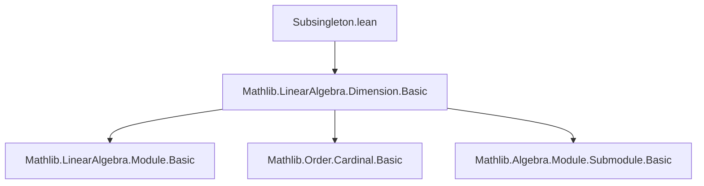
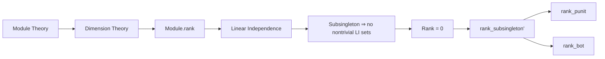

**Technical Brief: `Subsingleton.lean` Module**

---

### 1. **Key Definitions & Theorems**

| Name | Type | Purpose |
|------|------|---------|
| `rank_subsingleton'` | `[Nontrivial R] → [Subsingleton M] → Module.rank R M = 0` | Shows that any module over a nontrivial semiring with a *subsingleton* underlying type has rank 0. Uses `ciSup_le` and `linearIndependent_subsingleton_iff`. |
| `rank_punit` | `Module.rank R PUnit = 0` | Special case of `rank_subsingleton'` for the terminal additive monoid `PUnit`. |
| `rank_bot` | `Module.rank R (⊥ : Submodule R M) = 0` | Special case of `rank_subsingleton'` for the bottom submodule (i.e., the zero submodule), which is a subsingleton. |

> Note: The comment references `rank_subsingleton`, which assumes `Subsingleton R` instead of `Subsingleton M`; this file focuses on the *module* being a subsingleton.

---

### 2. **Naming Conventions**

- **Prefixes**:
  - `rank_`: for theorems about `Module.rank`.
- **Suffixes**:
  - `'` (prime): used for variants of a main theorem (`rank_subsingleton'` vs. `rank_subsingleton`).
- **Terms**:
  - `subsingleton`: indicates the type/class condition (`[Subsingleton M]`).
  - `nontriviality`: used in attribute `[nontriviality]`, indicating the tactic `nontriviality` may be used to discharge `Nontrivial R` goals.

---

### 3. **Tactic Stack**

- `rw`: rewriting using equalities (e.g., `← bot_eq_zero`, `eq_bot_iff`).
- `simp`: simplification, especially with `[(linearIndependent_subsingleton_iff _).mp s.2]`.
- `ciSup_le`: used to bound a supremum by showing each component ≤ target.
- `nontriviality`: a custom tactic (from Mathlib) to prove `Nontrivial R` goals when `R` is nontrivial.

---

### 4. **Proof Logic**

- **General pattern**:
  1. Rewrite `Module.rank` definition (as supremum over cardinals of linearly independent sets).
  2. Show that *every* linearly independent set is empty (since `M` is a subsingleton, any two elements are equal ⇒ no nontrivial linear independence).
  3. Use `linearIndependent_subsingleton_iff` to characterize linear independence in subsingleton modules.
  4. Conclude the supremum is over the empty set ⇒ rank = 0.

- **Specific steps in `rank_subsingleton'`**:
  ```lean
  rw [Module.rank, ← bot_eq_zero, eq_bot_iff]
  exact ciSup_le fun s ↦ by simp [(linearIndependent_subsingleton_iff _).mp s.2]
  ```
  - `eq_bot_iff`: characterizes when a cardinal is ≤ 0.
  - `ciSup_le`: reduces to showing each cardinal in the supremum ≤ 0.
  - `simp [...]`: uses equivalence `linearIndependent_subsingleton_iff` to show any linearly independent set must be empty ⇒ its cardinal is 0.

---

### 5. **Imports**

- `Mathlib.LinearAlgebra.Dimension.Basic`: provides:
  - `Module.rank`
  - `linearIndependent_subsingleton_iff`
  - `bot_eq_zero` (for submodules)
  - `PUnit`, `Submodule`, `AddCommMonoid`, `Module`, `Nontrivial`, `Subsingleton` infrastructure.

---

### 6. **Mermaid Diagrams**

#### Dependency Graph (Module-Level)



#### Theoretical Overview



---

### 7. **Summary**

This module formalizes the intuitive fact: *a module over a nontrivial semiring that is itself a subsingleton (i.e., has at most one element) must have rank 0*. It leverages the equivalence between linear independence and emptiness in such degenerate modules, and applies cardinal supremum reasoning to conclude rank = 0. The results are foundational for dimension theory in degenerate cases and are used as lemmas elsewhere (e.g., for zero modules, zero submodules, or terminal objects in module categories).
