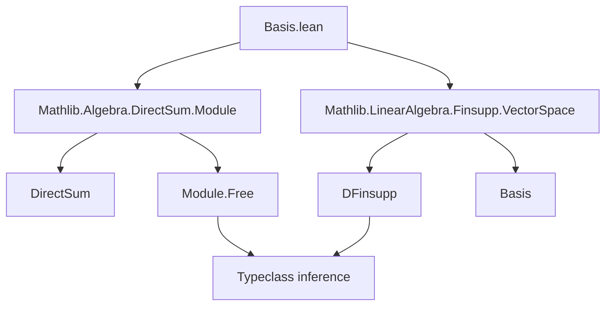
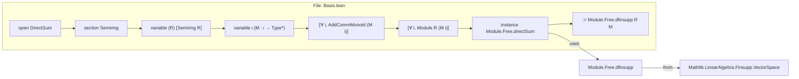

**Technical Brief: `Basis.lean` (Direct Sum Module Basis)**

---

### 1. **Key Definitions & Theorems**

| Name | Type / Signature | Purpose |
|------|------------------|---------|
| `Module.Free.directSum` | `[∀ i, Module.Free R (M i)] → Module.Free R (⨁ i, M i)` | Constructs a free module structure on the direct sum $\bigoplus_i M_i$ from free structures on each $M_i$. Implemented via `Module.Free.dfinsupp`. |

> **Note**: The file *exposes* the existence of a basis (via `Module.Free`) for the direct sum, but does **not** define an explicit basis object (e.g., `Basis ι R (⨁ i, M i)`). The comment indicates that `DFinsupp.basis` (from `Mathlib.LinearAlgebra.Finsupp.VectorSpace`) should be used for an explicit basis when types match defeq.

---

### 2. **Naming Conventions**

- **Prefixes**:
  - `directSum_`: Used for lemmas/instances about direct sums (here, `directSum` is the instance name).
- **Suffixes**:
  - `dfinsupp`: Indicates use of `DFinsupp`-based constructions (e.g., `Module.Free.dfinsupp`).
- **Variable naming**:
  - `R`: Base semiring.
  - `ι`: Index type.
  - `M : ι → Type*`: Family of modules.
  - Standard `variable` scoping with `(R)` and `{ι}` parentheses.

---

### 3. **Tactic Stack**

- **None explicitly used** in the visible code.
- The proof is *definitionally* handled by `Module.Free.dfinsupp`, which is likely a `constructor`/`infer_instance`-style instance resolution.
- Implicit reliance on `infer_instance` and `apply_instance` via typeclass resolution.

---

### 4. **Proof Logic**

- **Strategy**: *Instance derivation via typeclass inference*.
- **Steps**:
  1. Assume for each $i : \iota$, $M_i$ is a free $R$-module (`[∀ i, Module.Free R (M i)]`).
  2. Use the equivalence $\bigoplus_i M_i \cong \texttt{DFinsupp } \iota\ M$ (defeq by definition of `DirectSum`).
  3. Apply the known fact that `DFinsupp` of free modules is free (`Module.Free.dfinsupp`).
- **No manual induction or case analysis** — purely typeclass-based.

---

### 5. **Imports**

| Import | Role |
|--------|------|
| `Mathlib.Algebra.DirectSum.Module` | Provides `DirectSum` notation (`⨁`), `Module`-related constructions, and the definition of `Module.Free.directSum`. |
| `Mathlib.LinearAlgebra.Finsupp.VectorSpace` | Supplies `DFinsupp.basis` (used for explicit bases); referenced in comments. |

> **Note**: The file is minimal — only imports what’s needed to state the instance.

---

### 6. **Mermaid Diagrams**

#### Dependency Graph (Module-Level)



#### Overview of File Structure



---

### 7. **Theoretical Context**

- **Goal**: Establish that the direct sum of a family of free modules is free.
- **Key Insight**: In Lean, `⨁ i, M i` is definitionally equal to `DFinsupp ι M`, and `DFinsupp` of free modules is free (via a basis of delta functions).
- **Limitation**: This file only gives a *free module* instance — not an explicit basis. For a basis, one must use `DFinsupp.basis` (requires additional assumptions like `DecidableEq ι` or `Nonempty ι`).

---

### 8. **Recommendations for Extension**

- Add an explicit theorem:  
  ```lean
  theorem basis_directSum [∀ i, Module.Free R (M i)] :
      Basis (Σ i, Basis ι R (M i)) R (⨁ i, M i) := by
    refine' DFinsupp.basis _ _; exact fun i => (by infer_instance).basis
  ```
- Document the dependency on `DecidableEq ι` (if needed for `DFinsupp.basis`).

--- 

Let me know if you'd like the corresponding `Basis`-level formalization or a comparison with `Module.Basis.ofFree`.
