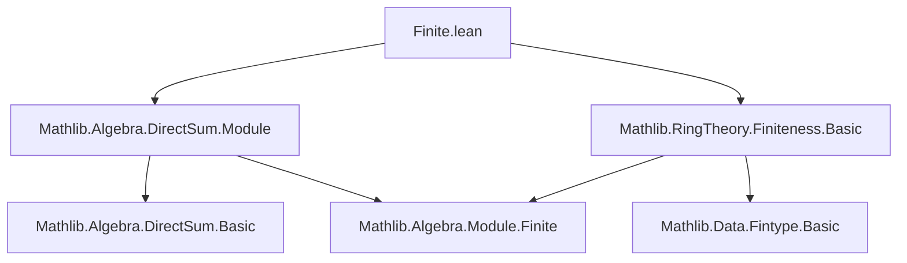

### Technical Brief: `Finite.lean`

---

#### **1. Key Definitions & Theorems**

| Name | Type / Signature | Purpose |
|------|------------------|---------|
| `Module.Finite.instDFinsupp` | `Module.Finite R (Π₀ (i : ι), M i)` | Proves that the space of finitely supported functions (i.e., `Π₀`) from a finite index type `ι` to finite `R`-modules `M i` is itself a finite `R`-module. |
| `Module.Finite.instDirectSum` | `Module.Finite R (⨁ i, M i)` | Derives finiteness of the direct sum `⨁ i, M i` by transporting the result for `Π₀` via the canonical linear equivalence `DFinsupp.linearEquivFunOnFintype`. |

- **`DFinsupp.linearEquivFunOnFintype`**: A canonical `R`-linear equivalence between `Π₀ (i : ι), M i` and `ι →₀ M i` (the space of finitely supported functions), used to transfer module-finiteness.
- **`Module.Finite.equiv`**: Given a linear equivalence `e : M ≃ₗ[ R ] N` and `Module.Finite R N`, yields `Module.Finite R M`. Here applied to `DFinsupp.linearEquivFunOnFintype.symm`.

---

#### **2. Naming Conventions**

- **Instance naming**: Uses `Module.Finite.inst*` pattern (e.g., `instDFinsupp`, `instDirectSum`) — standard Lean for typeclass instances.
- **No custom prefixes/suffixes** beyond standard Mathlib conventions (`inst*`, `linearEquiv*`, `DFinsupp.*`).
- **Variable naming**: `R`, `ι`, `M`, `i` follow standard algebraic conventions (`R` ring, `ι` index type, `M` family of modules).

---

#### **3. Tactic Stack**

- **`letI`**: Introduces a typeclass instance locally (`Fintype.ofFinite _`).
- **`equiv`**: Applies `Module.Finite.equiv` with the symmetric equivalence.
- **No explicit tactic blocks** — proofs are *definition-style* (using `:=` with combinators like `equiv` and `symm`), typical of Mathlib’s concise style.

---

#### **4. Proof Logic**

- **Strategy**: *Transport along equivalence*.
  1. Use `Finite ι` to get `Fintype ι`.
  2. Use `DFinsupp.linearEquivFunOnFintype` (a linear equivalence between `Π₀ (i : ι), M i` and `ι →₀ M i`).
  3. Apply `Module.Finite.equiv` with the *inverse* equivalence (`symm`) to transfer finiteness from the function space (known finite by assumption on each `M i` and finiteness of `ι`) to the `Π₀` space.
  4. For the direct sum `⨁ i, M i`, identify it with `Π₀ (i : ι), M i` (by definition of `DirectSum` as `DFinsupp`), and reuse the previous instance.

- **No induction or case analysis** — relies on pre-established equivalences and typeclass inference.

---

#### **5. Imports**

| Module | Purpose |
|--------|---------|
| `Mathlib.Algebra.DirectSum.Module` | Provides `DirectSum`, `DFinsupp`, and linear equivalences like `DFinsupp.linearEquivFunOnFintype`. |
| `Mathlib.RingTheory.Finiteness.Basic` | Defines `Module.Finite`, `Fintype`, and basic lemmas (e.g., `Module.Finite.equiv`). |

---

#### **8. Mermaid Diagrams**

##### **Dependency Graph (Module-Level)**



##### **Conceptual Overview**

```mermaid
flowchart LR
  subgraph Setup
    ι[Finite index type ι]
    M[Family M : ι → Type*]
    R[Semiring R]
    MF[∀ i, Module.Finite R (M i)]
  end

  subgraph Equivalence
    DF[Π₀ i, M i]
    Fun[ι →₀ M i]
    DF -- DFinsupp.linearEquivFunOnFintype.symm --> Fun
  end

  subgraph Finiteness
    Fun -- known finite --> MF & Finite ι
    DF -- Module.Finite.equiv --> Module.Finite R DF
    DS[⨁ i, M i] -- def = DFinsupp --> DF
    DS -- instDirectSum --> Module.Finite R DS
  end

  DF --> DS
```

---

**Summary**: This file formalizes a foundational closure property: *a finite direct sum of finite modules is finite*. It leverages Lean’s typeclass inference and equivalence-based transport, avoiding heavy proof automation in favor of structural clarity and reuse of existing equivalences.
