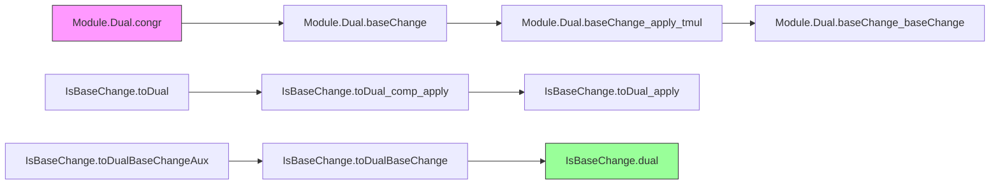

**Technical Brief: `BaseChange.lean` — Base Change for Dual Modules**

---

### 1. KEY DEFINITIONS & THEOREMS

| Name | Type / Signature | Purpose |
|------|------------------|---------|
| `Module.Dual.congr` | `e : V ≃ₗ[R] W → Dual R V ≃ₗ[R] Dual R W` | Shows duals of linearly equivalent modules are linearly equivalent. |
| `Module.Dual.baseChange` | `Dual R V →ₗ[R] Dual A (A ⊗[R] V)` | Constructs the base-changed functional via tensoring with algebra `A`. |
| `Module.Dual.baseChange_apply_tmul` | `f.baseChange A (a ⊗ₜ v) = f v • a` | Describes action of `baseChange f` on simple tensors. |
| `Module.Dual.baseChange_baseChange` | `(f.baseChange A).baseChange B ≃ (congr (cancelBaseChange ...)).symm (f.baseChange B)` | Compatibility of successive base changes up to equivalence. |
| `IsBaseChange.toDual` | `Dual R V →ₗ[R] Dual A W` | For `j : V →ₗ[R] W` a base change, lifts functionals along `j`. |
| `IsBaseChange.toDual_comp_apply` | `ibc.toDual f (j v) = algebraMap R A (f v)` | Evaluates lifted functional on image of `j`. |
| `IsBaseChange.toDual_apply` | `ibc.toDual f = (f.baseChange A).congr ibc.equiv` | Identifies `toDual` with base-changed functional composed with equivalence. |
| `IsBaseChange.toDualBaseChangeAux` | `A ⊗[R] Dual R V →ₗ[A] Dual A W` | Auxiliary linear map used to construct the equivalence. |
| `IsBaseChange.toDualBaseChange` | `A ⊗[R] Dual R V ≃ₗ[A] Dual A W` | Linear equivalence for finite free modules: base change commutes with dual. |
| `IsBaseChange.dual` | `IsBaseChange A (ibc.toDual)` | Main theorem: the map `toDual` itself is a base change. |

---

### 2. NAMING CONVENTIONS

- **Prefixes**:
  - `congr_`: for equivalences induced by module isomorphisms.
  - `baseChange_`: for constructions related to extending scalars.
  - `toDual_`: for maps from `Dual R V` to `Dual A W` via base change.
  - `dual`: for theorems about duals commuting with base change.

- **Suffixes**:
  - `_apply`: for evaluation formulas (e.g., `baseChange_apply_tmul`, `toDual_comp_apply`).
  - `_tmul`: for formulas on simple tensors `a ⊗ₜ v`.
  - `_aux`: for intermediate constructions (e.g., `toDualBaseChangeAux`).
  - `_equiv`/`_linearEquiv`: for equivalences (e.g., `toDualBaseChange` is underlying equivalence of `dual`).

---

### 3. TACTIC STACK

- **Core tactics**: `simp`, `rw`, `ext`, `induction`, `apply`, `intro`, `conv`, `aesop`
- **Specialized**:
  - `TensorProduct.induction_on`: for proving properties on tensor products.
  - `LinearEquiv.bijective_`, `LinearEquiv.ofBijective`: to construct equivalences from bijectivity.
  - `ibc.inductionOn`, `ibc.algHom_ext`, `ibc.basis`: leveraging structure of `IsBaseChange`.
  - `Free.chooseBasis`, `Basis.sum_equivFun`, `basis_repr_comp_apply`: basis computations for finite free modules.

---

### 4. PROOF LOGIC

- **Structure**:
  1. **Define constructions** (`congr`, `baseChange`, `toDual`, `toDualBaseChangeAux`) using universal properties (e.g., tensor product, linear extension).
  2. **Verify behavior on generators** (e.g., simple tensors) via `simp` and definitional equalities.
  3. **Prove compatibility** (e.g., `baseChange_baseChange`) using `ext` + `simp`.
  4. **For finite free modules**, construct an explicit equivalence:
     - Choose a basis `b` of `V`.
     - Use `b.constr` (basis extension) and its inverse.
     - Combine with `baseChange` and `IsBaseChange` structure (e.g., `ibc_pow`, `ibc.equiv`).
     - Show the auxiliary map is bijective → yields equivalence.
  5. **Conclude main theorem** `dual`: show `toDual` satisfies `IsBaseChange` via `of_equiv`.

- **Induction patterns**:
  - Tensor product induction (`TensorProduct.induction_on`) for properties over `A ⊗[R] V`.
  - Basis-based induction (`ibc.inductionOn`) for elements in the image of `j`.

---

### 5. IMPORTS

| Module | Role |
|--------|------|
| `Mathlib.LinearAlgebra.Dual.Defs` | Definitions of dual modules and linear functionals. |
| `Mathlib.LinearAlgebra.FreeModule.Finite.Basic` | Finite free modules, bases, and related constructions. |
| `Mathlib.RingTheory.TensorProduct.IsBaseChangeFree` | Characterization of base change for free modules. |
| `Mathlib.RingTheory.TensorProduct.IsBaseChangeHom` | General theory of `IsBaseChange`, including `toDual`, `equiv`, etc. |

---

### 6. DEPENDENCY & OVERVIEW DIAGRAM

```mermaid
graph TD
  A[CommSemiring R] --> B[Module R V]
  A --> C[CommSemiring A]
  C --> D[Algebra R A]
  B --> E[Module.Dual R V]
  D --> F[A ⊗[R] V]
  E --> G[Module.Dual A (A ⊗[R] V)]
  G <-->|congr| H[Module.Dual A W]
  F -->|j| I[W]
  I -->|IsBaseChange| J[IsBaseChange A j]
  J --> K[IsBaseChange.toDual : Dual R V →ₗ[A] Dual A W]
  K --> L[IsBaseChange A (toDual)]
  
  subgraph "Finite Free Case"
    B -- finite free --> M[Free R V]
    M --> N[IsBaseChange.toDualBaseChange : A ⊗ Dual R V ≃ Dual A W]
    N --> L
  end
```



---

### 7. THEORY SUMMARY

This file formalizes the interaction between **dual modules** and **base change** (scalar extension) in the context of commutative semirings and modules. Key contributions:

- Constructs natural maps `baseChange` and `toDual`, showing how functionals extend along algebra maps.
- Proves coherence laws for iterated base change (`baseChange_baseChange`).
- For finite free modules, establishes a canonical linear equivalence:
  $$
  A \otimes_R \operatorname{Dual}_R(V) \xrightarrow{\sim} \operatorname{Dual}_A(A \otimes_R V)
  $$
  and shows this equivalence is itself a base change (`dual`).

The development relies heavily on:
- Universal properties of tensor products and duals.
- Basis computations for finite free modules.
- Structural properties of `IsBaseChange`, especially its stability under finite powers and equivalence closure.

This is foundational for derived base change, Grothendieck duality, and descent theory in homological algebra.

--- 

Let me know if you'd like a formalized summary in `leanpkg` format or a dependency graph for the entire `Mathlib` module.
