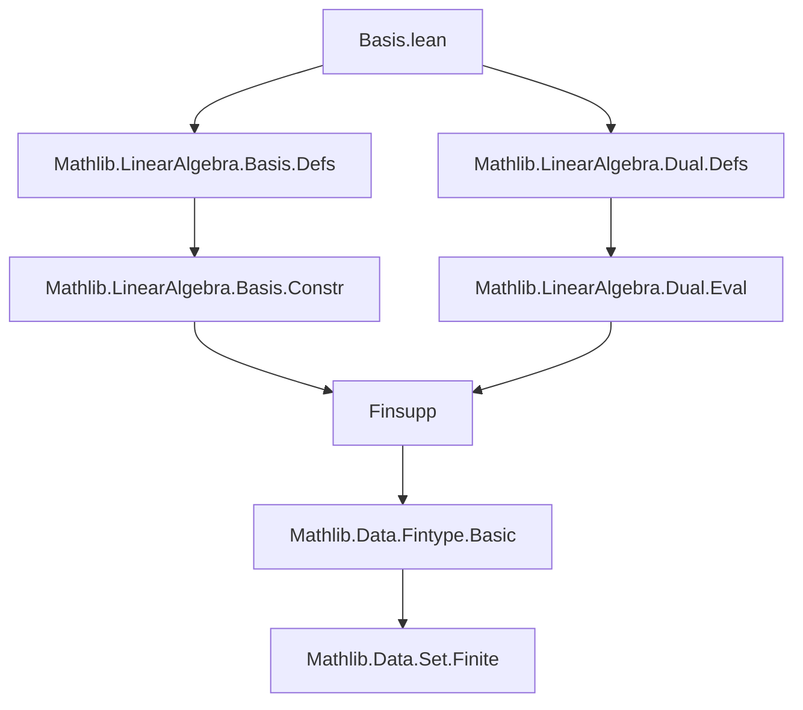
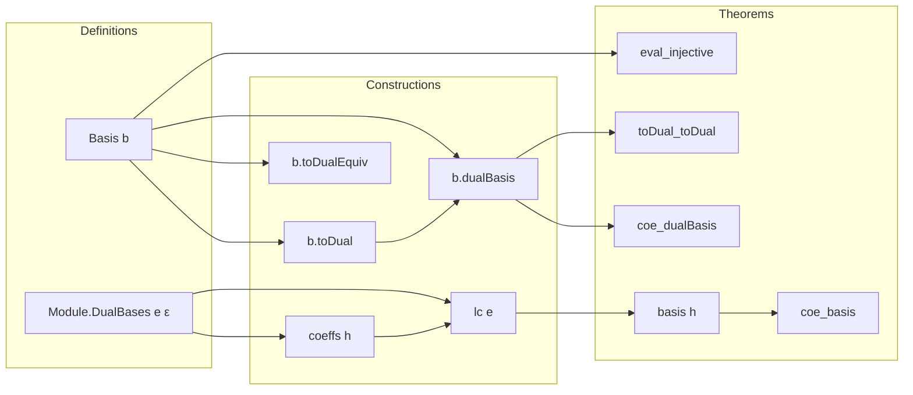

### Technical Brief: Basis Theory for Dual Vector Spaces in Lean 4

---

#### **1. Key Definitions & Theorems**

| Name | Type / Signature | Purpose |
|------|------------------|---------|
| `toDual` | `M →ₗ[R] Dual R M` | Constructs the linear map sending each basis vector `b i` to its dual coordinate functional `b.coord i`. |
| `toDualEquiv` | `M ≃ₗ[R] Dual R M` (when `ι` finite) | Linear equivalence between a finite-dimensional module and its dual, induced by a basis. |
| `dualBasis` | `Basis ι R (Dual R M)` | The dual basis to `b`, defined as `b.map b.toDualEquiv`. |
| `Module.DualBases e ε` | `Prop` | Predicate stating that families `e : ι → M` and `ε : ι → Dual R M` form a *dual pair*: `ε i (e j) = δ_{i,j}`, and every vector is determined uniquely by its dual coordinates (plus finiteness condition). |
| `coeffs h m` | `ι →₀ R` | Coefficient function of `m` w.r.t. dual pair `(e, ε)`, defined by `i ↦ ε i m`. |
| `lc e l` | `M` | Linear combination of `e` with coefficients `l : ι →₀ R`. |
| `basis h` | `Basis ι R M` | Constructs a basis from a dual pair `(e, ε)`. |
| `dual_lc h l i` | `ε i (lc e l) = l i` | Key property of dual pairs: evaluation picks out coefficients. |
| `lc_coeffs h m` | `lc e (coeffs h m) = m` | Reconstruction of vectors from dual coordinates. |
| `coe_dualBasis` | `⇑b.dualBasis = b.coord` | The dual basis coincides with the coordinate functionals. |
| `toDual_toDual` | `b.dualBasis.toDual.comp b.toDual = Dual.eval R M` | Relates double dual embedding to evaluation map. |
| `eval_injective`, `eval_ker`, `eval_range` | `Injective (Dual.eval R M)`, `ker = ⊥`, `range = ⊤` (finite case) | Standard properties of the double dual map under finite basis assumption. |

---

#### **2. Naming Conventions**

- **Prefixes**:
  - `toDual*`: constructions related to the canonical map into the dual.
  - `dualBasis*`: constructions related to the dual basis.
  - `coeffs*`, `lc*`: coefficient and linear combination operations for dual pairs.
  - `eval*`: properties of the evaluation map `M → Dual (Dual R M)`.

- **Suffixes**:
  - `_apply`: application of a map to arguments.
  - `_repr`: representation of elements in terms of a basis.
  - `_coeffs`: coefficient extraction.
  - `_dual`: dual-related (e.g., `dualBasis`, `dual_lc`).
  - `_finite`: finite-index variants (e.g., `toDual_range`, `eval_range`).

- **Structure fields**:
  - `eval_same`, `eval_of_ne`, `total`, `finite`: axiomatic properties of `DualBases`.

---

#### **3. Tactic Stack**

Frequently used tactics in proofs:

| Tactic | Usage |
|--------|-------|
| `rw` / `simp_rw` | Rewriting definitions (e.g., `toDual`, `dualBasis_apply`, `coeffs_apply`). |
| `simp` / `simp only` | Simplifying using lemmas like `toDual_apply`, `dualBasis_apply_self`, `lc_coeffs`. |
| `ext` | Extensionality for functions, linear maps, and basis elements. |
| `convert ... using 2` | Matching goals up to definitional equality (e.g., `dualBasis_apply_self`). |
| `cases` / `rcases` | Case analysis on equality or membership (e.g., `eq_or_ne i j`). |
| `apply` / `exact` | Direct proof steps (e.g., `apply Set.toFinite`). |
| `intro` / `intro h` | Introducing hypotheses. |
| `haveI := ...` | Introducing instance proofs (e.g., `Classical.decEq ι`). |
| `use_finite_instance` | Custom tactic to discharge `Set.Finite` goals via `Set.toFinite`. |

---

#### **4. Proof Logic**

The logical flow across the file follows a pattern:

1. **Construct canonical maps** (`toDual`, `toDualEquiv`, `dualBasis`) using basis universality (`constr`).
2. **Prove basic evaluation properties** (`toDual_apply`, `dualBasis_apply`, `coeffs_apply`) via `simp` and `rw`.
3. **Establish injectivity/surjectivity** of `toDual` and `Dual.eval` using basis extensionality and finite support.
4. **Define abstract dual pair structure** (`DualBases`) to generalize beyond concrete bases.
5. **Show equivalence**: any dual pair yields a basis (`basis h`) and vice versa (`coe_dualBasis`).
6. **Relate constructions**: e.g., `toDual_toDual` connects `b`, `b.dualBasis`, and the double dual embedding.

Induction is rarely used; instead, proofs rely on:
- **Basis extensionality** (`basis.ext`, `ext_elem_iff`)
- **Finsupp sum manipulations** (`Finsupp.sum`, `linearCombination_apply`)
- **Finite support** (`finite`, `mem_support_toFun`)
- **Decidable equality** (`DecidableEq ι`) for `ite` simplifications.

---

#### **5. Imports**

| Module | Purpose |
|--------|---------|
| `Mathlib.LinearAlgebra.Basis.Defs` | Core basis definitions (`Basis`, `repr`, `coord`, `linearCombination`). |
| `Mathlib.LinearAlgebra.Dual.Defs` | Dual module (`Dual R M`), evaluation map (`Dual.eval`), linear maps to `R`. |

---

#### **6. Mermaid Diagrams**

##### **Dependency Graph (Module-Level)**

##### **Overview of Theory Flow**

---

#### **7. Summary**

This file formalizes the theory of dual bases in the context of modules over a commutative semiring. It introduces:
- The canonical map `toDual` from a module to its dual,
- The linear equivalence `toDualEquiv` in finite dimensions,
- The dual basis `dualBasis`,
- An abstract notion of *dual pairs* (`DualBases`) that unifies concrete and abstract treatments.

It establishes foundational results such as:
- `dualBasis` is indeed a basis,
- The double dual embedding is an isomorphism in finite dimensions,
- Any dual pair determines a unique basis and vice versa.

The proofs are highly structured, leveraging `Finsupp`, `Basis.ext`, and `simp`-friendly definitions to automate routine calculations. The `DualBases` structure enables generalization beyond specific bases, supporting future work on reflexive modules, tensor products, and representation theory.
