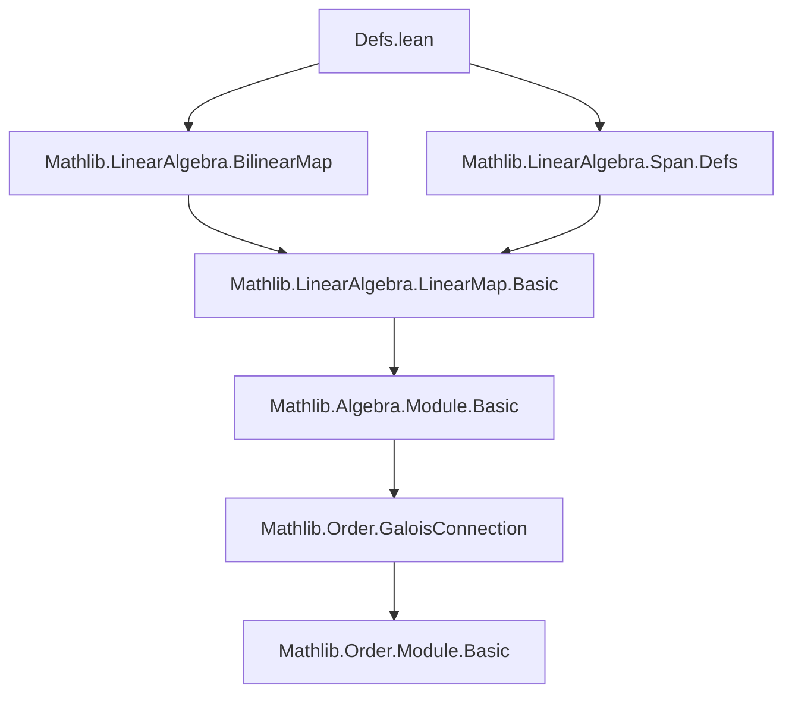

### Technical Brief: Dual Vector Spaces in Lean 4 (Mathlib)

---

#### **1. Key Definitions & Theorems**

| Name | Type / Signature | Purpose |
|------|------------------|---------|
| `Module.Dual R M` | `M →ₗ[R] R` | The dual module: linear functionals $M \to R$ |
| `Module.dualPairing R M` | `Dual R M →ₗ[R] M →ₗ[R] R` | Canonical pairing $\langle -, - \rangle : M^* \times M \to R$ |
| `Module.Dual.eval R M` | `M →ₗ[R] Dual R (Dual R M)` | Natural map to double dual: $m \mapsto (\phi \mapsto \phi(m))$ |
| `Module.Dual.transpose` | `(M →ₗ[R] M') →ₗ[R] Dual R M' →ₗ[R] Dual R M` | Transpose of linear maps: $f \mapsto (g \mapsto g \circ f)$ |
| `LinearMap.dualMap` | `f.dualMap : Dual R M₂ →ₗ[R] Dual R M₁` | Dual of $f : M₁ \to M₂$, i.e., precomposition with $f$ |
| `LinearEquiv.dualMap` | `f.dualMap : Dual R M₂ ≃ₗ[R] Dual R M₁` | Dual equivalence for linear isomorphisms |
| `Submodule.dualRestrict W` | `Dual R M →ₗ[R] Dual R W` | Restriction of functionals to submodule $W \le M$ |
| `Submodule.dualAnnihilator W` | `Submodule R (Dual R M)` | Functionals vanishing on $W$: $\{\phi \mid \phi(W) = 0\}$ |
| `Submodule.dualCoannihilator Φ` | `Submodule R M` | Elements of $M$ annihilated by all $\phi \in \Phi$ |
| `Module.IsReflexive` | `Prop` | Class for modules where `eval` is bijective (e.g., finite-dimensional vector spaces) |
| `Module.evalEquiv` | `M ≃ₗ[R] Dual R (Dual R M)` | Reflexivity isomorphism for reflexive modules |
| `Module.mapEvalEquiv` | `Submodule R M ≃o Submodule R (Dual R (Dual R M))` | Order isomorphism between submodules and their double dual images |
| `Submodule.dualAnnihilator_gc` | `GaloisConnection ...` | Antitone Galois connection between annihilator and coannihilator |

**Main Results:**
- `Module.dualAnnihilator_gc`: Antitone Galois connection $(\operatorname{Ann}^\*, \operatorname{CoAnn}^\*)$
- `Module.evalEquiv`: Reflexivity of finite-dimensional vector spaces
- `LinearMap.dualMap_injective_of_surjective`: Surjectivity of $f$ ⇒ injectivity of $f^*$
- `LinearMap.ker_dualMap_eq_dualAnnihilator_range`: $\ker(f^*) = \operatorname{Ann}( \operatorname{im} f )$
- `Submodule.dualAnnihilator_sup_eq`: $\operatorname{Ann}(U + V) = \operatorname{Ann}(U) \cap \operatorname{Ann}(V)$

---

#### **2. Naming Conventions**

| Pattern | Meaning | Examples |
|--------|---------|----------|
| `dual*` | Dual space / dual map related | `Dual`, `dualPairing`, `dualRestrict`, `dualAnnihilator`, `dualCoannihilator` |
| `eval*` | Evaluation map | `eval`, `evalEquiv`, `eval_naturality` |
| `transpose` | Transpose of linear maps | `transpose`, `transpose_apply`, `transpose_comp` |
| `dualMap*` | Dual of a linear map | `dualMap`, `dualMap_apply`, `dualMap_id`, `dualMap_comp_dualMap` |
| `*_eq_*` | Equality lemmas | `dualRestrict_def`, `ker_dualMap_eq_dualAnnihilator_range` |
| `*_le_*`, `*_eq_*`, `*_iff_*` | Submodule inclusion/equality/biconditional lemmas | `le_dualAnnihilator_iff_le_dualCoannihilator`, `sup_dualAnnihilator_le_inf` |
| `*_of_*` | Construction from structure | `IsReflexive.of_split`, `equiv` |
| `inst*` | Instance definitions | `IsReflexive.to_isTorsionFree`, `MulOpposite.instModuleIsReflexive` |

---

#### **3. Tactic Stack**

Frequently used tactics in proofs:
- `rfl`, `ext`, `simp`, `congr`, `congr_arg`, `congrFun`
- `aesop`, `grind`, `intro`, `exact`, `apply`, `rw`, `conv`
- `induction ... using OrderDual.rec`, `set`, `have`, `suffices`
- `apply ... <;> exact`, `refine ⟨..., ...⟩`, `intro; aesop`
- `simp only [...]`, `simp_rw`, `simp +contextual`

> **Note**: Proofs are mostly *computational* and rely on definitional equalities (`rfl`, `simp`), with occasional structural reasoning (e.g., Galois connections, bijectivity).

---

#### **4. Proof Logic**

- **Inductive/structural reasoning**: Most proofs are by extensionality (`ext`) and simplification (`simp`), leveraging definitional equality of linear maps.
- **Galois connections**: Used to derive lattice-theoretic properties (e.g., annihilator of join = meet of annihilators).
- **Reflexivity arguments**: For finite-dimensional vector spaces, `evalEquiv` provides equivalence with double dual, enabling transport of structure.
- **Diagram chasing**: Naturality of `eval` and `dualMap` used to relate compositions (e.g., `eval_naturality`).
- **Cancellation lemmas**: Injectivity/surjectivity of dual maps derived from properties of original maps via `congr_arg` and `funext`.

---

#### **5. Imports**

Primary dependencies:
```lean
import Mathlib.LinearAlgebra.BilinearMap
import Mathlib.LinearAlgebra.Span.Defs
```

These provide:
- Bilinear maps and their currying/uncurrying
- Submodule/span infrastructure (`Span.Defs`)

The file builds on:
- `LinearMap`, `Submodule`, `Module`, `Equiv`, `Order.GaloisConnection`
- `MulOpposite`, `OrderTheory.GaloisConnection`, `Algebra.Module.Basic`

---

#### **6. Mermaid Diagrams**

##### **Dependency Graph (Top-Level)**



##### **Theory Overview (Module Dual Space)**

```mermaid
graph LR
  subgraph Definitions
    D[Dual R M]
    DP[dualPairing]
    E[eval R M]
    T[transpose]
    DM[dualMap]
    DR[dualRestrict]
    DA[dualAnnihilator]
    DC[dualCoannihilator]
  end

  subgraph Results
    ER[evalEquiv]
    ME[mapEvalEquiv]
    GC[dualAnnihilator_gc]
    KER[ker_dualMap = Ann(range)]
    SURJ[dualMap_inj_of_surj]
  end

  D --> DP
  D --> E
  E --> ER
  T --> DM
  DR --> DA
  DA --> GC
  DC --> GC
  GC --> KER
  GC --> SURJ
  ME --> ER
```

##### **Galois Connection Structure**

```mermaid
graph LR
  subgraph Submodules of M
    SM[Submodule R M]
  end

  subgraph Submodules of Dual M
    SD[Submodule R (Dual R M)]
  end

  SM -- dualAnnihilator --> SD
  SD -- dualCoannihilator --> SM

  SD -.->|≤| SM
  SM -.->|≤| SD

  style SM fill:#f9f,stroke:#333
  style SD fill:#9ff,stroke:#333
```

---

#### **7. Summary**

This file formalizes the foundational theory of dual modules and annihilators in the context of modules over a commutative semiring. It introduces:
- Dual space, pairing, transpose, and evaluation
- Dual maps for linear maps and equivalences
- Annihilator/coannihilator constructions and their Galois connection
- Reflexivity and its consequences (e.g., finite-dimensional vector spaces)

The formalization is highly structured, with definitional clarity and minimal reliance on classical reasoning (noncomputable section only for `evalEquiv` in general modules). It serves as a base for further development in duality theory, including duality for vector spaces, bilinear forms, and Pontryagin duality.
