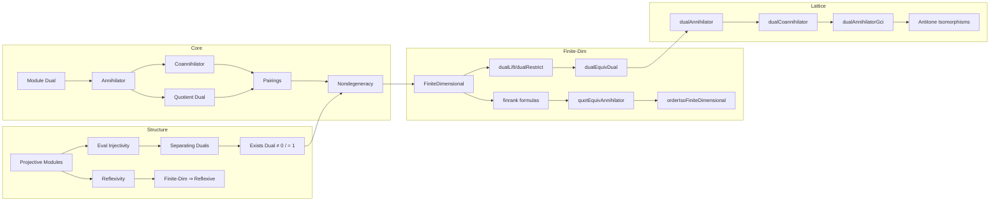

Here is the structured technical brief extracted from `Lemmas.lean`:

---

### **1. Key Definitions & Theorems**

#### **Definitions**
| Name | Type / Signature | Purpose |
|------|------------------|---------|
| `Module.Dual R M` | `Type uM → Type uR → [CommSemiring R] [AddCommMonoid M] [Module R M] → Type uM` | Dual module: $R$-linear maps $M \to R$ |
| `Submodule.dualAnnihilator W` | `W : Submodule R M ↦ { f : Dual R M | ∀ w ∈ W, f w = 0 }` | Annihilator of a submodule in the dual |
| `Submodule.dualCoannihilator Φ` | `Φ : Submodule R (Dual R M) ↦ { m : M | ∀ φ ∈ Φ, φ m = 0 }` | Co-annihilator: preimage of zero under all functionals in Φ |
| `Subspace.dualLift W` | `W : Subspace K V ↦ Dual K W →ₗ[K] Dual K V` | Arbitrary linear extension (section) of a functional on $W$ to $V$ |
| `Subspace.dualRestrict W` | `W : Subspace K V ↦ Dual K V →ₗ[K] Dual K W` | Restriction of functionals from $V$ to $W$ |
| `Submodule.dualCopairing W` | `W.dualAnnihilator →ₗ[K] (V ⧸ W) →ₗ[K] K` | Canonical pairing between annihilator and quotient |
| `Submodule.dualPairing W` | `(Dual K V ⧸ W.dualAnnihilator) →ₗ[K] W →ₗ[K] K` | Dual pairing factored through quotient |
| `Submodule.dualQuotEquivDualAnnihilator W` | `Dual K (V ⧸ W) ≃ₗ[K] W.dualAnnihilator` | Isomorphism between dual of quotient and annihilator |
| `Subspace.quotAnnihilatorEquiv W` | `Dual K V ⧸ W.dualAnnihilator ≃ₗ[K] Dual K W` | Quotient of dual by annihilator ≅ dual of subspace |
| `Subspace.quotEquivAnnihilator W` | `V ⧸ W ≃ₗ[K] W.dualAnnihilator` | Quotient by subspace ≅ its annihilator (finite-dim case) |
| `Subspace.dualLift.range` | `LinearMap.range (dualLift W)` | Copy of `Dual K W` inside `Dual K V` |
| `Subspace.dualEquivDual W` | `Dual K W ≃ₗ[K] LinearMap.range (dualLift W)` | Isomorphism to the image of `dualLift` |
| `dualProdDualEquivDual` | `(Dual R M × Dual R M') ≃ₗ[R] Dual R (M × M')` | Distributivity of dual over product |

#### **Theorems**
| Name | Statement | Purpose |
|------|-----------|---------|
| `Basis.linearEquiv_dual_iff_finiteDimensional` | `Nonempty (V ≃ₗ[K] Dual K V) ↔ FiniteDimensional K V` | Characterizes finite-dimensionality via self-duality |
| `Module.Basis.dual_rank_eq` | `rank (Dual R M) = lift(rank M)` | Rank of dual equals lift of rank (infinite case) |
| `LinearMap.ker_dual_map_eq_dualAnnihilator_range` | `f.dualMap.ker = f.range.dualAnnihilator` | Kernel of dual map = annihilator of range |
| `LinearMap.range_dual_map_eq_dualAnnihilator_ker` | `f.dualMap.range = f.ker.dualAnnihilator` (for vector spaces) | Range of dual map = annihilator of kernel |
| `Submodule.dualQuotEquivDualAnnihilator` | `Dual R (M ⧸ W) ≃ₗ[R] W.dualAnnihilator` | Fundamental annihilator–quotient duality |
| `Subspace.dualAnnihilator_dualCoannihilator_eq` | `W.dualAnnihilator.dualCoannihilator = W` | Double annihilator recovers original subspace |
| `Subspace.quotDualEquivAnnihilator W` | `Dual K V ⧸ W.dualLift.range ≃ₗ[K] W.dualAnnihilator` | Quotient of dual by lifted dual ≅ annihilator |
| `Subspace.quotEquivAnnihilator W` | `V ⧸ W ≃ₗ[K] W.dualAnnihilator` | Quotient ≅ annihilator (finite-dim) |
| `Subspace.dualAnnihilator_gci` | `dualAnnihilator` and `dualCoannihilator` form a Galois coinsertion | Lattice-theoretic duality |
| `Subspace.orderIsoFiniteCodimDim` | Antitone order isomorphism between finite-codim subspaces of $V$ and finite-dim subspaces of `Dual K V` | Duality for finite-codimensional subspaces |
| `Subspace.orderIsoFiniteDimensional` | Antitone order isomorphism between all subspaces of finite-dim $V$ and subspaces of `Dual K V` | Full lattice duality in finite-dim |
| `finite_dual_iff` | `Module.Finite (Dual K V) ↔ Module.Finite V` (for free $V$) | Finiteness preserved under dual |
| `finite_dualAnnihilator_iff` | `Module.Finite W.dualAnnihilator ↔ Module.Finite (V ⧸ W)` | Finiteness of annihilator ↔ quotient |
| `finrank_add_finrank_dualAnnihilator_eq` | `finrank W + finrank W.dualAnnihilator = finrank V` | Dimension formula for annihilators |
| `quotDualCoannihilatorToDual_nondegenerate` | Pairing `M ⧸ Φ.dualCoannihilator → Dual K Φ` is nondegenerate | Perfect pairing in general setting |
| `forall_dual_apply_eq_zero_iff` | `(∀ φ, φ v = 0) ↔ v = 0` (for projective $V$) | Separating property of dual |
| `Projective.exists_dual_ne_zero` | `x ≠ 0 ⇒ ∃ f, f x ≠ 0` (projective case) | Dual separates points |
| `Projective.exists_dual_eq_one` | `x ≠ 0 ⇒ ∃ f, f x = 1` (semifield case) | Normalized separating functional |

---

### **2. Naming Conventions**

- **Prefixes**:
  - `dual*`: Relating to dual module or dual maps (`dualLift`, `dualRestrict`, `dualMap`, `dualAnnihilator`, `dualCoannihilator`, `dualCopairing`, `dualPairing`, `dualQuotEquivDualAnnihilator`, `quotDualEquivAnnihilator`, `quotEquivAnnihilator`, `quotDualCoannihilatorToDual`)
  - `eval*`: Evaluation map (`eval`, `eval_apply_injective`, `eval_ker`, `eval_apply_eq_zero_iff`)
  - `quot*`: Quotient constructions (`quotAnnihilatorEquiv`, `quotDualEquivAnnihilator`, `quotEquivAnnihilator`, `quotDualCoannihilatorToDual`)
  - `mem_*`, `range_*`, `ker_*`: Membership, range, kernel properties
  - `finrank_*`, `rank_*`: Dimension/rank formulas

- **Suffixes**:
  - `_eq`: Equality theorems (`dualAnnihilator_dualCoannihilator_eq`, `quotDualEquivAnnihilator_symm_apply_mk`)
  - `_iff`: Biconditional theorems (`finite_dual_iff`, `dualAnnihilator_eq_bot_iff`, `finite_dualAnnihilator_iff`)
  - `_inj`, `_surj`: Injectivity/surjectivity (`dualLift_injective`, `dualRestrict_surjective`, `quotDualCoannihilatorToDual_injective`)
  - `_nondegenerate`: Nondegeneracy of pairings (`quotDualCoannihilatorToDual_nondegenerate`, `dualPairing_nondegenerate`)
  - `_GCI`: Galois coinsertion (`dualAnnihilatorGci`)
  - `_Equiv`, `_Iso`: Equivalences/isomorphisms (`quotAnnihilatorEquiv`, `dualQuotEquivDualAnnihilator`, `dualEquivDual`)

---

### **3. Tactic Stack**

- **Core tactics**:
  - `rw`, `simp`, `ext`, `congr_arg`, `apply`, `exact`, `intro`, `cases`, `rcases`, `obtain`, `refine`, `convert`
- **Algebra-specific**:
  - `linear_map_ext`, `funext`, `subtype.ext`, `quotient.sound`, `quotient.induction_on`
  - `linear_map.ext`, `LinearMap.coe_mk`, `LinearMap.coe_comp`, `LinearMap.coe_sum`, `LinearMap.smul_apply`
- **Module/linear algebra**:
  - `Module.eval_apply`, `Module.eval_ker`, `Module.forall_dual_apply_eq_zero_iff`, `Module.dualAnnihilator_dualCoannihilator_eq`
  - `Submodule.mem_dualAnnihilator`, `Submodule.mem_dualCoannihilator`, `Submodule.range_dualMap_mkQ_eq`
- **Set/quotient**:
  - `Set.mem_set_of_eq`, `Set.mem_image`, `Set.mem_range`, `Set.mem_iInf`, `Set.mem_span`, `Set.mem_bot`, `Set.mem_top`
- **Cardinal/finite-dimensionality**:
  - `FiniteDimensional`, `rank_lt_aleph0_iff`, `lift_rank_eq`, `lift_rank_lt_rank_dual`, `finite_or_infinite`
- **Proof automation**:
  - `aesop`, `linarith`, `ring`, `omega`, `interval_cases`, `by_cases`, `by_contra!`, `nontriviality`

---

### **4. Proof Logic**

- **Inductive structure**:
  - Most proofs follow **module-theoretic decomposition**: use projectivity/freeness to reduce to basis cases.
  - **Quotient-based reasoning**: many equivalences constructed via `quotEquivOfEq`, `quotEquivOfEquiv`, `quotKerEquivOfSurjective`.
  - **Annihilator duality**: proofs often use double-annihilator identity (`dualAnnihilator_dualCoannihilator_eq`) to reduce to inclusion checks.
  - **Evaluation map analysis**: many arguments hinge on injectivity/surjectivity of `eval` (especially for reflexive/projective modules).
  - **Dimension counting**: finite-dim arguments use `finrank_add_finrank_dualAnnihilator_eq`, `finrank_dualEquiv`, `lift_rank_eq`, `lift_rank_lt_rank_dual`.
  - **Galois coinsertion logic**: `dualAnnihilatorGci` used to derive lattice-theoretic properties (e.g., `dualAnnihilator_le_dualAnnihilator_iff`, `dualAnnihilator_inj`).
  - **Choice-based constructions**: `dualLift` defined via `leftInverse.dualMap`, relying on `exists_isCompl` (true for vector spaces).

- **Common proof patterns**:
  - *Annihilator inclusion*: Show $W \subseteq W'$ by proving $\forall φ ∈ W'.dualAnnihilator, φ|_W = 0$.
  - *Quotient lifting*: Use `liftQ`, `mkQ`, `comp` to lift maps through quotients.
  - *Nondegeneracy*: Prove `ker = ⊥` and `flip.ker = ⊥` for pairings.
  - *Dimension equality*: Use `finrank_eq` from an explicit equivalence or `finrank_add_...` identities.

---

### **5. Imports**

| Module | Purpose |
|--------|---------|
| `Mathlib.Algebra.Module.LinearMap.DivisionRing` | Linear maps over division rings |
| `Mathlib.LinearAlgebra.Basis.Basic` | Bases, `Basis`, `toDualEquiv`, `dualBasis` |
| `Mathlib.LinearAlgebra.Dimension.ErdosKaplansky` | Infinite-dimensional duality (Erdős–Kaplansky) |
| `Mathlib.LinearAlgebra.Dual.Basis` | Dual basis constructions |
| `Mathlib.LinearAlgebra.FiniteDimensional.Lemmas` | Finite-dim lemmas, `finrank`, `finiteDimensional` |
| `Mathlib.LinearAlgebra.FreeModule.Finite.Basic` | Free modules, finite generation |
| `Mathlib.LinearAlgebra.FreeModule.StrongRankCondition` | Strong rank condition, rank comparison |
| `Mathlib.LinearAlgebra.Matrix.InvariantBasisNumber` | IBN, uniqueness of rank |
| `Mathlib.LinearAlgebra.Projection` | Projections, complements (`exists_isCompl`) |
| `Mathlib.LinearAlgebra.SesquilinearForm.Basic` | Pairings, nondegeneracy |
| `Mathlib.RingTheory.Finiteness.Projective` | Projective modules, splitting lemmas |
| `Mathlib.RingTheory.LocalRing.Basic` | Local rings (used in some annihilator lemmas) |
| `Mathlib.RingTheory.TensorProduct.Maps` | Tensor maps (used in `dualProdDualEquivDual`) |

---

### **6. Mermaid Diagrams**

#### **Dependency Graph (High-Level)**

```mermaid
graph TD
  A[Module Theory] --> B[Linear Maps & Duals]
  A --> C[Bases & Rank]
  A --> D[Projective/Free Modules]
  B --> E[Annihilators]
  B --> F[Pairings & Nondegeneracy]
  C --> G[Erdős–Kaplansky]
  D --> H[Reflexivity & Eval Map]
  E --> I[Quotient–Dual Isomorphisms]
  E --> J[Lattice Duality (GCI)]
  F --> K[Perfect Pairings]
  G --> L[Finite vs Infinite Dual]
  H --> M[Separating Property]
  I --> N[Finite-Dim Duality Theorems]
  J --> N
  K --> N
  N --> O[Order Isomorphisms]
```

#### **Overview of File Structure**



--- 

Let me know if you'd like a formalized dependency graph (e.g., `.lean`-level imports) or a tactic-level proof trace for a specific theorem.
