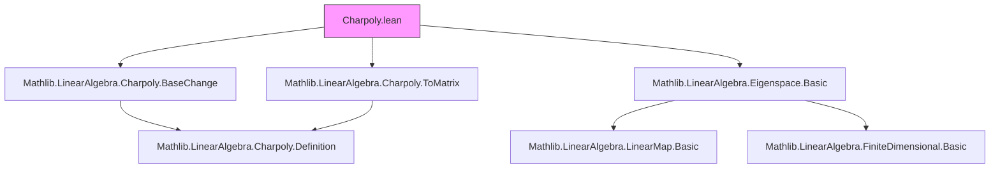

**Technical Brief: `Charpoly.lean` — Eigenvalues as Roots of the Characteristic Polynomial**

---

### 1. **Key Definitions & Theorems**

| Name | Type | Purpose |
|------|------|---------|
| `hasEigenvalue_iff_isRoot_charpoly` | `f.HasEigenvalue μ ↔ f.charpoly.IsRoot μ` | Establishes equivalence between existence of a nonzero vector $v$ with $f(v) = \mu v$ and $\mu$ being a root of the characteristic polynomial $\chi_f(X)$. Requires $R$ an integral domain. |
| `mem_spectrum_iff_isRoot_charpoly` | `μ ∈ spectrum K f ↔ f.charpoly.IsRoot μ` | Specialization of the above to fields $K$: eigenvalues (i.e., spectrum elements) are precisely the roots of the characteristic polynomial. |

- **`f.HasEigenvalue μ`**: Defined as $\exists v \ne 0,\ f(v) = \mu \cdot v$.
- **`f.charpoly`**: Characteristic polynomial of endomorphism $f$, defined via `charpoly f = charpoly (toMatrix f)` (see imports).
- **`spectrum K f`**: Set of $\mu \in K$ such that $f - \mu$ is not invertible (i.e., $\ker(f - \mu) \neq \{0\}$).
- **`eigenspace_def`**: $\ker(f - \mu)$.
- **`det_eq_zero_iff_ker_ne_bot`**: $\det(g) = 0 \iff \ker(g) \neq \{0\}$ for linear maps on finite free modules over domains.
- **`det_eq_sign_charpoly_coeff`**: Relates determinant of $f - \mu$ to evaluation of characteristic polynomial at $\mu$: $\det(f - \mu) = (-1)^n \cdot \chi_f(\mu)$.

---

### 2. **Naming Conventions**

- **Prefixes**:
  - `hasEigenvalue_`: Relates to existence of eigenvectors.
  - `isRoot_`: Predicate for polynomial roots.
  - `charpoly_`: Pertaining to characteristic polynomial.
- **Suffixes**:
  - `_iff_`: Biconditional lemmas.
  - `_def`: Definitions (not used here, but common in Mathlib).
- **`mem_spectrum_iff_`**: Membership in spectrum ↔ condition.

---

### 3. **Tactic Stack**

- `rw`: Rewriting using equivalences and definitions (`hasEigenvalue_iff`, `eigenspace_def`, `det_eq_zero_iff_ker_ne_bot`, `det_eq_sign_charpoly_coeff`, `hasEigenvalue_iff_mem_spectrum`).
- `simp`: Simplification using:
  - `Polynomial.coeff_zero_eq_eval_zero`
  - `charpoly_sub_smul`
- `simp_rw`: Implicitly used via `rw` + `simp` in combination.

No heavy automation (e.g., `aesop`, `ring`, `linarith`) appears—proofs are mostly definitional and rely on algebraic equivalences.

---

### 4. **Proof Logic**

- **First lemma** (`hasEigenvalue_iff_isRoot_charpoly`):
  1. Unfold `hasEigenvalue_iff` (definition of eigenvalue).
  2. Rewrite eigenspace as kernel: `eigenspace_def`.
  3. Apply equivalence: $\ker(f - \mu) \neq \{0\} \iff \det(f - \mu) = 0$ (`det_eq_zero_iff_ker_ne_bot`).
  4. Replace determinant with characteristic polynomial evaluation using `det_eq_sign_charpoly_coeff`.
  5. Simplify using `Polynomial.coeff_zero_eq_eval_zero` and `charpoly_sub_smul` (which identifies $\chi_f(\mu) = \det(\mu - f)$ up to sign).

- **Second lemma** (`mem_spectrum_iff_isRoot_charpoly`):
  1. Use `hasEigenvalue_iff_mem_spectrum` to relate spectrum membership to eigenvalue existence.
  2. Apply first lemma.

**Assumptions**:  
- $R$ is a commutative ring and an integral domain (to avoid zero-divisor pathologies in determinant/kernel equivalence).  
- $K$ is a field (so spectrum = eigenvalues, and invertibility = non-zero determinant).

---

### 5. **Imports**

| Import | Role |
|--------|------|
| `Mathlib.LinearAlgebra.Charpoly.BaseChange` | Invariance of characteristic polynomial under base change (ensures `charpoly` is well-defined independent of basis). |
| `Mathlib.LinearAlgebra.Charpoly.ToMatrix` | Identification of endomorphisms with matrices; defines `charpoly f = charpoly (toMatrix f)`. |
| `Mathlib.LinearAlgebra.Eigenspace.Basic` | Definitions: `eigenspace`, `HasEigenvalue`, `spectrum`, and basic lemmas like `hasEigenvalue_iff_mem_spectrum`. |

---

### 6. **Mermaid Diagrams**

#### **Dependency Graph (Module-Level)**



#### **Overview of Theoretical Flow**

```mermaid
flowchart LR
  subgraph Definitions
    D1[End R M] 
    D2[charpoly f]
    D3[HasEigenvalue μ]
    D4[spectrum f]
  end

  subgraph Equivalences
    E1[det = 0 ↔ ker ≠ 0]
    E2[det(f - μ) = ±χ_f(μ)]
    E3[χ_f(μ) = 0 ↔ μ root]
  end

  D1 -->|def| D2
  D1 -->|action on M| D3
  D1 -->|invertibility| D4
  E1 -->|used in proof| P1[hasEigenvalue ↔ χ_f root]
  E2 -->|used in proof| P1
  P1 -->|field case| P2[μ ∈ spectrum ↔ χ_f root]

  style P1 fill:#bbf,stroke:#333
  style P2 fill:#bbf,stroke:#333
```

---

### 7. **Summary**

This module formalizes the foundational result that **eigenvalues are exactly the roots of the characteristic polynomial**, under appropriate hypotheses (integral domain for base ring, field for vector space). It leverages:
- The equivalence between nontrivial kernel and zero determinant,
- The definition of the characteristic polynomial via determinant of $X - f$,
- The relationship between eigenspaces and spectrum.

The proof is short and highly structured, relying on pre-established equivalences in Mathlib’s linear algebra library.
