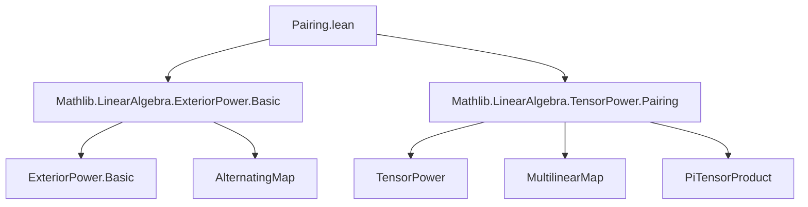
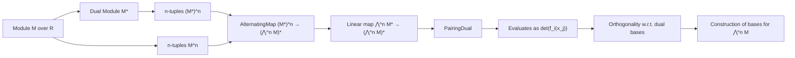

### Technical Brief: `Pairing.lean`

---

#### **1. Key Definitions & Theorems**

| Name | Type / Signature | Purpose |
|------|------------------|---------|
| `toTensorPower` | `n : ℕ → ⋀[R]^n M →ₗ[R] ⨂[R]^n M` | Embeds the $n$th exterior power into the $n$th tensor power via alternatization of the canonical multilinear map. |
| `alternatingMapToDual` | `n : ℕ → AlternatingMap R (Module.Dual R M) (Module.Dual R (⋀[R]^n M)) (Fin n)` | Constructs the canonical $n$-alternating map from $(M^*)^n$ to $(⋀^n M)^*$, defined via determinant. |
| `pairingDual` | `n : ℕ → ⋀[R]^n (Module.Dual R M) →ₗ[R] Module.Dual R (⋀[R]^n M)` | The main object: the natural pairing between exterior powers of a module and its dual. |
| `pairingDual_ιMulti_ιMulti` | `∀ f v, pairingDual … (ιMulti f) (ιMulti v) = det(f_j(v_i))` | Evaluates the pairing on decomposable elements: gives the determinant of the matrix $(f_j(v_i))$. |
| `pairingDual_apply_apply_eq_one` | `∀ a, pairingDual … (ιMulti (f ∘ a)) (ιMulti (x ∘ a)) = 1` | Under dual basis-like conditions (`f i (x i) = 1`, `f i (x j) = 0` for $i ≠ j$), the pairing on matched multi-indices yields 1. |
| `pairingDual_apply_apply_eq_one_zero` | `∀ a ≠ b, pairingDual … (ιMulti (f ∘ a)) (ιMulti (x ∘ b)) = 0` | Under same assumptions, pairing on mismatched multi-indices yields 0 — crucial for orthogonality/basis arguments. |

---

#### **2. Naming Conventions**

- **Prefixes**:
  - `toTensorPower`: “to-” prefix for canonical embeddings/constructions.
  - `alternatingMapToDual`: “to-” for mapping to a target structure.
  - `pairingDual`: “pairing” + “Dual” — indicates a bilinear (here linear) pairing involving duals.
- **Suffixes**:
  - `_apply_ιMulti_ιMulti`: specifies evaluation on decomposable elements (`ιMulti`).
  - `_apply_apply_eq_one`, `_eq_one_zero`: describes behavior on specific inputs (orthogonality).
- **Pattern**:
  - `ιMulti R n v` denotes the image of $v : \text{Fin } n \to M$ in $\bigwedge^n M$.
  - `f ∘ a`, `x ∘ a` for embeddings $a : \text{Fin } n \hookrightarrow \iota$.

---

#### **3. Tactic Stack**

- **Core tactics**:
  - `simp only [...]` — heavily used to reduce definitions and apply lemmas like `pairingDual_ιMulti_ιMulti`.
  - `rw [...]` — rewriting determinant identities or equality hypotheses.
  - `congr` — to reduce matrix equality to pointwise equality.
  - `ext` — extensionality for functions/morphisms.
  - `by_contra` / `by_cases` — for case analysis on equality/inequality.
  - `Finset.sum_eq_zero` — to show determinant sum vanishes.
  - `Matrix.det_apply`, `Matrix.det_one`, `Matrix.one_apply_eq/ne` — determinant-specific lemmas.
  - `Subsingleton.elim`, `OrderIso.ext`, `DFunLike.congr_fun` — for uniqueness of order isomorphisms.

---

#### **4. Proof Logic**

- **Structure of proofs**:
  - **Step 1**: Reduce to evaluation on decomposable elements (`ιMulti`) using `simp` and universal properties.
  - **Step 2**: Express pairing as determinant via `pairingDual_ιMulti_ιMulti`.
  - **Step 3**: Use matrix properties:
    - For equal multi-indices: show matrix is identity → det = 1.
    - For distinct multi-indices: show matrix has two equal columns (via $f_i(x_j) = 0$ for $i ≠ j$ and injectivity of embeddings) → det = 0.
  - **Step 4**: In `pairingDual_apply_apply_eq_one_zero`, use permutation analysis:
    - Show all terms in determinant sum vanish unless $\sigma = \text{id}$.
    - Prove $\sigma = \text{id}$ using monotonicity of $\sigma$ and $\sigma^{-1}$ (from order-preservation of embeddings $a, b$).

- **Induction**: Not used directly; relies on structural properties of permutations and alternating maps.

---

#### **5. Imports**

- `Mathlib.LinearAlgebra.ExteriorPower.Basic`: foundational exterior power theory.
- `Mathlib.LinearAlgebra.TensorPower.Pairing`: tensor power pairings and alternatization machinery.

These imports indicate the module builds on:
- Alternating maps and their linearization (`alternatingMapLinearEquiv`).
- Tensor power duality (`dualMap`, `multilinearMapToDual`).
- Determinant calculus over finite types (`Matrix.det_apply`, `Finset.sum`).

---

#### **6. Mermaid Diagrams**

##### **Dependency Graph (Module-Level)**

##### **Overview of Theory Flow**

---

#### **7. Theoretical Role**

This file constructs and analyzes the **canonical pairing** between exterior powers of a module and its dual:
$$
\bigwedge^n M^* \times \bigwedge^n M \to R,\quad
(\omega, v) \mapsto \omega(v).
$$
It is defined via determinant evaluation on decomposable elements and satisfies:
- **Normalization**: $\langle f_1 \wedge \dots \wedge f_n,\ x_1 \wedge \dots \wedge x_n \rangle = \det(f_i(x_j))$,
- **Orthogonality**: Under a dual basis $(x_i, f_i)$, the induced bases on $\bigwedge^n M$ and $\bigwedge^n M^*$ are dual.

This is foundational for:
- Proving $\bigwedge^n M$ is free of rank $\binom{d}{n}$ when $M$ is free of rank $d$,
- Defining volume forms, orientation, and Hodge duality in later developments.

--- 

Let me know if you'd like a formalized summary in Lean or a high-level exposition for documentation.
